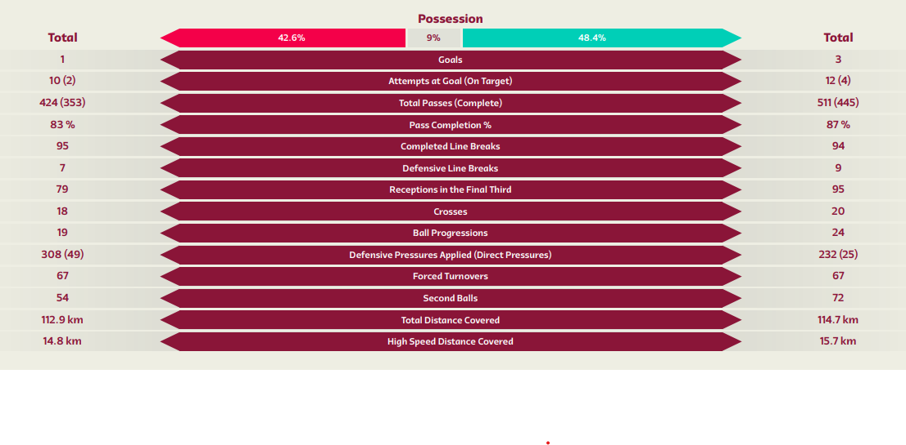
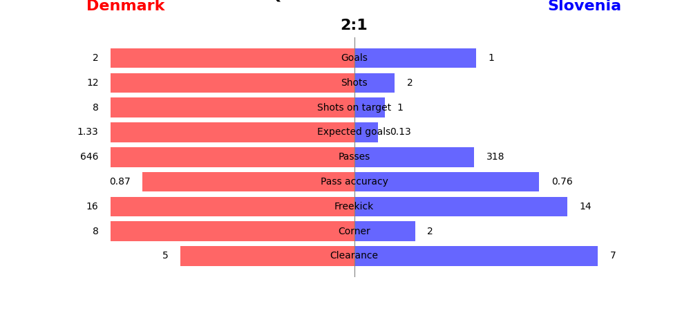
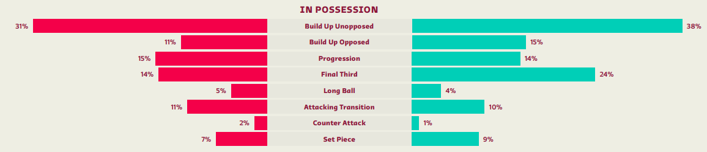
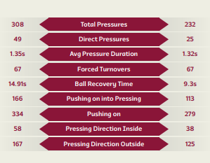

# Preparation Denmark to play against Slovenia !


## 1. Introduction

### 1.1 General comments 

Despite Denmark holding the 21st position in the FIFA rankings, and Slovenia being ranked at 55, overlooking a theoretically weaker opponent is never advisable. During the last game against Slovenia (Qualifiers Euro 23) we won with 2-1 in a complicated game while we got a draw 6 month earlier with 1-1 (Qualifiers Euro 23). In this analysis, we'll provide you with all the essential keys to ensure success against Slovenia in the upcoming match. 

Based on information from multiple sources, it's seems evident that Slovenia's team possesses notable strengths at some positions. Specifically, their goalkeeper, currently playing for Atlético, stands out, alongside midfielders Benjamin Sesko and Jaka Bijol. Given their midfield/attack roles, it's reasonable to anticipate Slovenia boasting a strong midfield/attack presence.


After analyzing their recent match against Malta, it's evident that Slovenia employed a traditional 4-4-2 formation with no unexpected variations in player selection. Additionally, one of the standout players we identified, Sesko, managed to score a goal during the game. We should keep in mind that the 4-4-2 formation brings a central presence that enables counter-attacks. 

### 1.2 Last 5 qualifier games slovenia

| wyscout | skillcorner | date | home | away | Score Home | Score Away | Notes |
|--------:|------------:|------|------|------|------------|------------|-------|
| 5414226 | 1385659 | 2023-09-10 | San Marino | Slovenia | 0 | 4 |  |
| 5414260| 1381446 | 2023-10-14 | Slovenia | Finland | 1 | 3 |  |
| 5414284 | 1381466 | 2023-10-17 | Northern Ireland | Slovenia | 0 | 1 |  |
| 5414302 | 1381485 | 2023-11-17 | Denmark | Slovenia | 2 | 1 |  |
| 5414324 | 1381505 | 2023-11-20 | Slovenia | Kazakhstan | 2 | 1 |  |

### 1.3 Injured & suspended players

Currently Benjamin Verbič is injured and doesn't have an official return date. No suspension need to be taken into account at this point.

## 2. Statistics of Slovenia's recent games 

### 2.1 Formation and line up 

We start first by analysing the common composition of Slovenia. In the last 9 games against Malta, USA, Kazakhstan, Denamrk, North Ireland and Finland, Slovenia used 8 times a 4-4-2 composition and the only modified composition was when Benjamin Sesko wasn't available. Therefore we can excpect the composition to be probably the same. Here is a quick recap of pro ans cons of the 4-4-2 composition.

Here is a quick refresh of the pros and cons of 4-4-2:

**Pros :** With a strong defense, wide attack, and quick movement into the opponent's territory, the 4-4-2 excels in counter-attacks. Defensively, it allows for a compact setup with two lines of four players, while the forwards remain poised for quick offensive opportunities. The presence of two strikers presents a unique challenge for defenders, as it reduces time and space on the ball and increases the threat of one-on-one situations. Additionally, passing out from the back becomes more challenging with constant pressure from two attackers.

**Cons :** In a 4-4-2 formation, teams may struggle to control the midfield, especially against opponents using a midfield trio, leading to less possession. Additionally, the 4-4-2 lacks defensive depth, as players within the same line may leave gaps. Despite being compact, this formation is vulnerable to line-breaking passes, making it easier for opponents to bypass multiple players at once. Defensive setups like the 4-1-4-1 offer better coverage between the lines.When attacking, the midfield and defensive lines align closely, restricting forward passing options. This setup can limit the team's ability to create passing opportunities compared to formations with players spread across different lines.

### 2.2 Key statistics

TODO: First fill the codes, then we can interpret the values and write the analysis





<details>
<summary> Codes </summary>

##### Ball possession

```python
# add script here
def compute_value():
  reuturn 1
```

##### Attemps at Goal (on target)

```python
# add script here
def compute_value():
  reuturn 1
```

##### Total passes

```python
# add script here
def compute_value():
  reuturn 1
```

##### Pass completion

```python
# add script here
def compute_value():
  reuturn 1
```

##### Completed line breks

```python
# add script here
def compute_value():
  reuturn 1
```

##### Reception in the final third

```python
# add script here
def compute_value():
  reuturn 1
```

##### Crosses

```python
# add script here
def compute_value():
  reuturn 1
```

##### Ball progressions

```python
# add script here
def compute_value():
  reuturn 1
```

##### Defensive pressures - direct pressures

```python
# add script here
def compute_value():
  reuturn 1
```

##### Forced turnover

```python
# add script here
def compute_value():
  reuturn 1
```

##### Total distance covered

```python
# add script here
def compute_value():
  reuturn 1
```

##### High speed distance covered

```python
# add script here
def compute_value():
  reuturn 1
```

</details>

### 2.3 Attacking Players Heatmap

In order to analyze Slovenian's attacking behavior, let's take a look at the thermal images of the attacking and midfield players. 

<div style="display:flex;">
    
    
    
</div>

<div style="display:flex;">
    
    
    
</div>

<details>
  <python> Code </python>

#### Create an array with players you want to see

player = ['B. Šeško', 'J. Kurtič', 'Ž. Karničnik']
for pl in player:
    df_player = df[df['player.name'] == pl]
        
    # Pitch     
    pitch = VerticalPitch(pitch_color='#2f8c58', 
                          line_color='white', 
                          pitch_type='wyscout')
    
    fig, ax = pitch.grid(grid_height=0.9, title_height=0.06, axis=False,
                         endnote_height=0.04, title_space=0, endnote_space=0)

    # Heatmap as Kernel Density Estimation
    pitch.kdeplot(
    x=df_player['location.x'],
    y=df_player['location.y'],
    shade = True,
    shade_lowest=False,
    alpha=.5,
    n_levels=10,
    cmap = 'coolwarm',
    ax=ax['pitch']
    )

    legend_elements = [Line2D([0], [0], color='w', markerfacecolor='k', marker='o', label=pl)]

    plt.legend(handles=legend_elements, loc='upper center', bbox_to_anchor=(0.5, 1), bbox_transform=plt.gcf().transFigure,  
               handlelength=2, labelspacing=1.2, fontsize=10)
    
    def replace_dot_space_with_underscore(pl):
        return pl.replace(". ", "_")
    
    pl = replace_dot_space_with_underscore(pl)
    
    plt.savefig(f'plots/{pl}_Heatmaps.png', dpi=400)
    plt.show()
</details>

    
```

## 3. In possesion - attack of Slovenia

### 3.1 Attacking formation & style:

TODO: Add same distribution like in the picture



### 3.2 Passing network & ball heatmap

#### TODO: Analyse passing network


```python
# This script isn't complete
third_possession = dynamic_events.groupby(['channel_end', 'third_end'])['possession_duration'].sum().reset_index()
total_possession = third_possession['possession_duration'].sum()
third_possession['possession_percentage'] = (third_possession['possession_duration'] / total_possession) * 100
print(third_possession[['channel_end','third_end', 'possession_percentage']])
```

### 3.3 Typical tactical moves

#### 3.3.1 Long passes


#### 3.3.2 Crosses


#### 3.3.3 Shots & shots on target


#### 3.3.4 Duels


#### 3.3.5 Interceptions


#### 3.3.6 Fouls


## 4 Out of possesion - defense of Slovenia

### 4.1 Typical defensive formation & style

TODO: Add same distribution like in the picture


```python
# Add script to type of play out of possesion
```

Add player heatmap

```python
# Add script to type of play out of possesion
```

### 4.2 Statistics

TODO: Create scripts to generate the values and then we analyse the results



```python
# Add script to generate staticsitws
```

<details>
<summary> Codes </summary>

##### Total pressures

```python
# add script here
def compute_value():
  reuturn 1
```

##### Direct pressures

```python
# add script here
def compute_value():
  reuturn 1
```

##### Average pressures duartion

```python
# add script here
def compute_value():
  reuturn 1
```

##### Forced turnovers

```python
# add script here
def compute_value():
  reuturn 1
```

##### Ball recovery time

```python
# add script here
def compute_value():
  reuturn 1
```

##### Pusing into pressing

```python
# add script here
def compute_value():
  reuturn 1
```

##### Pushing on

```python
# add script here
def compute_value():
  reuturn 1
```

##### Pushing direction inside

```python
# add script here
def compute_value():
  reuturn 1
```

##### Pushing direction outside

```python
# add script here
def compute_value():
  reuturn 1
```

</details>

### 4.3 Duel performance of the players

### 4.4 Goal keeper behaviour

## 5. Set plays

### 5.1 Corners

TODO: Who shots, any danger? (inswing vs outswing)

### 5.2 Penalties

TODO: Who shots, which direction statistically?

### 5.3 Free kicks

TODO: Who shots, who does what. Any Danger? How do they shot normally?

## 6 Statistics of the players : 

### Physical data

| Player name          |   Distance |   Running Distance |   HSR Distance |   Sprinting Distance |   Accelerations |   Max speed |
|:---------------------|-----------:|-------------------:|---------------:|---------------------:|----------------:|------------:|
| Adam Gnezda Čerin    |      12318 |               2323 |            675 |                  118 |               5 |        27.2 |
| Benjamin Verbič      |       8654 |               1350 |            564 |                  156 |              11 |        27.5 |
| Benjamin Šeško       |       9439 |               1226 |            462 |                  228 |              11 |        31.1 |
| Erik Janža           |       6943 |                833 |            363 |                  115 |               8 |        28.1 |
| Jaka Bijol           |       9688 |               1061 |            355 |                   57 |               6 |        27.1 |
| Jan Mlakar           |      10772 |               1675 |            590 |                   81 |               5 |        26.9 |
| Jasmin Kurtič        |       4454 |                922 |            117 |                    0 |               2 |        22.9 |
| Jon Gorenc- tankovič |       2986 |                546 |            185 |                   12 |               2 |        24.6 |
| Miha Blažič          |      10579 |               1368 |            333 |                   67 |               5 |        25.9 |
| Miha Zajc            |       1266 |                223 |             90 |                    6 |               0 |        25.2 |
| Sandi Lovrič         |       2926 |                498 |            153 |                   52 |               2 |        29.6 |
| Timi Max Elšnik      |       7857 |               1185 |            367 |                   27 |               3 |        25.3 |
| Vanja Drkušić        |       3954 |                597 |            264 |                  101 |               0 |        29.4 |
| Žan Karničnik        |      11470 |               1751 |            501 |                  129 |               7 |        28.4 |
| Žan Vipotnik         |      10364 |               1195 |            490 |                  149 |              13 |        29.2 |
#### Top 5 Distance
| Player name       |   Distance |   Running Distance |   HSR Distance |   Sprinting Distance |   Accelerations |   Max speed |
|:------------------|-----------:|-------------------:|---------------:|---------------------:|----------------:|------------:|
| Adam Gnezda Čerin |      12318 |               2323 |            675 |                  118 |               5 |        27.2 |
| Žan Karničnik     |      11470 |               1751 |            501 |                  129 |               7 |        28.4 |
| Jan Mlakar        |      10772 |               1675 |            590 |                   81 |               5 |        26.9 |
| Miha Blažič       |      10579 |               1368 |            333 |                   67 |               5 |        25.9 |
| Žan Vipotnik      |      10364 |               1195 |            490 |                  149 |              13 |        29.2 |
#### Top 5 Running Distance
| Player name       |   Distance |   Running Distance |   HSR Distance |   Sprinting Distance |   Accelerations |   Max speed |
|:------------------|-----------:|-------------------:|---------------:|---------------------:|----------------:|------------:|
| Adam Gnezda Čerin |      12318 |               2323 |            675 |                  118 |               5 |        27.2 |
| Žan Karničnik     |      11470 |               1751 |            501 |                  129 |               7 |        28.4 |
| Jan Mlakar        |      10772 |               1675 |            590 |                   81 |               5 |        26.9 |
| Miha Blažič       |      10579 |               1368 |            333 |                   67 |               5 |        25.9 |
| Benjamin Verbič   |       8654 |               1350 |            564 |                  156 |              11 |        27.5 |
#### Top 5 HSR Distance
| Player name       |   Distance |   Running Distance |   HSR Distance |   Sprinting Distance |   Accelerations |   Max speed |
|:------------------|-----------:|-------------------:|---------------:|---------------------:|----------------:|------------:|
| Adam Gnezda Čerin |      12318 |               2323 |            675 |                  118 |               5 |        27.2 |
| Jan Mlakar        |      10772 |               1675 |            590 |                   81 |               5 |        26.9 |
| Benjamin Verbič   |       8654 |               1350 |            564 |                  156 |              11 |        27.5 |
| Žan Karničnik     |      11470 |               1751 |            501 |                  129 |               7 |        28.4 |
| Žan Vipotnik      |      10364 |               1195 |            490 |                  149 |              13 |        29.2 |
#### Top 5 Sprinting Distance
| Player name       |   Distance |   Running Distance |   HSR Distance |   Sprinting Distance |   Accelerations |   Max speed |
|:------------------|-----------:|-------------------:|---------------:|---------------------:|----------------:|------------:|
| Benjamin Šeško    |       9439 |               1226 |            462 |                  228 |              11 |        31.1 |
| Benjamin Verbič   |       8654 |               1350 |            564 |                  156 |              11 |        27.5 |
| Žan Vipotnik      |      10364 |               1195 |            490 |                  149 |              13 |        29.2 |
| Žan Karničnik     |      11470 |               1751 |            501 |                  129 |               7 |        28.4 |
| Adam Gnezda Čerin |      12318 |               2323 |            675 |                  118 |               5 |        27.2 |
#### Top 5 Accelerations
| Player name     |   Distance |   Running Distance |   HSR Distance |   Sprinting Distance |   Accelerations |   Max speed |
|:----------------|-----------:|-------------------:|---------------:|---------------------:|----------------:|------------:|
| Žan Vipotnik    |      10364 |               1195 |            490 |                  149 |              13 |        29.2 |
| Benjamin Verbič |       8654 |               1350 |            564 |                  156 |              11 |        27.5 |
| Benjamin Šeško  |       9439 |               1226 |            462 |                  228 |              11 |        31.1 |
| Erik Janža      |       6943 |                833 |            363 |                  115 |               8 |        28.1 |
| Žan Karničnik   |      11470 |               1751 |            501 |                  129 |               7 |        28.4 |
#### Top 5 Max speed
| Player name    |   Distance |   Running Distance |   HSR Distance |   Sprinting Distance |   Accelerations |   Max speed |
|:---------------|-----------:|-------------------:|---------------:|---------------------:|----------------:|------------:|
| Benjamin Šeško |       9439 |               1226 |            462 |                  228 |              11 |        31.1 |
| Sandi Lovrič   |       2926 |                498 |            153 |                   52 |               2 |        29.6 |
| Vanja Drkušić  |       3954 |                597 |            264 |                  101 |               0 |        29.4 |
| Žan Vipotnik   |      10364 |               1195 |            490 |                  149 |              13 |        29.2 |
| Žan Karničnik  |      11470 |               1751 |            501 |                  129 |               7 |        28.4 |

##### TODO: Left
- possesion
- distribution
- offers & receptions
- physical data sprints / avg runs / top speed and so on
- Dangerous runs & types of runs

```python
# Example to see all supports runs
print(dynamic_events['event_subtype'].unique())
print(dynamic_events[dynamic_events['event_subtype'] == 'support'][['player_name', 'time_start']])
```


## 7 Weaknesses & Tactic to adopt

TODO: Write this at the end when everything is done - probably not important for the first draft


