<!---------------- HEADER SECTION -------------------->
<details><summary>Project Group</summary>

_Please fill in the following table._

| handle      | name               |
| ----------- | ------------------ |
| @dgregory   | Grégory de Meurichy|
| @ngrogg     | Nic Grogg          |
| @grloris    | Loris Griesbaum    |
| @ygoergen        | Yves Görgen             |
| @fcosta          | François Costa               |
</details>

<details>
<summary>TA Comments :warning: April 19 </summary>

Your teaching assistant is Ivana (@ismokovic) and can be reached at ismokovic@ethz.ch 

- [ ] when saving, please indicate what you changed in a meaningful commit messages
- [x] draft due: **Monday, April 8**
- Good start! Overall you have implemented some nice ideas – would be great if you could extend to include data from other matches to get a feeling of Slovenia’s patterns of play and how Denmark could exploit weaknesses. I see from your message you are already planning to do this, so keep it up!
- You make some claims about 442 formations but it is not clear where you are taking this from.
- Attacking style: you say that Slovenia’s attack is mainly characterized by long balls and counter attacks, but seems that 35% of their attacking style is attributed to build up?
- Passing network: nice interpretation (difficulty linking defense and midfield… is this a pattern across games or did Denmark do something special last time?)
- Interesting that you look into the centralities of the passing networks, but it is not clear what the centralities can tell us about the passing networks / how we can interpret the results. 
- Some heatmaps have some interesting features: concentrations on two opposite sides of the pitch – would be interesting to understand what that means… is it real or consequence of skillcorner’s player detection?
- You have a lot of maps showing where certain actions happened, but not clear what we can take from these in terms of preparing Denmark for the match. If you compare across the other qualifying matches, perhaps you see some trends / patterns which can give us a hint of what to expect more concretely?
- Some of your set piece analysis might be more informative when including other matches (see comment above).
- Nice that you have a summary at the end of the report with weaknesses and suggested tactics
- Please remember that details of how each piece of analysis / visualization was produced (either by linking to the relevant snippets, online sources, or providing your own source code directly) **MUST** be provided, and we expect each visualization to be accompanied by a meaningful interpretation.
- [ ] final version due: **Friday, May 24** 
</details>


<!---------------- HEADER SECTION -------------------->
<details><summary>Project Group</summary>

_Please fill in the following table._

| handle      | name               |
| ----------- | ------------------ |
| @dgregory   | Grégory de Meurichy|
| @ngrogg     | Nic Grogg          |
| @grloris    | Loris Griesbaum    |
| @ygoergen   | Yves Görgen        |
| @fcosta     | François Costa     |
</details>

<details>
<summary>TA Comments :warning: April 19 </summary>

</details>

# Match \#06 (SVN-DEN): preparing Denmark to play against Slovenia


<!------------ START YOUR REPORT BELOW THIS LINE --------------->
# Preparation Denmark 🇩🇰 to play against Slovenia 🇸🇮 !
<p align="center">

</p>


## 1. Introduction

### 1.1 General comments

Despite Denmark holding the 21st position in the FIFA rankings, and Slovenia being ranked at 55, overlooking a theoretically weaker opponent is never advisable. During the last game against Slovenia (Qualifiers Euro 23) we won with 2-1 in a complicated game while we got a draw 6 month earlier with 1-1 (Qualifiers Euro 23). In this analysis, we'll provide you with all the essential keys to ensure success against Slovenia in the upcoming match.

Our preparation for the group match of the European Championship consists of the analysis of the  6 games in the European Championship qualification of Slovenia. The games are the last 5 games and an additional game against Denmark. They are analysed and patterns are evaluated.

Based on information from multiple sources, it's seems evident that Slovenia's team possesses notable strengths at some positions. Specifically, their goalkeeper, currently playing for Atlético, stands out, alongside midfielders Benjamin Sesko and Jaka Bijol. Given their midfield/attack roles, it's reasonable to anticipate Slovenia boasting a strong midfield/attack presence.

After analyzing their recent matches, it's evident that Slovenia employed a traditional 4-4-2 formation with no unexpected variations in player selection. Additionally, one of the standout players we identified, Sesko, managed to score a goal during the game against Denmark on November 17, 2023. We should keep in mind that the 4-4-2 formation brings a central presence that enables counter-attacks.

### 1.2 Analysed qualifier games Slovenia

| wyscout | skillcorner | date       | home             | away       | Score Home | Score Away |
| ------: | ----------: | ---------- | ---------------- | ---------- | ---------- | ---------- |
| 5414226 |     1385659 | 2023-09-10 | San Marino       | Slovenia   | 0          | 4          |
| 5414260 |     1381446 | 2023-10-14 | Slovenia         | Finland    | 3          | 0          |
| 5414284 |     1381466 | 2023-10-17 | Northern Ireland | Slovenia   | 0          | 1          |
| 5414302 |     1381485 | 2023-11-17 | Denmark          | Slovenia   | 2          | 1          |
| 5414324 |     1381505 | 2023-11-20 | Slovenia         | Kazakhstan | 2          | 1          |
| 5414180 |          -  | 2023-06-19 | Slovenia         | Denmark    | 1          | 1          |

### 1.3 Injured & suspended players

Currently Benjamin Verbič is injured and doesn't have an official return date. No suspension need to be taken into account at this point.

## 2. Statistics of Slovenia's recent games

### 2.1 Formation and line up

We start first by analysing the common composition of Slovenia. In the last 10 games against Portugal, Malta, USA, Kazakhstan, Denamrk, North Ireland and Finland, Slovenia used 9 times a 4-4-2 composition and the only modified composition was when Benjamin Sesko wasn't available. Therefore we can excpect the composition to be probably the same. Here is a quick recap of pro ans cons of the 4-4-2 composition.

| 26 Mar vs Portugal | 21 Mar vs Malta | 20 Jan vs USA | 20 Nov vs Kazakhstan | 17 Nov vs Denmark |
| ------------- | ------------- | ------------- | ------------- | ------------- |
|  | | | | |

|17 Oct vs N. Ireland | 14 Oct vs Finland | 10 Sep vs San Marino | 7 Sep vs N. Ireland | 19 Jun vs Denmark |
| ------------- | ------------- | ------------- | ------------- | ------------- |
|  | | | | |

Here is a quick refresh of the pros and cons of 4-4-2:

**Pros :** With a strong defense, wide attack, and quick movement into the opponent's territory, the 4-4-2 excels in counter-attacks. Defensively, it allows for a compact setup with two lines of four players, while the forwards remain poised for quick offensive opportunities. The presence of two strikers presents a unique challenge for defenders, as it reduces time and space on the ball and increases the threat of one-on-one situations. Additionally, passing out from the back becomes more challenging with constant pressure from two attackers.

**Cons :** In a 4-4-2 formation, teams may struggle to control the midfield, especially against opponents using a midfield trio, leading to less possession. Additionally, the 4-4-2 lacks defensive depth, as players within the same line may leave gaps. Despite being compact, this formation is vulnerable to line-breaking passes, making it easier for opponents to bypass multiple players at once. Defensive setups like the 4-1-4-1 offer better coverage between the lines.When attacking, the midfield and defensive lines align closely, restricting forward passing options. This setup can limit the team's ability to create passing opportunities compared to formations with players spread across different lines.

<details><summary>Sources</summary>

Images: They are screenshot of Google Chrome output when we type : Last games of slovenia

1. [Coachesvoice](https://www.coachesvoice.com/cv/4-4-2-football-tactics-ferguson-simeone-hasenhuttl-dyche/#:~:text=There%20can%20also%20be%20a,out%20four%20players%20at%20once.)
2. [Jobs in football](https://jobsinfootball.com/blog/tactics/4-4-2-formation/)
3. [Build line up](https://www.buildlineup.com/articles/1/football-formation-4-4-2)
4. [Coachesvoice](https://www.coachesvoice.com/cv/4-4-2-diamond-football-tactics-explained-klopp-potter-allegri/)
5. [Comment jouer le 4-4-2 (in french)](https://www.entrainement-foot.fr/blog/tactique-comment-jouer-en-4-4-2-guide-complet#)

</details>

### 2.2 Key statistics

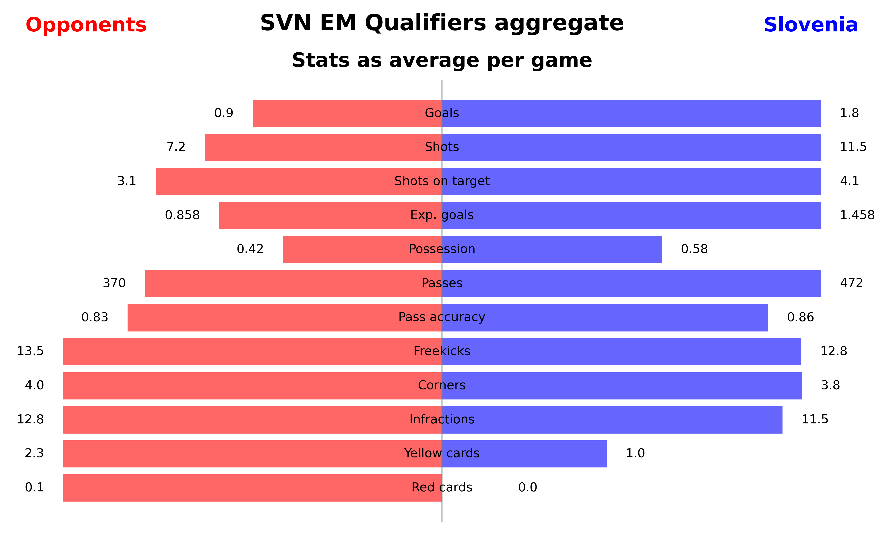
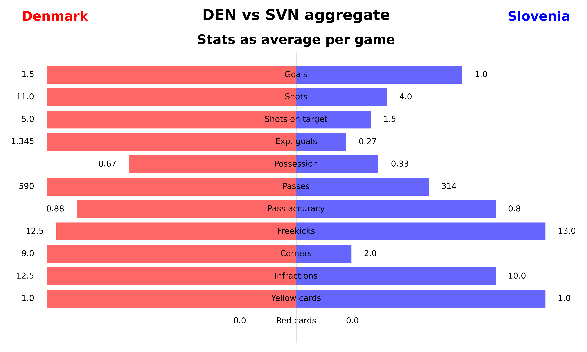
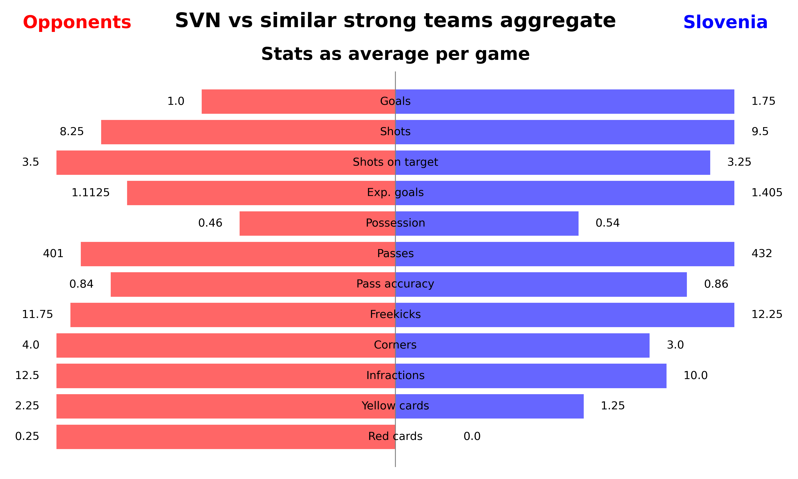
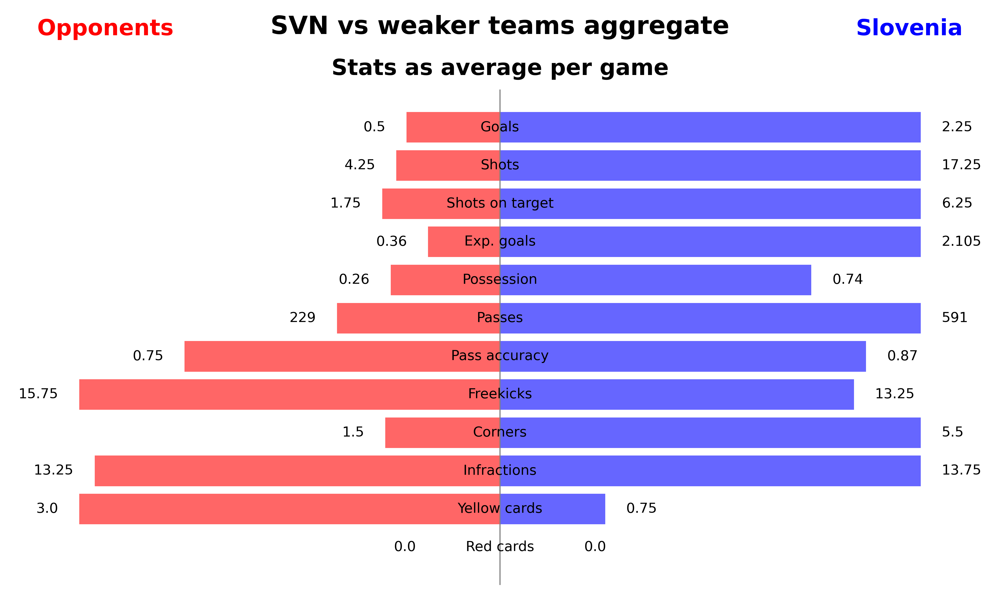


We proceed by analyzing key statistics from Slovenia’s European Championship (EM) Qualifiers through four aggregate plots that reveal the average stats per game. These plots cover total stats across all ten qualifiers, a direct comparison with Denmark in two matches, a summary of four games against teams of similar strength (Finland and Northern Ireland), and another summary against weaker teams (San Marino and Kazakhstan).

Strength is measured by the relative position in the FIFA Men’s World Ranking compared to Slovenia (SVN). Denmark is considered a stronger team than Slovenia.

The statistics reveal a clear pattern in game performance based on the strength of the opponent.

**Against weaker teams**, Slovenia dominated the matches, evident by:
- **74% possession**
- **Almost 600 passes**
- **More than 2 goals per game**, aligning with expected goals (opponents averaged 0.5 goals)
- **Over 6 shots on target per game**
- **17 total shots**, with opponents averaging 1.75 shots on target and 4.25 total shots

**Against similarly strong teams**, the pattern shifted with less dominance:
- **54% possession**
- **430 passes**
- **Chances created were similar to opponents**, with Slovenia averaging 3.25 shots on target and 9.5 total shots (oponent 3.5 and 8.25 respectively)
- Despite this, Slovenia won most games, likely due to higher efficiency in goal-scoring (1.75 goals per game vs. opponents' 1.0 goals)

**Against stronger teams like Denmark**, the pattern changed significantly:
- **33% possession**
- **300 passes**
- Slovenia created few chances, averaging **1.5 shots on target and 4 total shots**, compared to Denmark's 5 shots on target and 11 total shots
- Despite Denmark's control, Slovenia managed to keep the games close, scoring an average of **1 goal per game**, resulting in a 2:1 loss and a 1:1 draw. This outcome might be attributed to some luck, as Slovenia's expected goals were only 0.27.

This analysis demonstrates that Slovenia’s game statistics varied notably based on the strength of their opponents, reflecting their adaptability and strategic adjustments in different competitive contexts.


<details>
  <summary> code </summary>

```python
# Code for the SVN total aggregate (Remaining plots can be generated by adjusting the IDs)

match_ids = ['5414324', '5414302', '5414284', '5414260', '5414226', '5414180', '5414103', '5414128', '5414156', '5414203']
opponent_names = ['Denmark', 'San Marino', 'Northern Ireland', 'Finland', 'Kazakhstan']

team2 = 'Opponents'
team1 = 'Slovenia'
subtitle='Stats as average per game'
title = 'SVN EM Qualifiers aggregate'

for i in range(len(match_ids)):
    match_id = match_ids[i]
    if i == 0:
        df_events = pd.read_csv(f"./results/wyscout/{match_id}_df_events.csv", index_col=0)
    else:
        df_events = pd.concat([df_events, pd.read_csv(f"./results/wyscout/{match_id}_df_events.csv", index_col=0)])

# replace opponent names with 'Opponent'
df_events['team.name'] = df_events['team.name'].replace(opponent_names, team2)

team_type_counts = df_events.groupby(['team.name', 'type.primary']).size().unstack(fill_value=0)
shots_team2 = df_events[(~df_events["shot.isGoal"].isnull()) & (df_events["team.name"] == team2)]
shots_team1 = df_events[(~df_events["shot.isGoal"].isnull()) & (df_events["team.name"] == team1)]
passes_completed = df_events[df_events["type.primary"] == "pass"].groupby(['team.name'])['pass.accurate'].sum()
possession = df_events.groupby("team.name")["possession.duration"].sum() / df_events["possession.duration"].sum()
num_matches = len(match_ids)

team2_data = {'Goals': 0 if shots_team2['shot.isGoal'].sum() == False else shots_team2['shot.isGoal'].sum() / num_matches,
            'Shots': shots_team2.shape[0] / num_matches,
            'Shots on target':0 if shots_team2['shot.onTarget'].sum() == False else shots_team2['shot.onTarget'].sum( ) / num_matches,
            'Exp. goals': shots_team2['shot.xg'].sum().round(2) / num_matches,
            'Possession': (possession.loc[team2]).round(2), # in percent
            'Passes': int(team_type_counts.loc[team2, 'pass'] / num_matches),
            'Pass accuracy': (passes_completed.loc[team2] / team_type_counts.loc[team2, 'pass']).round(2),
            'Freekicks': team_type_counts.loc[team2, 'free_kick'] / num_matches,
            'Corners': team_type_counts.loc[team2, 'corner'] / num_matches,
            'Infractions': team_type_counts.loc[team2, 'infraction'] / num_matches,
            'Yellow cards': df_events[(df_events["team.name"] == team2) & (df_events["infraction.yellowCard"] == True)].shape[0] / num_matches,
            'Red cards': df_events[(df_events["team.name"] == team2) & (df_events["infraction.redCard"] == True)].shape[0] / num_matches,
            }

team1_data = {'Goals': shots_team1['shot.isGoal'].sum() / num_matches,
            'Shots': shots_team1.shape[0] / num_matches,
            'Shots on target': shots_team1['shot.onTarget'].sum() / num_matches,
            'Exp. goals': shots_team1['shot.xg'].sum().round(2) / num_matches,
            'Possession': (possession.loc[team1]).round(2), # in percent
            'Passes': int(team_type_counts.loc[team1, 'pass'] / num_matches),
            'Pass accuracy': (passes_completed.loc[team1] / team_type_counts.loc[team1, 'pass']).round(2),
            'Freekicks': team_type_counts.loc[team1, 'free_kick'] / num_matches,
            'Corners': team_type_counts.loc[team1, 'corner'] / num_matches,
            'Infractions': team_type_counts.loc[team1, 'infraction'] / num_matches,
            'Yellow cards': df_events[(df_events["team.name"] == team1) & (df_events["infraction.yellowCard"] == True)].shape[0] / num_matches,
            'Red cards': df_events[(df_events["team.name"] == team1) & (df_events["infraction.redCard"] == True)].shape[0] / num_matches,
            }

# if category % do not normalize
perc_categories = ['Possession', 'Pass accuracy']

def normalize_value(key, value, compare_value, perc_categories=None):
    """ Normalize or pass the value through based on category """
    if key not in perc_categories and max(value, compare_value) >= 0.001:
        return value / max(value, compare_value)
    return value


def add_value_labels(ax, values, labels, y_pos, is_left=True):
    """ Add value labels to the bars """
    for i, (value, label) in enumerate(zip(values, labels)):
        if is_left:
            ax.text(min(value - 0.05, -0.2), y_pos[i], str(label),
                    va='center', ha='right', color='black', fontsize=10)
        else:
            ax.text(max(value + 0.05, 0.2), y_pos[i], str(label),
                    va='center', ha='left', color='black', fontsize=10)


def plot_stats_barchart(team1_stats, team2_stats, team1_name=None, team2_name=None, perc_categories=None, title="", subtitle="",
                        team1_color='red', team2_color='blue', saveplt=False, savepath=None):
    """ Display a bar chart comparing the match statistics between two teams"""

    # Normalizing values within each category between the teams, except for percentage categories
    normalized_dnk_data = {key: normalize_value(
        key, value, team2_stats[key], perc_categories) for key, value in team1_stats.items()}
    normalized_svn_data = {key: normalize_value(
        key, value, team1_stats[key], perc_categories) for key, value in team2_stats.items()}
    team_1_values = list(normalized_dnk_data.values())[::-1]
    team_2_values = list(normalized_svn_data.values())[::-1]

    # Original values for displaying at the end of bars
    original_team_1_values = list(team1_stats.values())[::-1]
    original_team_2_values = list(team2_stats.values())[::-1]

    # Categories for the y-axis
    categories = list(team1_stats.keys())[::-1]

    # The y position for the bars
    y_pos = np.arange(len(categories))

    # Create the figure and the axes
    fig, ax = plt.subplots(figsize=(10, len(categories) * 0.5))
    fig.patch.set_facecolor('white')

    # Draw bars for team 1 and team 2

    # Fix for bar centering issue
    if 1.0 not in team_1_values:
        hval_idx = np.argmax(np.asarray(original_team_1_values))
        team_1_values[hval_idx] = 1.0
    if 1.0 not in team_2_values:
        hval_idx = np.argmax(np.asarray(original_team_2_values))
        team_2_values[hval_idx] = 1.0
        
    ax.barh(y_pos, team_1_values, color=team1_color, alpha=0.6)
    ax.barh(y_pos, [-value for value in team_2_values],
            color=team2_color, alpha=0.6)

    # Add data labels inside the bars (categories)
    for y, category in zip(y_pos, categories):
        ax.text(0, y, category, va='center',
                ha='center', color='black', fontsize=10)

    # Add value labels to the bars (team values)
    add_value_labels(ax, team_1_values, original_team_1_values,
                     y_pos, is_left=False)
    add_value_labels(ax, [-v for v in team_2_values],
                     original_team_2_values, y_pos, is_left=True)

    ax.text(1, 1.1, team1_name, transform=ax.transAxes, ha='right',
            va='bottom', color=team1_color, fontsize=16, fontweight='bold')
    ax.text(0, 1.1, team2_name, transform=ax.transAxes, ha='left',
            va='bottom', color=team2_color, fontsize=16, fontweight='bold')

    # Set the labels and title (if needed)
    ax.set_title(f"{title}", fontsize=18, fontweight='bold', pad=40)
    ax.text(0.5, 1.02, f"{subtitle}", fontsize=16, fontweight='bold',
            ha='center', va='bottom', transform=ax.transAxes)

    # Remove the spines and ticks, and add gridlines
    ax.spines['top'].set_visible(False)
    ax.spines['right'].set_visible(False)
    ax.spines['left'].set_visible(False)
    ax.spines['bottom'].set_visible(False)
    ax.xaxis.set_ticks_position('none')
    ax.yaxis.set_ticks_position('none')
    ax.yaxis.set_visible(False)
    ax.xaxis.set_visible(False)
    plt.axvline(0, color='grey', linewidth=0.8)
    ax.xaxis.grid(False)
    ax.legend().set_visible(False)

    plt.tight_layout()

    if saveplt is True and savepath is not None:
        plt.savefig(savepath, dpi=400)

    plt.show()

# plot statistics
plot_stats_barchart(team1_data, team2_data, team1_name=team1, team2_name=team2, perc_categories=perc_categories, title=title, 
                    subtitle=subtitle, team1_color='blue', team2_color='red', saveplt=True, savepath=f'plots/2-statistics/key_statistics_SVN_agg.png')
```

</details>

## 3. In possesion - attack of Slovenia


### 3.1 Attacking style:

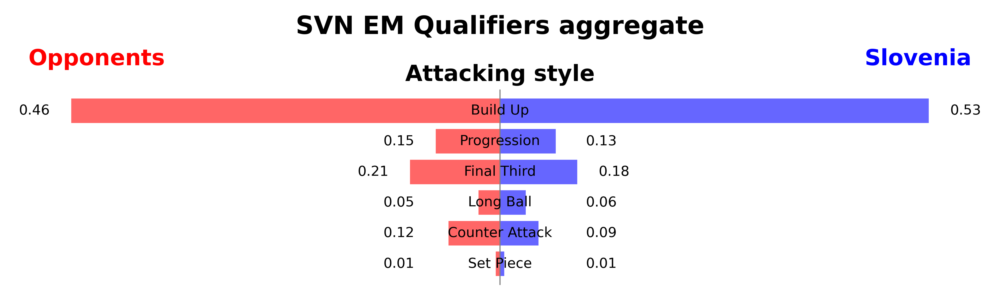
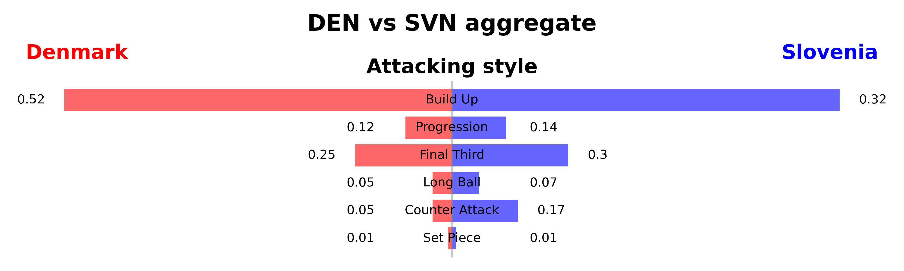
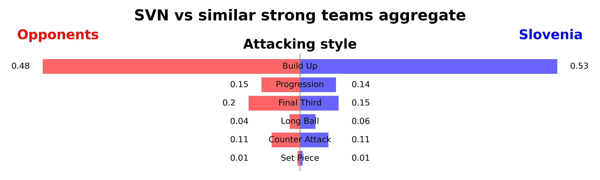
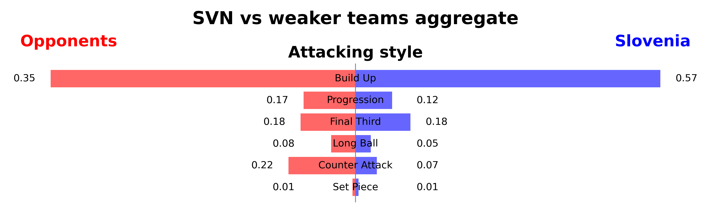

A look at the statistics on attacking style quickly shows that Slovenia has a very varied attacking game. 53% of all attacks are preceded by a build-up phase, the rest are long switching actions, counter-attacks or long balls to the top to outplay the opponent. The direct comparison with group opponents Denmark is striking. The Slovenians are forced to play high balls due to their high pressing and the tall Danes. This speaks against their ability to play under pressure.

The Slovenians are also worse than their opponents at moving the ball in attack. Especially against weaker teams, the Slovenians seem to have difficulties penetrating the final third. Denmark must be prepared for a Slovenia that does not make the play but often relies on counter-attacks. Against teams of equal strength, there is a good balance between build-up phases and counter-attacks compared to their opponents. In any case, a team that wants to and can play long balls, especially from the two central defenders.

Slovenia's approach to attacking was markedly different from Denmark's, particularly in their avoidance of prolonged build-up plays. Instead, Slovenia's offensive strategy was predominantly characterized by quick counter-attacks and the utilization of long balls to advance up the field swiftly when in possession.


<details>
  <summary> code </summary>
  
  ```python
# Code for the SVN total aggregate (Remaining plots can be generated by adjusting the IDs)
# plot_stats_barchart function used from section 2.2

match_ids = ['5414324', '5414302', '5414284', '5414260', '5414226', '5414180', '5414103', '5414128', '5414156', '5414203']
opponent_names = ['Denmark', 'San Marino', 'Northern Ireland', 'Finland', 'Kazakhstan']

team2_name = 'Opponents'
team1_name = 'Slovenia'
subtitle='Stats as average per game'
title = 'SVN EM Qualifiers aggregate'

for i in range(len(match_ids)):
    match_id = match_ids[i]
    if i == 0:
        df_events = pd.read_csv(f"./results/wyscout/{match_id}_df_events.csv", index_col=0)
    else:
        df_events = pd.concat([df_events, pd.read_csv(f"./results/wyscout/{match_id}_df_events.csv", index_col=0)])

# replace opponent names with 'Opponent'
df_events['team.name'] = df_events['team.name'].replace(opponent_names, team2_name)
df_events['possession.team.name'] = df_events['possession.team.name'].replace(opponent_names, team2_name)

# Parameters for the analysis
final_third_start = 66.6
counter_attack_time_max = 15
progression_time_max = 20
build_up_time_min = 20
long_ball_min_length = 30
min_event_duration = 3

# Min requirement for attacking events: should be atleast 3s, and end in opposition third
df_events_att = df_events[(df_events['possession.duration'] >= min_event_duration) & \
                            (df_events['possession.endLocation.x'] > final_third_start)].copy()


def categorize_event(row):
    if row['possession.duration'] < min_event_duration:
        return 'too_short'
    if row['type.primary'] in ['free_kick', 'corner', 'penalty'] and row['possession.startLocation.x'] > 50:
        return 'set_piece'
    elif row['type.primary'] == 'pass' and row['pass.length'] > long_ball_min_length and row['possession.startLocation.x'] < 50:
        return 'long_ball'
    elif row['possession.startLocation.x'] < 50 and row['possession.endLocation.x'] > final_third_start and row['possession.duration'] < counter_attack_time_max:
        return 'counter_attack'
    elif row['possession.startLocation.x'] < final_third_start and row['possession.endLocation.x'] > final_third_start and row['possession.duration'] < progression_time_max:
        return 'progression'
    elif row['possession.startLocation.x'] < final_third_start and row['possession.duration'] >= build_up_time_min:
        return 'build_up'
    elif row['possession.endLocation.x'] > final_third_start and row['possession.startLocation.x'] > final_third_start:
        return 'final_third_play'
    else:
        return 'other'

# Apply function to each row/event
df_events_att['category'] = df_events_att.apply(categorize_event, axis=1)

# Group by team and category
team_category_counts = df_events_att.groupby(['possession.team.name', 'category']).size().unstack(fill_value=0)

# Calculate the percentages for each category by team
team_category_perc = (team_category_counts.div(team_category_counts.sum(axis=1), axis=0)).round(2)

team2_data = {'Build Up': team_category_perc.loc[team2_name, 'build_up'].round(2),
            'Progression': team_category_perc.loc[team2_name, 'progression'].round(2),
            'Final Third': team_category_perc.loc[team2_name, 'final_third_play'].round(2),
            'Long Ball': team_category_perc.loc[team2_name, 'long_ball'],
            'Counter Attack': team_category_perc.loc[team2_name, 'counter_attack'],
            'Set Piece': team_category_perc.loc[team2_name, 'set_piece'],
}

team1_data = {'Build Up': team_category_perc.loc[team1_name, 'build_up'],
            'Progression': team_category_perc.loc[team1_name, 'progression'],
            'Final Third': team_category_perc.loc[team1_name, 'final_third_play'],
            'Long Ball': team_category_perc.loc[team1_name, 'long_ball'],
            'Counter Attack': team_category_perc.loc[team1_name, 'counter_attack'],
            'Set Piece': team_category_perc.loc[team1_name, 'set_piece'],
}

# if category % do not normalize
perc_categories = ['Build Up', 'Progression', 'Final Third', 'Long Ball', 'Counter Attack', 'Set Piece']

plot_stats_barchart(team1_data, team2_data, team1_name=team1_name, team2_name=team2_name, perc_categories=perc_categories, title=title, 
                    subtitle='Attacking style', team1_color='blue', team2_color='red', saveplt=True, savepath=f'plots/3-attack/attacking_style_SVN_agg.png')
```
</details>


### 3.2 Attacking efficiency

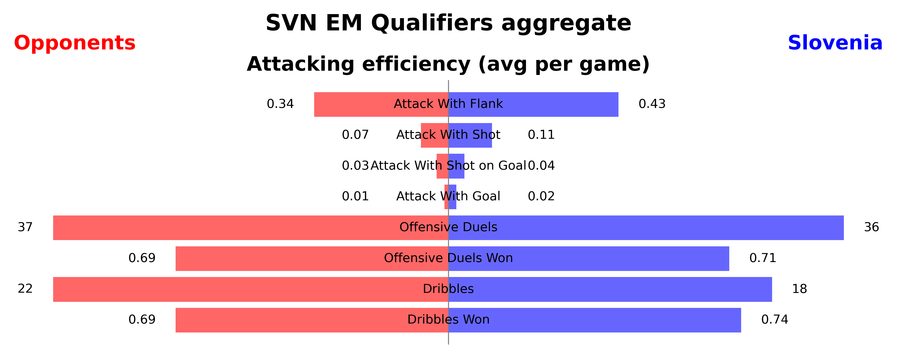
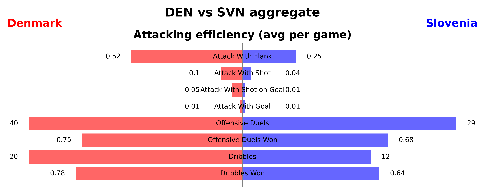
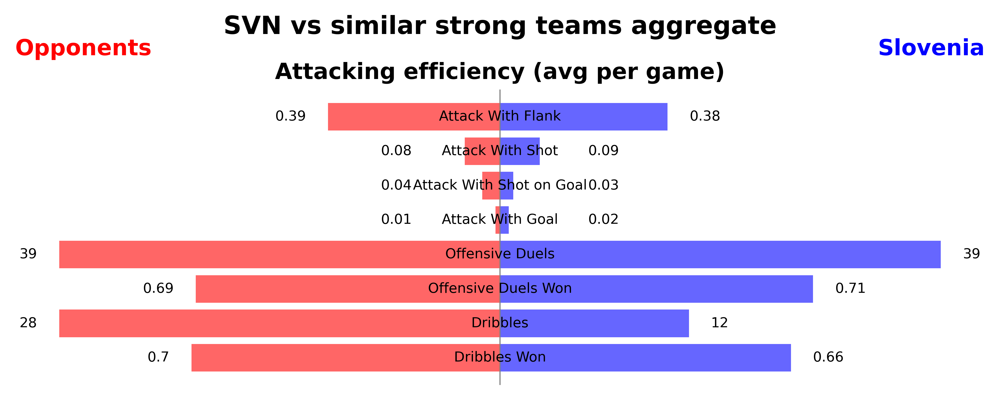
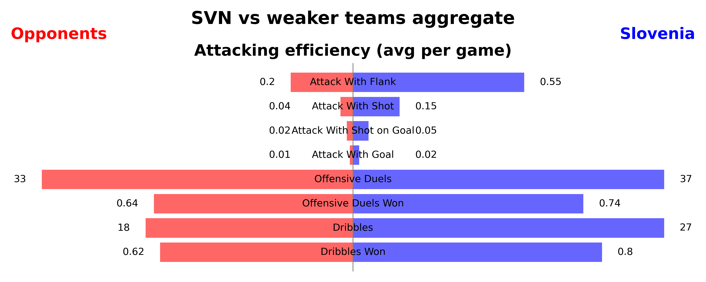


On average, the Slovenians attack more from the flanks than their opponents in the European Championship qualifiers, which can be attributed to the height of the double strikers Sesko (1.95 m), Sporar (1.86 m) and Vipotnik (1.85 m). This is also reflected in the dribbling statistics, in which Slovenia performs below average. No strong dribbling forwards. The Slovenians also win more offensive duels on average due to the great physicality and tackling strength of their strikers. Slovenia is also a team that is not afraid to shoot, albeit with average efficiency. 

For the direct comparison with Denmark, the effectiveness of Slovenia's attacking maneuvers was notably lacking. A mere 1% of their attacking efforts resulted in a shot, with none of these attempts being on target. The sole goal they managed to score originated from a free kick taken approximately 35 meters from the goal. Additionally, Slovenia's performance in offensive duels and dribbling was significantly inferior to that of Denmark, further highlighting the inefficacies in their attacking play.


<details>
  <summary> code </summary>

```python
# Code for the SVN total aggregate (Remaining plots can be generated by adjusting the IDs)
# plot_stats_barchart function used from section 2.2

match_ids = ['5414324', '5414302', '5414284', '5414260', '5414226', '5414180', '5414103', '5414128', '5414156', '5414203']
opponent_names = ['Denmark', 'San Marino', 'Northern Ireland', 'Finland', 'Kazakhstan']

team2_name = 'Opponents'
team1_name = 'Slovenia'
subtitle='Stats as average per game'
title = 'SVN EM Qualifiers aggregate'

for i in range(len(match_ids)):
    match_id = match_ids[i]
    if i == 0:
        df_events = pd.read_csv(f"./results/wyscout/{match_id}_df_events.csv", index_col=0)
    else:
        df_events = pd.concat([df_events, pd.read_csv(f"./results/wyscout/{match_id}_df_events.csv", index_col=0)])

# replace opponent names with 'Opponent'
df_events['team.name'] = df_events['team.name'].replace(opponent_names, team2_name)
df_events['possession.team.name'] = df_events['possession.team.name'].replace(opponent_names, team2_name)

def calculate_attacking_efficiency(team_name, num_matches=1):

    team_events = df_events[df_events["possession.team.name"] == team_name]

    # Attacks
    with_flank = team_events[(~team_events["possession.attack.flank"].isna())]['possession.id'].nunique()
    with_shot = team_events[(team_events["possession.attack.withShot"] == True)]['possession.id'].nunique()
    with_shot_on_target = team_events[(team_events["possession.attack.withShotOnGoal"] == True)]['possession.id'].nunique()
    with_goal = team_events[(team_events["possession.attack.withGoal"] == True)]['possession.id'].nunique()
    total_events = team_events["possession.id"].nunique()

    # Offensive Duels and Dribbles
    offensive_duels = team_events[(team_events["groundDuel.duelType"] == "offensive_duel")]
    offensive_duels_won = offensive_duels[offensive_duels["groundDuel.keptPossession"] == True]
    
    dribbles = team_events[(team_events["groundDuel.duelType"] == "dribble")]
    dribbles_won = dribbles[dribbles["groundDuel.keptPossession"] == True]
    

    
    return {
        'Attack With Flank': round(with_flank / total_events, 2) ,
        'Attack With Shot': round(with_shot / total_events, 2),
        'Attack With Shot on Goal': round(with_shot_on_target / total_events, 2),
        'Attack With Goal': round(with_goal / total_events, 2),
        'Offensive Duels': int(round(offensive_duels.shape[0], 2) / num_matches),
        'Offensive Duels Won': round(offensive_duels_won.shape[0] / offensive_duels.shape[0], 2),
        'Dribbles': int(round(dribbles.shape[0], 2) / num_matches),
        'Dribbles Won': round(dribbles_won.shape[0] / dribbles.shape[0], 2),
    }

team2_data = calculate_attacking_efficiency(team2_name, num_matches=len(match_ids))
team1_data = calculate_attacking_efficiency(team1_name, num_matches=len(match_ids))

perc_categories = ["Attack With Flank", "Attack With Shot", "Attack With Shot on Goal", "Attack With Goal", "Offensive Duels Won", "Dribbles Won"]

plot_stats_barchart(team1_data, team2_data, team1_name=team1_name, team2_name=team2_name, perc_categories=perc_categories, title=title,
                    subtitle='Attacking efficiency (avg per game)', team1_color='blue', team2_color='red', saveplt=True, savepath=f'plots/3-attack/attacking_efficiency_SVN_agg.png')

```
</details>


### 3.3 Passing network & Player Heatmap

### Passing network

Pass network plots are read as follows. The more passes a player has played, the larger his circle is. The position of the circle was determined based on the average position of all passes played by a player.  

A quick look at all the pitches gives us some insights into the Slovenian attacking game. Cerin is clearly a key player. Especially in the game against San Marino, he played the central midfield role. As he is a good attacking and defensive midfielder, he can play both roles, making him a perfect 4-4-2 player. His circle makes him the pivot between defense and attack.

It is striking how closely the full-backs and wingers play together. The duo of Stojanovic and Karnicnik in particular are inseparable. When both are playing, they play an important role in the passing network. Karnicnik in particular distributes a conspicuous number of passes as a full-back. Purely in terms of the passes, they often play via this side, where Karnicnik is positioned. Bijol and Blazic, the central defenders, remain true to their chain and build up play from the back. It is also noticeable that they both look for the flanks rather than playing the pass into the middle. This can be seen in the link-up line.

A glance at the two forwards shows that they are not involved in the passing game to any great extent. 


|Kazakhstan|Denmark|N_Ireland|
|---|---|---|
||||

|Finland|San_Marino|Denmark_2|
|---|---|---|
||||

<details>
  <summary> code </summary>

``` python
import pandas as pd
import numpy as np
from mplsoccer import VerticalPitch

import warnings
warnings.filterwarnings("ignore")

pitch_length = 120
pitch_width = 80


def plot_network(name_other_team, path, links):

    data = pd.read_csv(f"./results/wyscout/{path}_df_events.csv")

    data = data[['location.x', 'location.y', 'pass.endLocation.x', 'pass.endLocation.y', "player.name", "pass.recipient.name","team.name","minute",'player.id']]

    df_merged = data.rename(columns={
    'location.x':'x',
    'location.y':'y',
    'pass.endLocation.x':'end_x',
    'pass.endLocation.y':'end_y',
    "player.name":"player_name",
    "pass.recipient.name":"pass_recipient_name",
    "team.name":"team_name",
    "minute":"minute",
    "player.id":'player_id'
    })


    df_home_pass = df_merged[df_merged.team_name == 'Slovenia']

    # Check player play time
    home_player_df = df_merged[df_merged.team_name == 'Slovenia'].groupby('player_name').agg({'minute': [min, max]}).reset_index()
    home_player_df = pd.concat([home_player_df['player_name'], home_player_df['minute']], axis=1)
    home_player_df['minutes_played'] = home_player_df['max'] - home_player_df['min']
    home_player_df = home_player_df.sort_values('minutes_played', ascending=False)

    home_player_name = home_player_df.player_name[:11].tolist()
    df_home_pass = df_home_pass[df_home_pass.player_name.isin(home_player_name)]
    df_home_pass = df_home_pass[df_home_pass.pass_recipient_name.isin(home_player_name)]

    scatter_df = pd.DataFrame()
    for i, name in enumerate(df_home_pass["player_name"].unique()):
        passx = df_home_pass.loc[df_home_pass["player_name"] == name]["x"].to_numpy()
        recx = df_home_pass.loc[df_home_pass["pass_recipient_name"] == name]["end_x"].to_numpy()
        passy = df_home_pass.loc[df_home_pass["player_name"] == name]["y"].to_numpy()
        recy = df_home_pass.loc[df_home_pass["pass_recipient_name"] == name]["end_y"].to_numpy()
        scatter_df.at[i, "player_name"] = name

        #make sure that x and y location for each circle representing the player is the average of passes and receptions
        scatter_df.at[i, "x"] = np.mean(np.concatenate([passx, recx]))
        scatter_df.at[i, "y"] = np.mean(np.concatenate([passy, recy]))

        #calculate number of passes
        scatter_df.at[i, "no"] = df_home_pass.loc[df_home_pass["player_name"] == name].count().iloc[0]
        
    #adjust the size of a circle so that the player who made more passes
    scatter_df['marker_size'] = (scatter_df['no'] / scatter_df['no'].max() * 900)

    #Calculate edge width
    df_home_pass["pair_key"] = df_home_pass.apply(lambda x: "_".join(sorted([x["player_name"], x["pass_recipient_name"]])), axis=1)
    lines_df = df_home_pass.groupby(["pair_key"]).x.count().reset_index()
    lines_df.rename({'x':'pass_count'}, axis='columns', inplace=True)
    #setting a treshold
    lines_df = lines_df[lines_df['pass_count']> 0]


    import matplotlib.pyplot as plt
    pitch = VerticalPitch(pitch_color='grass', line_color='white', stripe=True)

    fig, ax = pitch.draw()

    pitch.scatter(scatter_df.x / 100 * pitch_length, scatter_df.y / 100 * pitch_width, s=scatter_df.marker_size, color='#272822', edgecolors='#EDBB00', linewidth=3, alpha=1, ax=ax, zorder = 3)

    for i, row in scatter_df.iterrows():
        pitch.annotate(row.player_name, xy=(row.x/100 * pitch_length +6, row.y/100 * pitch_width), c='white', va='center',
                    ha='center', size=6, weight = "bold", ax=ax, zorder = 4, 
                    bbox=dict(facecolor='#272822', alpha=1, edgecolor='#272822', boxstyle='round,pad=0.4'))
    

    for i, row in lines_df.iterrows():
            player1 = row["pair_key"].split("_")[0]
            player2 = row['pair_key'].split("_")[1]
            #take the average location of players to plot a line between them
            player1_x = scatter_df.loc[scatter_df["player_name"] == player1]['x'] / 100 * pitch_length
            player1_y = scatter_df.loc[scatter_df["player_name"] == player1]['y'] / 100 * pitch_width
            player2_x = scatter_df.loc[scatter_df["player_name"] == player2]['x'] / 100 * pitch_length
            player2_y = scatter_df.loc[scatter_df["player_name"] == player2]['y'] / 100 * pitch_width
            num_passes = row["pass_count"]
            #adjust the line width so that the more passes, the wider the line
            line_width = (num_passes / lines_df['pass_count'].max() * 8)
            # adjust the alpha of the lines based on number of passes and set minimum alpha for a fewer pass
            alpha = 0.5 * num_passes / lines_df['pass_count'].max() + 0.5
            #plot lines on the pitch
            pitch.lines(player1_x, player1_y, player2_x, player2_y,
                            alpha=alpha, lw=line_width, zorder=2, color="#EDBB00", ax = ax)

    plt.savefig(f'plots/3-network/passing_network_{name_other_team}.png', dpi=600,bbox_inches='tight')


    links += f"|"
    #plt.show()

    return links


data = [("Kazakhstan", "5414324"),("Denmark", "5414302"),("N_Ireland", "5414284")]
data2 = [("Finland", "5414260"),("San_Marino", "5414226"),("Denmark_2","5414180")]

head = "|"
second = "|"
links = "|"
for against, match_id in data:
    head += f"{against}|"
    second += "---|"
    links = plot_network(against, match_id, links)

print(head)
print(second)
print(links)

head = "|"
second = "|"
links = "|"
for against, match_id in data2:
    head += f"{against}|"
    second += "---|"
    links = plot_network(against, match_id, links)

print(head)
print(second)
print(links)
```
</details>

### Centrality metrics

Analyzing the provided data reveals some insights into the passes dynamics of Slovenian players across different matches. Let's delve into each centrality metric and glean more detail

#### Definitions

In graph analysis, several metrics are used to measure the importance or centrality of nodes within a network. Here's a brief explanation of each metric:

Degree Centrality: It measures the number of connections a node has. Nodes with a higher degree centrality are considered more central within the network as they have more connections.

Betweenness Centrality: It quantifies the number of times a node acts as a bridge along the shortest path between two other nodes. Nodes with high betweenness centrality have significant influence over the flow of information in the network.

Closeness Centrality: It measures how close a node is to all other nodes in the network. Nodes with high closeness centrality are able to quickly interact with other nodes in the network.

Eigenvector Centrality: It assigns relative scores to all nodes in the network based on the concept that connections to high-scoring nodes contribute more to the score of the node in question. It's similar to Google's PageRank algorithm.

PageRank Centrality: It measures the importance of a node based on the number and quality of links to it. It assigns a numerical weighting to each element of a hyperlinked set of documents, such as the World Wide Web, with the purpose of "measuring" its relative importance within the set.


#### Degree Centrality

Across various opponents, including Kazakhstan, Denmark, and Northern Ireland, players like T. Elšnik, P. Stojanović, A. Čerin and J. Bijol consistently emerge as top performers. This suggests they maintain a high number of connections within the team's gameplay structure, likely reflecting their engagement in scoring goals or facilitating plays.

|Degree Centrality|Top 3|
|---|---|
|Against: Kazakhstan | ['T. Elšnik: 1.5000', 'P. Stojanović: 1.4286', 'J. Bijol: 1.3571']|
|Against: Denmark | ['T. Elšnik: 1.5000', 'P. Stojanović: 1.4286', 'J. Bijol: 1.3571']|
|Against: N_Ireland | ['A. Čerin: 1.6923', 'J. Bijol: 1.6923', 'B. Šeško: 1.6154']|
|Against: Finland | ['E. Janža: 1.4286', 'A. Čerin: 1.4286', 'T. Elšnik: 1.4286']|
|Against: San_Marino | ['A. Čerin: 1.8000', 'S. Lovrič: 1.6667', 'Ž. Karničnik: 1.6000']|
|Against: Denmark_2 | ['P. Stojanović: 1.8000', 'Ž. Karničnik: 1.7000', 'J. Bijol: 1.6000']|

#### Betweenness Centrality

Once again, players such as B. Šeško, A. Čerin, M. Blažič, T. Elšnik, and J. Bijol demonstrate significant influence as bridging nodes between other players during matches. Their strategic positioning and ability to link various parts of the team's gameplay contribute crucially to the overall flow and effectiveness of tactics.

|Betweenness Centrality|Top 3|
|---|---|
|Against: Kazakhstan | ['M. Blažič: 0.0779', 'S. Lovrič: 0.0659', 'T. Elšnik: 0.0486']|
|Against: Denmark | ['M. Blažič: 0.0779', 'Ž. Karničnik: 0.0659', 'T. Elšnik: 0.0486']|
|Against: N_Ireland | ['B. Šeško: 0.0911', 'A. Čerin: 0.0911', 'J. Bijol: 0.0824']|
|Against: Finland | ['E. Janža: 0.1679', 'A. Čerin: 0.1290', 'T. Elšnik: 0.0883']|
|Against: San_Marino | ['A. Čerin: 0.0857', 'J. Bijol: 0.0853', 'S. Lovrič: 0.0639']|
|Against: Denmark_2 | ['D. Brekalo: 0.0620', 'J. Mlakar: 0.0572', 'J. Bijol: 0.0485']|


#### Closeness Centrality

While the top performers vary more across different opponents in this metric, players like T. Elšnik, A. Čerin, B. Šeško, and J. Bijol consistently show high closeness centrality. This suggests their adeptness at quickly engaging with teammates on the field, indicating strong strategic positioning and communication skills.

|Closeness Centrality|Top 3|
|---|---|
|Against: Kazakhstan | ['T. Elšnik: 0.7912', 'J. Bijol: 0.7347', 'B. Šeško: 0.7347']|
|Against: Denmark | ['T. Elšnik: 0.7912', 'J. Bijol: 0.7347', 'B. Šeško: 0.7347']|
|Against: N_Ireland | ['A. Čerin: 0.9286', 'B. Šeško: 0.9286', 'J. Bijol: 0.8125']|
|Against: Finland | ['E. Janža: 0.7778', 'Ž. Karničnik: 0.7368', 'M. Blažič: 0.7368']|
|Against: San_Marino | ['A. Čerin: 0.9375', 'J. Bijol: 0.8824', 'S. Lovrič: 0.8824']|
|Against: Denmark_2 | ['J. Bijol: 0.9091', 'D. Brekalo: 0.8333', 'Ž. Karničnik: 0.8333']|

### Eigenvector Centrality 

Alongside degree centrality, this metric underscores the significance of players like B. Šeško, T. Elšnik, P. Stojanović, and A. Čerin, who not only maintain numerous connections but also have ties to other highly connected players. Their pivotal role in the team's gameplay and overall strategy is emphasized by their high eigenvector centrality scores.

|Eigenvector Centrality|Top 3|
|---|---|
|Against: Kazakhstan | ['B. Šeško: 0.3662', 'T. Elšnik: 0.3612', 'P. Stojanović: 0.3549']|
|Against: Denmark | ['B. Šeško: 0.3662', 'T. Elšnik: 0.3612', 'P. Stojanović: 0.3549']|
|Against: N_Ireland | ['A. Čerin: 0.3520', 'B. Šeško: 0.3489', 'M. Blažič: 0.3063']|
|Against: Finland | ['A. Čerin: 0.3436', 'T. Elšnik: 0.3287', 'A. Šporar: 0.3237']|
|Against: San_Marino | ['A. Čerin: 0.3396', 'S. Lovrič: 0.3310', 'J. Bijol: 0.3215']|
|Against: Denmark_2 | ['J. Bijol: 0.3629', 'P. Stojanović: 0.3620', 'Ž. Karničnik: 0.3362']|

#### PageRank Centrality

Similar to other metrics, players such as J. Bijol, M. Blažič, and A. Čerin consistently rank high in terms of their importance within the team's performance against various opponents. Their contributions, whether in terms of scoring goals or orchestrating plays, significantly impact the team's success on the field.

|PageRank Centrality|Top 3|
|---|---|
|Against: Kazakhstan | ['M. Blažič: 0.1139', 'J. Bijol: 0.1113', 'P. Stojanović: 0.1023']|
|Against: Denmark | ['M. Blažič: 0.1139', 'J. Bijol: 0.1113', 'P. Stojanović: 0.1023']|
|Against: N_Ireland | ['J. Bijol: 0.1531', 'M. Blažič: 0.1464', 'A. Čerin: 0.1347']|
|Against: Finland | ['A. Čerin: 0.1102', 'E. Janža: 0.1058', 'Ž. Karničnik: 0.1035']|
|Against: San_Marino | ['A. Čerin: 0.1396', 'T. Elšnik: 0.1006', 'J. Bijol: 0.0988']|
|Against: Denmark_2 | ['Ž. Karničnik: 0.1330', 'D. Brekalo: 0.1239', 'P. Stojanović: 0.1215']|

Based on the provided data and focusing on players who seem important in the passing network, we can examine the top performers across the Degree Centrality, Betweenness Centrality, Closeness Centrality, Eigenvector Centrality, and PageRank Centrality metrics.

#### T. Elšnik

Elšnik consistently emerges as a key player in the passing network across various metrics. With high scores in degree centrality, betweenness centrality, closeness centrality, and eigenvector centrality, Elšnik's presence is pivotal in orchestrating passes and facilitating the team's offensive maneuvers. His ability to connect with teammates efficiently and act as a bridge between different parts of the team's gameplay makes him indispensable in driving the team's passing dynamics forward.

#### M. Blažič

Blažič demonstrates significant influence in the passing network, particularly evident in his high betweenness centrality and PageRank centrality scores. As a bridging node between other players and with a notable ranking in terms of importance within the team's performance, Blažič plays a crucial role in channeling the flow of passes and contributing to strategic plays.

#### B. Šeško

Šeško's involvement in the passing network is underscored by his high scores in degree centrality, betweenness centrality, and eigenvector centrality. His consistent presence among the top performers across different metrics highlights his integral role in maintaining connections and influencing the team's passing strategies. Šeško's ability to effectively link with teammates and contribute to the team's passing dynamics makes him a valuable asset on the field.

#### A. Čerin

Čerin emerges as the last central figure in the passing network, evident from his high scores in degree centrality, betweenness centrality, and closeness centrality. With his adeptness at quickly engaging with teammates and maintaining connections, Čerin plays a crucial role in facilitating passes and driving the team's offensive movements. His significance within the team's passing dynamics is further emphasized by his notable rankings in eigenvector centrality and PageRank centrality, highlighting his importance in the team's overall performance.


<details>
  <summary> code </summary>

``` python
import pandas as pd
import json
from IPython.display import display
import networkx as nx
import matplotlib.pyplot as plt
from mplsoccer import VerticalPitch, Pitch


def preprocess_team_pass_data(df_events, team_name):
    df_passes = df_events[df_events['type.primary'] == 'pass']
    df_accurate_passes = df_passes[df_passes['pass.accurate'] == True]
    ap_team = df_accurate_passes[df_accurate_passes['team.name'] == team_name]
    filtered_passes = ap_team[['player.name', 'pass.recipient.name', 'location.x', 'location.y']].copy()
    average_positions = ap_team.groupby('player.name').agg({'location.x': 'mean', 'location.y': 'mean'}).reset_index()
    return filtered_passes, average_positions

def create_weighted_graph(df):
    G = nx.DiGraph()
    unique_players = set(df['player.name'])
    unique_recipients = set(df['pass.recipient.name'])

    for index, row in df.iterrows():
        player = row['player.name']
        recipient = row['pass.recipient.name']

        if player is None or recipient is None:
            continue

        if player not in unique_recipients or recipient not in unique_players:
            continue

        if G.has_edge(player, recipient):
            G[player][recipient]['weight'] += 1
        else:
            G.add_edge(player, recipient, weight=1)

    return G

def calculate_top_players(G):
    centrality_measures = {
        "Degree Centrality": nx.degree_centrality(G),
        "Betweenness Centrality": nx.betweenness_centrality(G),
        "Closeness Centrality": nx.closeness_centrality(G),
        "Eigenvector Centrality": nx.eigenvector_centrality(G),
        "PageRank Centrality": nx.pagerank(G) 
    }

    top_players = {}
    # Loop through each centrality measure
    for measure, centrality in centrality_measures.items():
        sorted_centrality = sorted(centrality.items(), key=lambda x: x[1], reverse=True)
        top_players[measure] = [f"{player}: {centrality_value:.4f}" for player, centrality_value in sorted_centrality[:3]]

    return top_players


data = [("Kazakhstan", "5414324"),("Denmark", "5414324"),("N_Ireland", "5414284"),("Finland", "5414260"),("San_Marino", "5414226"),("Denmark_2","5414180")]

centrality_measures = {
        "Degree Centrality": [],
        "Betweenness Centrality": [],
        "Closeness Centrality": [],
        "Eigenvector Centrality": [],
        "PageRank Centrality": [],
    }


for against, match_id in data:
    #example usage
    df_events = pd.read_csv(f"./results/wyscout/{match_id}_df_events.csv")
    filtered_passes_g, average_positions_g = preprocess_team_pass_data(df_events, 'Slovenia')
    G = create_weighted_graph(filtered_passes_g)
    values = calculate_top_players(G)

    for val in values: 
        centrality_measures[val].append(f"Against: {against} --> " + str(values[val]))

for val in centrality_measures:
    print(f"### {val}")
    for line in centrality_measures[val]:
        print(line)

```
</details>

### Attacking Players Heatmap

In order to analyze Slovenian's attacking behavior, let's take a look at the Heatmaps of the attacking and midfield players. 


### San Marino vs. Slovenia

Slovenia had a lot of possession in the game against San Marino. The Slovenians were aware of this in advance and shaped their game accordingly. However, as Slovenia do not play for possession against better opponents, this game is not very representative. The two strikers Sporar and Vipotnik rarely dropped into midfield. There were very few changes of position or sides and generally very little movement from individual players compared to the rest of the game. Slovenia was rarely defensively oriented.


<div align="center">
  
  
</div>


<div align="center">
  </td>
  </td>
  </td>
  </td>
</div>

### Slovenia vs Finnland

The interplay between Sporar and Stojanovic is very exciting. It seems as if Sporar is dropping back into midfield and Stojanovic is virtually taking his place. But the exact opposite happened on the left. Sesko took over the left midfield position and Mlakar supported the left-back more than he was active offensively.

<div align="center">
  
  
</div>


<div align="center">
  
  
  
  
</div>

### Northern Island vs. Slovenia

It would appear that Northern Ireland had the full-backs in a strong position, which left Cerin and Elsnik at full-back. It's also not the first time that the outside midfielders have stayed on the sidelines and rarely looked to make their way into midfield.

<div align="center">
  
  
</div>


<div align="center">
    
    
    
    
</div>

### Denmark vs. Slovenia

From the passing Network from chapter 3.1 and the generated images there is a soft tendency that the attacking play is more developped on the right side, through Vipotnik and Verbic/Mlakar. Mlakar and Verbic kept changing their starting positions during the game. Only on the counterattacks do they act as offensive wingers and only then do they give the strikers the opportunity to move into the center. The outside midfielders are therefore very defensively prepared for this game and help out the full-backs.

It is also clear that Slovenian were mainly occupied with defending and Sesko and Vipotnik therefore received little support up front. Elsnik and Cerin took over the position of the typical number 8 and rarely dropped deep to the side and kept the center closed.


<div align="center">
  
  
</div>


<div align="center">
    
    
    
    
</div>

### Slovenia vs. Kazakhstan

A pattern that has now been seen several times (e.g. against San Marino): When Slovenia has more possession, the double spike is more focused on the center and less on the sides. This can also be seen on the heat maps against Kazakhstan. The outside midfielders are still mostly on the flanks. In this match, a large part of the game was played down the sides, which is why Elsnik and Cerin had little presence in midfield. 


<div align="center">
  
  
</div>


<div align="center">
    
    
    
    
</div>

### Slovenia vs. Denmark

This game is clearly characterized by an offensive side. Sesko and Sporar were both often on the right flank. This gave Mlakar the opportunity to act as a third striker, so to speak, and he often moved into the middle. As Mlakar played very offensively, Elsnik had to remain a central defensive midfielder and protect behind Mlakar. Cerin, on the other hand, was able to play more offensively. Cerin's heat map confirms the offensive efforts on the right. 

<div align="center">
  
  
</div>


<div align="center">
    
    
    
    
</div>


<details>
  <summary> code </summary>

#### Create an array with players you want to see

```python
  player = ['B. Šeško', 'J. Kurtič', 'Ž. Karničnik']
    for pl in player:
        df_player = df[df['player.name'] == pl]

    pitch = VerticalPitch(pitch_color='#2f8c58',
                          line_color='white',
                          pitch_type='wyscout')

    fig, ax = pitch.grid(grid_height=0.9, title_height=0.06, axis=False,
                         endnote_height=0.04, title_space=0, endnote_space=0)

    # Heatmap as Kernel Density Estimation
    pitch.kdeplot(
    x=df_player['location.x'],
    y=df_player['location.y'],
    shade = True,
    shade_lowest=False,
    alpha=.5,
    n_levels=10,
    cmap = 'coolwarm',
    ax=ax['pitch']
    )

    legend_elements = [Line2D([0], [0], color='w', markerfacecolor='k', marker='o', label=pl)]

    plt.legend(handles=legend_elements, loc='upper center', bbox_to_anchor=(0.5, 1), bbox_transform=plt.gcf().transFigure,
               handlelength=2, labelspacing=1.2, fontsize=10)

    def replace_dot_space_with_underscore(pl):
        return pl.replace(". ", "_")

    pl = replace_dot_space_with_underscore(pl)

    plt.savefig(f'plots/{pl}_Heatmaps.png', dpi=400)
    plt.show()
```

</details>

### 3.4 Typical tactical moves

#### 3.4.1 Long passes

No major patterns can be identified with the long passes. Most long balls are hit by the central defenders with a good success rate. It is interesting to see that in games where Slovenia are under pressure (e.g. Denmark, Northern Ireland), the long balls are often played from the sides, as Slovenia have lost their midfield dominance in these games. Against San Marino, they were much more present in midfield and also had the most possession.

In the direct comparison in the denmark game, the Slovenians' great strength lies in the long passes from their two central defenders. The long passes from the full-backs have a high error rate. Especially the right side. Slovenia often need this type of pass to get out of pressure situations. However, with a relatively baleful outcome


| Vs : Kazakhstan | Vs : Denmark | Vs : N_Ireland |
|---|---|---|
||||

| Vs : Finland | Vs : San_Marino | Vs : Denmark_2 |
|---|---|---|
||||


#### 3.4.2 Crosses

The success rate of Slovenia's crosses is above average, meaning Mlakar and Stojanovic should not be allowed to cross freely, especially with Sesko in the middle. It is difficult to determine a preferred side.

| Vs : Kazakhstan | Vs : Denmark | Vs : N_Ireland |
|---|---|---|
||||

| Vs : Finland | Vs : San_Marino | Vs : Denmark_2 |
|---|---|---|
||||


#### 3.4.3 Shots 

As soon as Slovenia are confronted with little possession, they only shoot from the second row. In other words: outside the sixteen. However, their long-range shooting efficiency is very modest. Here, too, the presence in the penalty area can be seen from the shots and the goal.

For the direct comparison with the denmark game. What is striking about this statistic is that only shots were taken from the second row and therefore from long range. The two strikers did not get a shot on target. Two shots and only one on goal shows how busy Slovenia were defending. Slovenia's efficiency and above all Janza's shooting technique is astonishing. There is a slight tendency to shoot from the right.

| Vs : Kazakhstan | Vs : Denmark | Vs : N_Ireland |
|---|---|---|
||||

| Vs : Finland | Vs : San_Marino | Vs : Denmark_2 |
|---|---|---|
||||


#### 3.4.4 Dribblings
Dribbling has only been implemented for the wingers in Slovenia's game. You can rarely expect dribbling from Elsnik and Cerin from the center.
Verbic's dribbling strength in particular must be emphasized here. There is an increased number of dribbles on the right-hand side with a high chance of success. Especially for the denmark game.

The only thing that stands out is that there is relatively little dribbling in the penalty area. This has to do with the reasons mentioned in section 3.2.

| Vs : Kazakhstan | Vs : Denmark | Vs : N_Ireland |
|---|---|---|
||||

| Vs : Finland | Vs : San_Marino | Vs : Denmark_2 |
|---|---|---|
||||


#### 3.4.5 Interceptions

It is striking how few balls are intercepted in the middle. This extends to the entire midfield.

Surprisingly, in the center of the Slovenian defense there is a 50/50 chance of success from intercepted balls. Certainly a weak point that Denmark can exploit by coming through the middle or from the left. The right side with Verbic and Karnicnik seems to be like a wall that is difficult to overcome and has a 100% rate of interceptions.

| Vs : Kazakhstan | Vs : Denmark | Vs : N_Ireland |
|---|---|---|
||||

| Vs : Finland | Vs : San_Marino | Vs : Denmark_2 |
|---|---|---|
||||

#### 3.4.6 Fouls
Most fouls are committed on the flanks. In the last three games in particular, there has been a tendency to play on the right-hand side. This could indicate a weakness in Stojanovic's tackling. But it's difficult to confirm. The team is not prone to yellow cards.

Especially against denmark, the slovenians are disciplined and there is a high incidence of fouls in Slovenia's defensive central midfield. Despite a period of high pressure throughout the game, the Slovenians were not tempted to commit many tactical fouls, which indicated that the team was deep and therefore did not allow the Danes to counter-attack. The central midfield did not seem insurmountable and the central midfielders were often only able to help themselves with fouls.

| Vs : Kazakhstan | Vs : Denmark | Vs : N_Ireland |
|---|---|---|
||||

| Vs : Finland | Vs : San_Marino | Vs : Denmark_2 |
|---|---|---|
||||


<details>
  <summary> code </summary>
    
```python
def intercept_color_funcion(entry):    
    color = "red"
    if 'loss' in entry['type.secondary']:
        color = "white"
    return color

def duel_color_function(entry):
    color = "red"
    if 'loss' in entry['type.secondary']:
        color = "white"
    return color

def long_passes_color_function(entry):
    color = "red"
    if 'loss' in entry['type.secondary']:
        color = "white"
    return color

def cross_color_function(entry):
    color = "red"
    if 'loss' in entry['type.secondary']:
        color = "white"
    return color

def shot_color_function(entry):
    goal=entry['shot.isGoal']
    color = "white"
    if goal:
        color = "red"
    return color

def fouls_color_function(entry):
    color = "white"
    if 'yellow_card' in entry['type.secondary']:
        color = "yellow"
    return color

def plot_values(type, against, values, color_function, plot_text = False):
    pitch = VerticalPitch(pitch_color='grass', line_color='white', stripe=True)

    fig, ax = pitch.draw()

    for i,entry in values.iterrows():
        #get the information
        x=entry['location.x']
        y=entry['location.y']
        goal=entry['shot.isGoal']
        team_name=entry['team.name']
        #set circlesize
        circleSize=1
        color = color_function(entry)
        # Plot England
        if (team_name=='Slovenia'):
            shotCircle=plt.Circle((y/100.0 * pitch_width, x/100.0 * pitch_length),circleSize,color=color)
            if plot_text:
                plt.text(y/100.0 * pitch_width-4, x/100.0 * pitch_length - 4,entry['player.name'])
            ax.add_patch(shotCircle)

    plt.savefig(f"plots/3-tactical/{type}_map_{against}.png", dpi=400,bbox_inches='tight')


data = [("Kazakhstan", "5414324"),("Denmark", "5414302"),("N_Ireland", "5414284")]
data2 = [("Finland", "5414260"),("San_Marino", "5414226"),("Denmark_2","5414180")]

for against, match_id in data + data2:
    # Read data
    df_events = pd.read_csv(f"./results/wyscout/{match_id}_df_events.csv", index_col=0)

    # Save values
    plot_values("interception", against, df_events[df_events["type.primary"].str.contains('interception')], intercept_color_funcion)
    plot_values("duel", against, df_events[df_events["type.primary"].str.contains('duel')], duel_color_function)
    plot_values("long_passes", against, df_events[df_events["type.secondary"].str.contains('long_pass')], long_passes_color_function)
    plot_values("crosses", against, df_events[df_events["type.secondary"].str.contains('cross')], cross_color_function)
    plot_values("shots", against, df_events[~df_events["shot.isGoal"].isna()],shot_color_function)
    plot_values("fouls", against, df_events[df_events["type.secondary"].str.contains('foul')],fouls_color_function)


values = ["long_passes","crosses","shots","duel","interception","fouls"]
for type in values:
    head = "|"
    second = "|"
    links = "|"
    for against, match_id in data:
        head += f" Vs : {against} |"
        second += "---|"
        links += f"|"

    print(head)
    print(second)
    print(links)

    print()

    head = "|"
    second = "|"
    links = "|"
    for against, match_id in data2:
        head += f" Vs : {against} |"
        second += "---|"
        links += f"|"

    print(head)
    print(second)
    print(links)

    print("\n")
```

</details>

## 4 Out of possesion - defense of Slovenia

### 4.1 Statistics

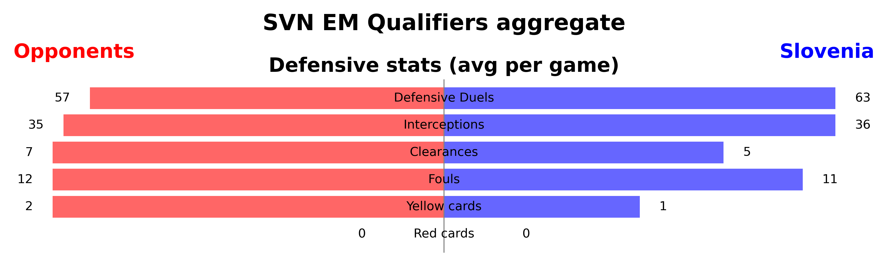
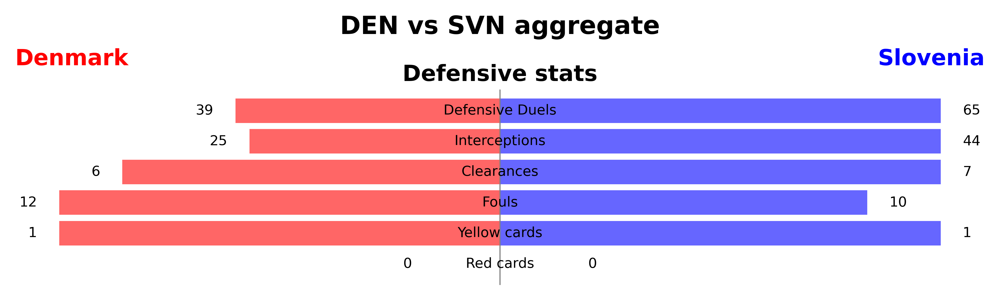
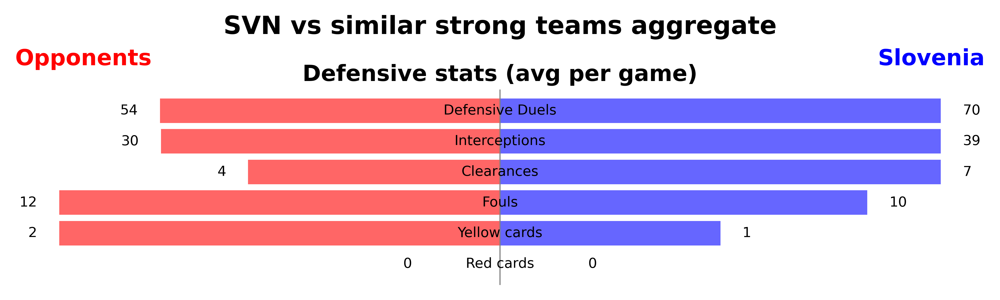
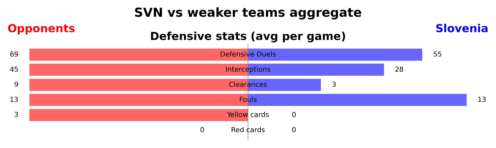

The defensive statistics align mostly with the previously observed patterns in game performance.

**Against Stronger Teams (e.g., Denmark)**: Increased emphasis on maintaining a strong defensive stance against stronger teams like Denmark.

**Against Weak Teams**: Less defensive action required as they dominate the game.

**Against Similarly Strong Teams**: Strong defensive dominance despite equal gameplay: More duels won compared to opponents, higher number of interceptions and more clearances.


<details>
  <summary> code </summary>

```python
# Code for the SVN total aggregate (Remaining plots can be generated by adjusting the IDs)
# plot_stats_barchart function used from section 2.2

match_ids = ['5414324', '5414302', '5414284', '5414260', '5414226', '5414180', '5414103', '5414128', '5414156', '5414203']
opponent_names = ['Denmark', 'San Marino', 'Northern Ireland', 'Finland', 'Kazakhstan']

team2 = 'Opponents'
team1 = 'Slovenia'
subtitle='Stats as average per game'
title = 'SVN EM Qualifiers aggregate'
num_matches = len(match_ids)

for i in range(len(match_ids)):
    match_id = match_ids[i]
    if i == 0:
        df_events = pd.read_csv(f"./results/wyscout/{match_id}_df_events.csv", index_col=0)
    else:
        df_events = pd.concat([df_events, pd.read_csv(f"./results/wyscout/{match_id}_df_events.csv", index_col=0)])

# replace opponent names with 'Opponent'
df_events['team.name'] = df_events['team.name'].replace(opponent_names, team2)
df_events['possession.team.name'] = df_events['possession.team.name'].replace(opponent_names, team2)

team_type_counts = df_events.groupby(['team.name', 'type.primary']).size().unstack(fill_value=0)

team2_data = {'Defensive Duels': int(df_events[(df_events["groundDuel.duelType"] == "defensive_duel") & (df_events["team.name"] == team2)]["groundDuel.relatedDuelId"].notna().sum() / num_matches),
            'Interceptions': int(team_type_counts.loc[team2, 'interception'] / num_matches),
            'Clearances': int(team_type_counts.loc[team2, 'clearance'] / num_matches),
            'Fouls': int(team_type_counts.loc[team2, 'infraction'] / num_matches),
            'Yellow cards': int(df_events[(df_events["team.name"] == team2) & (df_events["infraction.yellowCard"] == True)].shape[0] / num_matches),
            'Red cards': int(df_events[(df_events["team.name"] == team2) & (df_events["infraction.redCard"] == True)].shape[0] / num_matches),
            }

team1_data = {'Defensive Duels': int(df_events[(df_events["groundDuel.duelType"] == "defensive_duel") & (df_events["team.name"] == team1)]["groundDuel.relatedDuelId"].notna().sum() / num_matches),
            'Interceptions': int(team_type_counts.loc[team1, 'interception'] / num_matches),
            'Clearances': int(team_type_counts.loc[team1, 'clearance'] / num_matches),
            'Fouls': int(team_type_counts.loc[team1, 'infraction'] / num_matches),
            'Yellow cards': int(df_events[(df_events["team.name"] == team1) & (df_events["infraction.yellowCard"] == True)].shape[0] / num_matches),
            'Red cards': int(df_events[(df_events["team.name"] == team1) & (df_events["infraction.redCard"] == True)].shape[0] / num_matches),
            }

perc_categories = []

plot_stats_barchart(team1_data, team2_data, team1_name=team1, team2_name=team2, perc_categories=perc_categories, title=title,
                    subtitle='Defensive stats (avg per game)', team1_color='blue', team2_color='red',saveplt=True, savepath=f'plots/4-defense/defense_statistics_SVN_agg.png')
```
</details>

### 4.2 Defensive efficiency & style

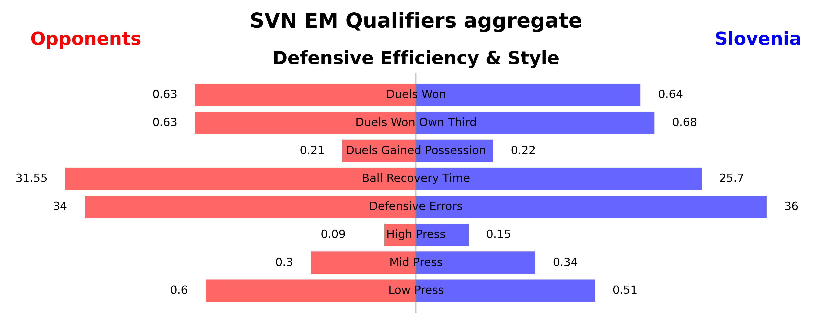
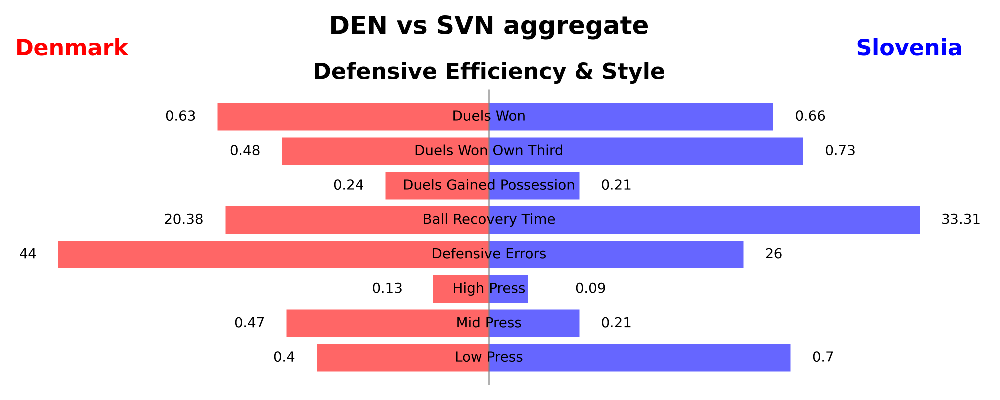
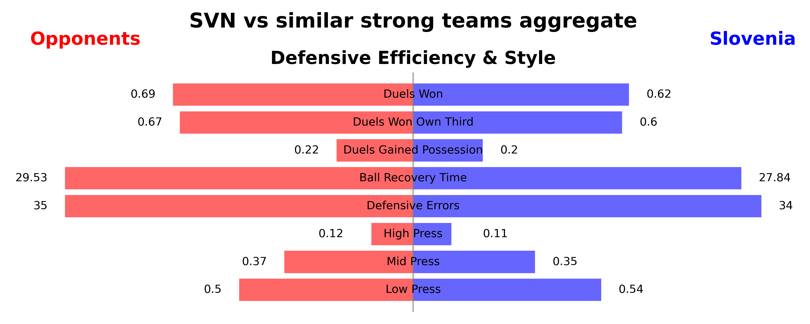
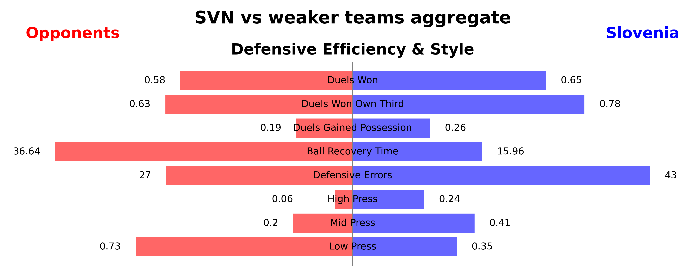

This analysis complements the defensive statistics and provides further insights into Slovenia's defensive strategies, key observations are: 

**Pressing Strategy Based on Opponent Strength**

Against stronger teams like Denmark, Slovenia adopts a “park the bus” strategy, with 70% of their pressing occurring in their own third. This approach emphasizes a strong defensive stance to mitigate the offensive threat posed by stronger opponents.

In contrast, when facing similarly strong and weaker teams, Slovenia shifts to an earlier pressing strategy. This is evident as they press more in the middle of the field or even in the opponent’s half. This adjustment allows them to regain possession higher up the pitch and exert more control over the game.

**Defensive Efficiency**

When examining defensive efficiency, no clear pattern emerges. Slovenia shows high defensive efficiency against weaker teams, which then decreases against similarly strong teams. Interestingly, their efficiency increases again when playing against Denmark. Over the course of 10 games, Slovenia's defensive efficiency is comparable to that of their opponents when aggregated.


<details>
  <summary> code </summary>

```python
# Code for the SVN total aggregate (Remaining plots can be generated by adjusting the IDs)
# plot_stats_barchart function used from section 2.2

match_ids = ['5414324', '5414302', '5414284', '5414260', '5414226', '5414180', '5414103', '5414128', '5414156', '5414203']
opponent_names = ['Denmark', 'San Marino', 'Northern Ireland', 'Finland', 'Kazakhstan']

team2 = 'Opponents'
team1 = 'Slovenia'
subtitle='Stats as average per game'
title = 'SVN EM Qualifiers aggregate'
num_matches = len(match_ids)

for i in range(len(match_ids)):
    match_id = match_ids[i]
    if i == 0:
        df_events = pd.read_csv(f"./results/wyscout/{match_id}_df_events.csv", index_col=0)
    else:
        df_events = pd.concat([df_events, pd.read_csv(f"./results/wyscout/{match_id}_df_events.csv", index_col=0)])

# replace opponent names with 'Opponent'
df_events['team.name'] = df_events['team.name'].replace(opponent_names, team2)
df_events['possession.team.name'] = df_events['possession.team.name'].replace(opponent_names, team2)


def calculate_defensive_efficiency(team_name, opponent_name, num_matches=1):

    team_events = df_events[df_events["team.name"] == team_name]
    
    defensive_duels = team_events[(team_events["groundDuel.duelType"] == "defensive_duel")]
    defensive_duels_ownthird = defensive_duels[(defensive_duels["location.x"] < 33.3)]
    duels_won = defensive_duels[(defensive_duels["groundDuel.stoppedProgress"] == True) | (defensive_duels["groundDuel.recoveredPossession"] == True)].shape[0]
    duels_won_pos = defensive_duels[(defensive_duels["groundDuel.recoveredPossession"] == True)].shape[0]
    duels_won_ownthird = defensive_duels_ownthird[(defensive_duels_ownthird["groundDuel.stoppedProgress"] == True) |
    (defensive_duels_ownthird["groundDuel.recoveredPossession"] == True)].shape[0]
    total_events = defensive_duels.shape[0]
    total_events_ownthird = defensive_duels_ownthird.shape[0]

    # ball recovery time avg possession duration of opponent
    ball_recovery_time = df_events[(df_events["possession.team.name"] == opponent_name)]["possession.duration"].mean()

    # defensive errors = interceptions + offensive duels lost + dribbles lost in own half
    own_half = df_events[(df_events["location.x"] < 50)]
    interceptions = own_half[(own_half["type.primary"] == "interception") & (own_half["team.name"] == opponent_name)]
    offensive_duels_lost = own_half[(own_half["groundDuel.duelType"] == "offensive_duel") & (own_half["team.name"] == team_name) &
    (own_half["groundDuel.keptPossession"] == False)]
    dribbles_lost = own_half[(own_half["groundDuel.duelType"] == "offensive_duel") & (own_half["team.name"] == team_name) & (own_half["groundDuel.keptPossession"] == False)]
    defensive_errors = pd.concat([interceptions, offensive_duels_lost, dribbles_lost]).shape[0]

    # Pressure actions
    interceptions = team_events[(team_events["type.primary"] == "interception")]
    clearence = team_events[(team_events["type.primary"] == "clearance")]
    defensive_duels = team_events[(team_events["groundDuel.duelType"] == "defensive_duel")]
    pressures = pd.concat([interceptions, clearence, defensive_duels])

    # High press: Pressure in the opposing third
    high_press = pressures[(pressures["location.x"] > 66.6)]
    mid_press = pressures[(pressures["location.x"] > 33.3) & (pressures["location.x"] < 66.6)]
    low_press = pressures[(pressures["location.x"] < 33.3)]

    return {'Duels Won': round(duels_won / total_events, 2),
            'Duels Won Own Third': round(duels_won_ownthird / total_events_ownthird, 2),
            'Duels Gained Possession': round(duels_won_pos / total_events, 2),
            'Ball Recovery Time': round(ball_recovery_time, 2),
            'Defensive Errors': int(defensive_errors / num_matches),
            'High Press': round(high_press.shape[0] / pressures.shape[0], 2),
            'Mid Press': round(mid_press.shape[0] / pressures.shape[0], 2),
            'Low Press': round(low_press.shape[0] / pressures.shape[0], 2),
            }


# Use the function to calculate stats for Denmark and Slovenia
team2_data = calculate_defensive_efficiency(team2, team1, num_matches=num_matches)
team1_data = calculate_defensive_efficiency(team1, team2, num_matches=num_matches)

perc_categories = ["Duels Won", "Duels Won Own Third", "Duels Gained Possession", "High Press", "Mid Press", "Low Press"]

plot_stats_barchart(team1_data, team2_data, team1_name=team1, team2_name=team2, perc_categories=perc_categories, title=title,
                    subtitle='Defensive Efficiency & Style', team1_color='blue', team2_color='red', saveplt=True,
                    savepath=f'plots/4 defense/defensive_efficiency_style_SVN_agg.png')
```
</details>

It's clear to see that the 4-man chain was played consistently throughout the game and that they stayed true to their strategy. In other words, the coach doesn't allow himself to be tempted into plan B, C or D, but draws a clear line. Karnicnik is talented on both feet, which must be taken into account when analyzing the game. In very rare cases, the chain dared to cross the halfway line, but for the majority of the game, it certainly focused solely on defending.

### San Marino vs. Slovenia

The game against San Marino is a good example of how Slovenia behave when they have the majority of the ball. Both central defenders defend at the back and the full-backs take part in the attacking play. Karnicnik can cross with both feet as he was often seen on the right side. A trait that Denmark must keep an eye on.

<div align="center">
  </td>
  </td>
  </td>
  </td>
</div>

### Slovenia vs Finnland

In the game against Finland and Northern Ireland, the back four will be compact. The full-backs will spend most of their time on the halfway line and play a classic 50/50 between defense and attack.

<div align="center">
  
  
  
  
</div>

### Northern Island vs. Slovenia

<div align="center">
    
    
    
    
</div>

### Denmark vs. Slovenia

As in the last game, Karnicnik can be seen on both sides of the full-backs. The central defenders rarely cross the halfway line. Otherwise, they remain very compact in their chain.

<div align="center">
    
    
    
    
</div>

### Slovenia vs. Kazakhstan

A pattern that has emerged several times now is that Karnicnik is much more involved in attacking play than the other full-back. In other words, Slovenia prefer to attack down the right flank. The same pattern can be observed in central defense, where Blazic carries the ball into midfield more often than Bijol.   

<div align="center">
    
    
    
    
</div>

### Slovenia vs. Denmark

But as soon as Slovenia play against an equally good/better opponent, they very quickly fall back into the compact back four and Karnicnik, who is strong on the flanks, has fewer chances up front.

<div align="center">
    
    
    
    
</div>


<details>
  <summary> code </summary>

#### Create an array with players you want to see

```python
  player = ['B. Šeško', 'J. Kurtič', 'Ž. Karničnik']
    for pl in player:
        df_player = df[df['player.name'] == pl]

    pitch = VerticalPitch(pitch_color='#2f8c58',
                          line_color='white',
                          pitch_type='wyscout')

    fig, ax = pitch.grid(grid_height=0.9, title_height=0.06, axis=False,
                         endnote_height=0.04, title_space=0, endnote_space=0)

    # Heatmap as Kernel Density Estimation
    pitch.kdeplot(
    x=df_player['location.x'],
    y=df_player['location.y'],
    shade = True,
    shade_lowest=False,
    alpha=.5,
    n_levels=10,
    cmap = 'coolwarm',
    ax=ax['pitch']
    )

    legend_elements = [Line2D([0], [0], color='w', markerfacecolor='k', marker='o', label=pl)]

    plt.legend(handles=legend_elements, loc='upper center', bbox_to_anchor=(0.5, 1), bbox_transform=plt.gcf().transFigure,
               handlelength=2, labelspacing=1.2, fontsize=10)

    def replace_dot_space_with_underscore(pl):
        return pl.replace(". ", "_")

    pl = replace_dot_space_with_underscore(pl)

    plt.savefig(f'plots/{pl}_Heatmaps.png', dpi=400)
    plt.show()
```

</details>


### 4.3 Duel defence performance of the players
In this section the players from Slovenia are analyzed regarding the duel performance while defending. The regarding matches are listed in Section 1.2.

The plots below show the duel performance of the players from Slovenia.\
The defender of Slovenia are the players with the most duels and also the most duels won. Starting with the game against Northern Ireland, Janža with a total of 13 duels had a big impact for the win. Furthermore in the game against Denmark Bijol with also a total of 13 duels was an important part in keeping the score low although they lost the game. Everytime Bijol plays he wins around 80% of his duels which is a remarkable amount. To finish the discussion about the defender it is looked at Blažič. With a percentage won of 100% against Northern Ireland he shows his importance in the defending line of Slovenia.\
The midfielder of Slovenia do not stand out with the duel performance. Mostly the players have not remarkable stats about their duels. Cérin is the only midfielder that stands out over all games. With mostly over 8 duels and against Kazakhstan with a total of 12 duels he strengthens the midfield remarkable.\
Closing this discussion with Blažič, Bijol and Janža the defense of Slovenia is ready for the game against Denmark taking into acount that with Cérin an important midfielder will support them.

#### 4.3.1 Total duels and duels won: Slovenia

| 20 Nov vs Kazakhstan | 17 Nov vs Denmark | 17 Oct vs N. Ireland |
| ------------- | ------------- | ------------- |
||||

|  14 Oct vs Finland | 10 Sep vs San Marino | 19 Jun vs Denmark |
| ------------- | ------------- | ------------- |
||||


#### 4.3.2 Duels won percentage: Slovenia

| 20 Nov vs Kazakhstan | 17 Nov vs Denmark | 17 Oct vs N. Ireland |
| ------------- | ------------- | ------------- |
||||

|  14 Oct vs Finland | 10 Sep vs San Marino | 19 Jun vs Denmark |
| ------------- | ------------- | ------------- |
||||


<details>
<summary> code</summary>

```python
# MAIN
import pandas as pd
import json
from IPython.display import display
import zipfile
from pathlib import Path
from datetime import datetime, timedelta
import numpy as np
import seaborn as sns
import matplotlib.pyplot as plt
from matplotlib.patches import Patch

# specfic soccer analysis packages
from mplsoccer import Pitch

# load custom functions
from src.visualization import *
from src.dataloader import dataloader

# Function for Duel Performance of the Players
def dueldefperfomance(teamname, opponentTeamname, df_events):

    df_duels = df_events[df_events['type.primary'] == 'duel']

    # defensive duels HOME
    df_dduels_home = df_duels[(df_duels['team.name'] == teamname) & (df_duels["groundDuel.duelType"] == "defensive_duel")]
    # number of duels home
    ## dduels_home = df_dduels_home.shape[0]
    # player who had duel
    ## df_dduels_home_players = df_dduels_home['player.name'].dropna().unique()
    # number of duels per player
    df_dduels_home_player_count = df_dduels_home['player.name'].dropna().value_counts()
    # duels won per player
    df_dduelswon_home = df_dduels_home[df_dduels_home['player.name'].notna() & ((df_dduels_home["groundDuel.stoppedProgress"] == True) | (df_dduels_home["groundDuel.recoveredPossession"] == True))]
    # number of duels won per player
    df_dduelwon_home_player_count = df_dduelswon_home['player.name'].value_counts()
    # aligned counts
    aligned_counts_home = pd.concat([df_dduels_home_player_count, df_dduelwon_home_player_count], axis=1, keys=['total_duels', 'duels_won']).fillna(0)
    aligned_counts_home['percentage_won'] = ((aligned_counts_home['duels_won']) / (aligned_counts_home['total_duels']) * 100).round(0)


    # defensive duels AWAY
    df_dduels_away = df_duels[(df_duels['team.name'] == opponentTeamname) & (df_duels["groundDuel.duelType"] == "defensive_duel")]
     # number of duels away
    ## dduels_away = df_dduels_away.shape[0]
    # player who had duel
    ##df_dduels_home_players = df_dduels_away['player.name'].dropna().unique()
    # number of duels per player
    df_dduels_away_player_count = df_dduels_away['player.name'].dropna().value_counts()
    # duels won per player
    df_dduelswon_away = df_dduels_away[df_dduels_away['player.name'].notna() & ((df_dduels_away["groundDuel.stoppedProgress"] == True) | (df_dduels_away["groundDuel.recoveredPossession"] == True))]
    # number of duels won per player
    df_dduelwon_away_player_count = df_dduelswon_away['player.name'].value_counts()
    # aligned counts
    aligned_counts_away = pd.concat([df_dduels_away_player_count, df_dduelwon_away_player_count], axis=1, keys=['total_duels', 'duels_won']).fillna(0)
    aligned_counts_away['percentage_won'] = ((aligned_counts_away['duels_won']) / (aligned_counts_away['total_duels']) * 100).round(0)
    
    return aligned_counts_home, aligned_counts_away

def plot_duel(aligned_counts_home, aligned_counts_away, teamname, opponentTeamname):

    # Home Plot
    sns.set_theme(style="darkgrid")
    palette = sns.color_palette("viridis", len(aligned_counts_home))
    color1 = palette[3]
    color2 = palette[9]
    plt.figure(figsize=(10, 6))
    sns.barplot(x=aligned_counts_home.index, y=aligned_counts_home['total_duels'], color=color1, label='Total Duels')
    sns.barplot(x=aligned_counts_home.index, y=aligned_counts_home['duels_won'], color=color2, label='Duels Won')
    plt.xlabel('Player')
    plt.ylabel('Count')
    plt.title(f'Duel Performance per Player: {teamname}')
    plt.xticks(rotation=45, ha='right')
    plt.legend()
    save_path = (f'C:/Users/loris/Documents/ETH Zürich/Master/Soccer Analytics/plot_duel{teamname}-{opponentTeamname}HOME.png')  # Specify your desired save path here
    plt.tight_layout()
    plt.savefig(save_path)

    # Away Plot
    plt.figure(figsize=(10, 6))
    sns.barplot(x=aligned_counts_away.index, y=aligned_counts_away['total_duels'], color=color1, label='Total Duels')
    sns.barplot(x=aligned_counts_away.index, y=aligned_counts_away['duels_won'], color=color2, label='Duels Won')
    plt.xlabel('Player')
    plt.ylabel('Count')
    plt.title(f'Duel Performance per Player: {opponentTeamname}')
    plt.xticks(rotation=45, ha='right')
    plt.legend()
    save_path2 = (f'C:/Users/loris/Documents/ETH Zürich/Master/Soccer Analytics/plot_duel{teamname}-{opponentTeamname}AWAY.png')  # Specify your desired save path here
    plt.tight_layout()
    plt.savefig(save_path2)

    # rerange for percentage won
    aligned_counts_home_sorted = aligned_counts_home.sort_values(by='percentage_won', ascending=False)
    aligned_counts_away_sorted = aligned_counts_away.sort_values(by='percentage_won', ascending=False)

    # Home Plot Percentage
    plt.figure(figsize=(10, 6))
    sns.barplot(x=aligned_counts_home_sorted.index, y=aligned_counts_home_sorted['percentage_won'], color=color1)
    plt.xlabel('Player')
    plt.ylabel('Percentage of Duels Won')
    plt.title(f'Percentage of Duels Won per Player: {teamname}')
    plt.xticks(rotation=45, ha='right')
    save_path3 = (f'C:/Users/loris/Documents/ETH Zürich/Master/Soccer Analytics/plot_duel_percentage{teamname}-{opponentTeamname}HOME.png')  # Specify your desired save path here
    plt.tight_layout()
    plt.savefig(save_path3)

    # Away Plot Percentage
    plt.figure(figsize=(10, 6))
    sns.barplot(x=aligned_counts_away_sorted.index, y=aligned_counts_away_sorted['percentage_won'], color=color1)
    plt.xlabel('Player')
    plt.ylabel('Percentage of Duels Won')
    plt.title(f'Percentage of Duels Won per Player: {opponentTeamname}')
    plt.xticks(rotation=45, ha='right')
    save_path = (f'C:/Users/loris/Documents/ETH Zürich/Master/Soccer Analytics/plot_duel_percentage{teamname}-{opponentTeamname}AWAY.png')  # Specify your desired save path here
    plt.tight_layout()
    plt.savefig(save_path)

# MAIN
match_id1 = "5414226"
match_id2 = "5414260"
match_id3 = "5414284"
match_id4 = "5414302"
match_id5 = "5414324"
match_id6 = "5414180"

match_id = ([match_id1, match_id2, match_id3, match_id4, match_id5, match_id6])
# start with the for loops for all matches
team_name_array = (['San Marino', 'Slovenia', 'Northern Ireland', 'Denmark', 'Slovenia', 'Slovenia'])
opponentTeam_name_array = (['Slovenia', 'Finland', 'Slovenia', 'Slovenia', 'Kazakhstan', 'Denmark'])
goalkeeper_home_array = (['E. Benedettini', 'J. Oblak', 'B. Peacock-Farrell', 'K. Schmeichel', 'J. Oblak', 'J. Oblak'])
goalkeeper_away_array = (['J. Oblak', 'L. Hradecky', 'J. Oblak', 'J. Oblak', 'I. Shatskiy', 'K. Schmeichel'])

for i in range(len(match_id)):

    df_events = dataloader(match_id[i])
    teamname = team_name_array[i]
    opponentTeamname = opponentTeam_name_array[i]
    aligned_counts_home, aligned_counts_away = dueldefperfomance(teamname, opponentTeamname, df_events)
    plot_duel(aligned_counts_home, aligned_counts_away, teamname, opponentTeamname)

```
</details>

### 4.4 Goalkeeper behaviour

To analyse the defense the goal keeper needs also to be considered. He is a main part of the defense not only that he is the last man who can save a shot on target but also for his view over the pitch. He can manage his defense optimal and help the defense to understand the play style of the opponent strikers. In the first part the shots parried per goalkeeper are analysed and in the second part the passes played per goalkeeper.

To get a better insight into the performance of J. Oblak the following new set of matches is used. In these matches at least one goal was scored against J. Oblak. Further information about his performance and potential weaknesses is considered.

#### 4.4.1 Matches for goalkeeper behaviour

| wyscout | skillcorner | date       | home             | away       | Score Home | Score Away |
| ------: | ----------: | ---------- | ---------------- | ---------- | ---------- | ---------- |
| 5414103 |           - | 2023-03-23 | Kazakhstan       | Slovenia   | 1          | 2          |
| 5414302 |     1381485 | 2023-11-17 | Denmark          | Slovenia   | 2          | 1          |
| 5414324 |     1381505 | 2023-11-20 | Slovenia         | Kazakhstan | 2          | 1          |

#### 4.4.2 Shots parried per goalkeeper

The shots parried by J. Oblak and the opponent goal keeper are analysed in this Section. The percentage of the parried shots is ploted.

J. Oblak has a percentage of shots parried of over 50% in all matches. With a percentage of 75% against Denmark he keeped the score lower altought the match was lost. In the game against Kazakhstan J. Oblak had a remarkable input for the 2:1 win with a total percentage won of also 75%.\
The goal against J. Oblak in the first match against Kazakhstan was a header from a cross ball in which Oblak had no chance. During the starting phase of the match against Denmark Oblak already showed that he could keep his sheet clean with a big save from a header at his left corner. Sadly Denmark was still able to score 2 goals but for J. Oblak it was impossible to save them. With 75% parried shots against Kazakhstan on November 20, 2023, J. Oblak had another good match. The only goal that Kazakhstan scored was a side pass into the penalty room and the striker of Kazakhstan could perfectly push the ball into the goal without any disturbance from the defenders from Slovenia, J. Oblak had no chance once more.


| 23 Mar vs Kazakhstan | 17 Nov vs Denmark | 20 Nov vs Kazakhstan |
| ------------- | ------------- | ------------- |
||||


<details>
<summary> code</summary>

```python
import pandas as pd
import json
from IPython.display import display
import zipfile
from pathlib import Path
from datetime import datetime, timedelta
import numpy as np
import seaborn as sns
import matplotlib.pyplot as plt
from matplotlib.patches import Patch

# specfic soccer analysis packages
from mplsoccer import Pitch

# load custom functions
from src.visualization import *
from src.dataloader import dataloader

# Match IDs Goalkeeper Behaviour
match_id1_gk = "5414103"
match_id2_gk = "5414302"
match_id3_gk = "5414324"

match_id_gk = ([match_id1_gk, match_id2_gk, match_id3_gk])
team_name_array_gk = (['Kazakhstan', 'Denmark', 'Slovenia'])
opponentTeam_name_array_gk = (['Slovenia', 'Slovenia', 'Kazakhstan'])
goalkeeper_home_array_gk = (['I. Shatskiy', 'K. Schmeichel', 'J. Oblak'])
goalkeeper_away_array_gk = (['J. Oblak', 'J. Oblak', 'I. Shatskiy'])

def plot_shots_parried(df_events, goalkeeper_home, goalkeeper_away, teamname, opponentTeamname):

    df_goalkeeper = df_events[(df_events['shot.onTarget'] == True)]
    # Shots on Target from Hometeam
    df_ontarget_home = df_goalkeeper[(df_goalkeeper['shot.onTarget'] == True) & (df_goalkeeper['shot.goalkeeper.name'] == goalkeeper_away)]
    df_ontarget_home_count = df_ontarget_home.shape[0]
    df_isgoal_home = df_goalkeeper[(df_goalkeeper['shot.isGoal'] == True) & (df_goalkeeper['shot.goalkeeper.name'] == goalkeeper_away)]
    df_isgoal_home_count = df_isgoal_home.shape[0]
    # parried home keeper
    if df_ontarget_home_count == 0:
        df_parried_home = 0 #'No Shots on Target'
    else:
        df_parried_home = 100 - (df_isgoal_home_count / df_ontarget_home_count * 100)
    # Shots on Target from Awayteam
    df_ontarget_away = df_goalkeeper[(df_goalkeeper['shot.onTarget'] == True) & (df_goalkeeper['shot.goalkeeper.name'] == goalkeeper_home)]
    df_ontarget_away_count = df_ontarget_away.shape[0]
    df_isgoal_away = df_goalkeeper[(df_goalkeeper['shot.isGoal'] == True) & (df_goalkeeper['shot.goalkeeper.name'] == goalkeeper_home)]
    df_isgoal_away_count = df_isgoal_away.shape[0]
    # parried away keeper
    if df_ontarget_away_count == 0:
        df_parried_away = 0 #'No Shots on Target'
    else:
        df_parried_away = 100 - (df_isgoal_away_count / df_ontarget_away_count * 100)

    team_data = {
    'Team': [(f'{teamname}'), (f'{opponentTeamname}')],
    'Shots on Target': [df_ontarget_home_count, df_ontarget_away_count],  # Example shots on target data for both teams
    'Goals Scored': [df_isgoal_home_count, df_isgoal_away_count],      # Example goals scored data for both teams
    '% Parried by Opp. GK': [df_parried_home, df_parried_away]        # Example possession data for both teams
    }
    
    # Convert data to a DataFrame
    df = pd.DataFrame(team_data)
    
    # Melt the DataFrame to have one column for variable and one column for value
    melted_df = pd.melt(df, id_vars='Team', var_name='Category', value_name='Value')
    
    # Plot
    plt.figure(figsize=(10, 6))
    ax = sns.barplot(data=melted_df, x='Value', y='Category', hue='Team', orient='h')
    
    # Add value numbers at the end of the bars
    for p in ax.patches:
        value = p.get_width()
        rounded_value = round(value)
        ax.text(value, p.get_y() + p.get_height() / 2, f'{rounded_value}', ha='left', va='center')

    plt.xlabel('Value')
    plt.ylabel('Category')
    plt.title(f'Shots parried: {teamname}-{opponentTeamname}')
    plt.legend(title='Team')
    save_path = (f'C:/Users/loris/Documents/ETH Zürich/Master/Soccer Analytics/Shots_parried{teamname}-{opponentTeamname}.png')  # Specify your desired save path here
    plt.tight_layout()
    plt.savefig(save_path)

# MAIN

for i in range(len(match_id_gk)):

    df_events = dataloader(match_id_gk[i])
    goalkeeper_home = goalkeeper_home_array_gk[i]
    goalkeeper_away = goalkeeper_away_array_gk[i]
    teamname = team_name_array_gk[i]
    opponentTeamname = opponentTeam_name_array_gk[i]
    plot_shots_parried(df_events, goalkeeper_home, goalkeeper_away, teamname, opponentTeamname)

```
</details>

#### 4.4.3 Passes played per goalkeeper

Like mentioned above the goalkeeper is a main part of the defense. With the ability to really take part in the game and create possible pass stations the goalkeeper can be the one additional man in the defense line. It is possible to make changes of side or also launch a quick attack with a long shot of the goalkeeper.\
In the following charts the passes played are shown. The passes are seperated into normal passes and long/high passes. A pass is considered as long pass if the length of the pass is over 40 meters.

In the following charts it can be seen that J. Oblak had always at least 15 passes. He was often used to calm down the defense and waiting for the right time to launch an attack. Furthermore with a total of 8 high and long passes J. Oblak made some passes near and over the own pitch half to start an attack in the match against Kazakhstan on march 03, 2023, which resulted in the win for Slovenia.\
In general Slovenia has a solid goalkeeper with J. Oblak who can be taken into account as a good support player in the defense line regarding the passes played and the impact on calming the game down and switch sides.


| 23 Mar vs Kazakhstan | 17 Nov vs Denmark | 20 Nov vs Kazakhstan |
| ------------- | ------------- | ------------- |
||||


<details>
<summary> code</summary>

```python
import pandas as pd
import json
from IPython.display import display
import zipfile
from pathlib import Path
from datetime import datetime, timedelta
import numpy as np
import seaborn as sns
import matplotlib.pyplot as plt
from matplotlib.patches import Patch

# specfic soccer analysis packages
from mplsoccer import Pitch

# load custom functions
from src.visualization import *
from src.dataloader import dataloader

# Match IDs Goalkeeper Behaviour
match_id1_gk = "5414103"
match_id2_gk = "5414302"
match_id3_gk = "5414324"

match_id_gk = ([match_id1_gk, match_id2_gk, match_id3_gk])
team_name_array_gk = (['Kazakhstan', 'Denmark', 'Slovenia'])
opponentTeam_name_array_gk = (['Slovenia', 'Slovenia', 'Kazakhstan'])
goalkeeper_home_array_gk = (['I. Shatskiy', 'K. Schmeichel', 'J. Oblak'])
goalkeeper_away_array_gk = (['J. Oblak', 'J. Oblak', 'I. Shatskiy'])

def plot_passes_goalkeeper(df_events, goalkeeper_home, goalkeeper_away, teamname, opponentTeamname):
    # Home
    passes_goalkeeper_home = df_events[(df_events['type.primary'] == 'pass') & (df_events['player.name'] == goalkeeper_home)].shape[0]
    long_high_passes_goalkeeper_home = df_events[(df_events['type.primary'] == 'pass') & (df_events['player.name'] == goalkeeper_home) & (df_events['pass.length'] >= 40) & (df_events['pass.height'] == 'high')].shape[0]
    # Away
    passes_goalkeeper_away = df_events[(df_events['type.primary'] == 'pass') & (df_events['player.name'] == goalkeeper_away)].shape[0]
    long_high_passes_goalkeeper_away = df_events[(df_events['type.primary'] == 'pass') & (df_events['player.name'] == goalkeeper_away) & (df_events['pass.length'] >= 40) & (df_events['pass.height'] == 'high')].shape[0]

    # Plot
    df_passes_gk = pd.DataFrame(columns=['name', 'passes'])
    # Assign names
    df_passes_gk.at[0, 'name'] = (f'{goalkeeper_home} passes')
    df_passes_gk.at[1, 'name'] = (f'{goalkeeper_home} high/long passes')
    df_passes_gk.at[2, 'name'] = (f'{goalkeeper_away} passes')
    df_passes_gk.at[3, 'name'] = (f'{goalkeeper_away} high/long passes')


    # Assign calculated passes
    df_passes_gk.at[0, 'passes'] = passes_goalkeeper_home
    df_passes_gk.at[1, 'passes'] = long_high_passes_goalkeeper_home
    df_passes_gk.at[2, 'passes'] = passes_goalkeeper_away
    df_passes_gk.at[3, 'passes'] = long_high_passes_goalkeeper_away

    # 2 Plot Data
    # Set Seaborn theme and color palette
    sns.set_theme(style="darkgrid")
    # palette = sns.color_palette("viridis", len(df_passes_gk))
    palette = sns.color_palette("viridis", len(aligned_counts_away))

    # Plotting the data using Seaborn and Matplotlib
    plt.figure(figsize=(10, 6))

    # Plot percentage of duels won per player
    sns.barplot(x='name', y='passes', data=df_passes_gk, color=palette[8])

    ax = sns.barplot(x='name', y='passes', data=df_passes_gk, color=palette[8])
    # Adding labels and title
    plt.xlabel('Goalkeeper')
    plt.ylabel('Number of Passes')
    plt.title('Total Passes per Goalkeepers')

    # Rotate x-axis labels for better readability
    plt.xticks(rotation=45, ha='right')

    # Customize x-axis labels
    ax.set_xticklabels([(f'{goalkeeper_home}\nPasses'), (f'{goalkeeper_home}\nHigh/long passes'), (f'{goalkeeper_away}\nPasses'), (f'{goalkeeper_away}\nHigh/long passes')])

    # Save plot to a specified path
    save_path = (f'C:/Users/loris/Documents/ETH Zürich/Master/Soccer Analytics/goalkeeper_passes_{teamname}-{opponentTeamname}.png')  # Specify your desired save path here
    plt.tight_layout()
    plt.savefig(save_path)

# MAIN
for i in range(len(match_id_gk)):

    df_events = dataloader(match_id_gk[i])
    goalkeeper_home = goalkeeper_home_array_gk[i]
    goalkeeper_away = goalkeeper_away_array_gk[i]
    teamname = team_name_array_gk[i]
    opponentTeamname = opponentTeam_name_array_gk[i]
    plot_passes_goalkeeper(df_events, goalkeeper_home, goalkeeper_away, teamname, opponentTeamname)

```
</details>


## 5. Set plays

### 5.1 Corners

In this section, the corner kicks from Slovenia's last 5 European Championship qualifiers are analyzed. Corners are a very important part of the game of soccer, as they can often lead to scoring opportunities for the attacking team, but also to counter-attacking chances for the defending team. As can be seen from the following graph of corner kicks, Slovenia's opponents were the more dominant teams in terms of the number of corner kicks. 


In total, the opponents received 21 corners in the 5 matches and Slovenia only 17. We can take a closer look at Slovenia's offensive and defensive tactics. The statistics of the corners show that 7 of the corners resulted in a shot, of which 4 were on target and 1 was a goal. This shows that although Slovenia's opponents convert every 5th corner into a shot on target, goalkeeper Oblak is excellent at saving these shots. We can also see that although Slovenia take as many shots from corners as their opponents, they are not as good at scoring with only one shot on target from 17 corners.

If we take a look at the map of the opponent's pass receiver position, we can see more details of their offensive tactics.


95% of the opponents corners found their target in the middle of the penalty area, while only 5% were hit far behind the penalty area.

A look at the map of shots after corners shows what happened at the dangerous corners.


From this map it can be seen that Slovenia had problems defending the penalty area in aerial duels, as 4 corners into the penalty area resulted in shots from corners with 3 shots on target and one goal.

The same analysis can be done for Slovenia as an attacking team. As can be seen from the statistics of corner kicks, 7 of the 17 corners resulted in a shot, one of which led to a goal.


81% of corner kicks were taken inside the penalty area. 19% were taken far behind the penalty area.

We can get more information from the shots after corner for Slovenia map.


We see that their main attacking target after a corner is A. Cerin, who is quite successful in getting a shot off after the corner, but not so successful in hitting the target. Nevertheless, the focus at corners is clearly on him and it is important information for Denmark to know how to defend Cerin in corner situations.

After corners, there is often an opportunity to launch a counter-attack if they are defended properly. That's why we looked at the consecutive counter-attacks after corners in this game. It seems that Slovenia is very vulnerable to counter-attacks after a corner kick. This is an indication that the Slovenian defensive movement after a corner kick is not yet fully implemented and can be abused by Denmark.


<details>
<summary> code</summary>

##### Corner events

```python
# Corner events
df_corners = df_events[df_events['type.primary']=='corner']

# Corner for Slovenia
df_corners_svn = df_corners[df_corners["team.name"] == "Slovenia"]
corners_svn = df_corners_svn.shape[0]

# Coorner for Opponent
df_corners_opp = df_corners[df_corners["opponentTeam.name"] == "Slovenia"]
corners_opp = df_corners_opp.shape[0]

# Amount of corner events that ended with a shot for Slovenia
shots_svn = (df_corners_svn['possession.attack.withShot'] == True).sum()
shots_on_goal_svn = (df_corners_svn['possession.attack.withShotOnGoal'] == True).sum()
goals_scored_svn = (df_corners_svn['possession.attack.withGoal'] == True).sum()
xgoal_svn = df_corners_svn[~df_corners_svn['possession.attack.xg'].isnull()]['possession.attack.xg'].sum().round(2)

# Amount of corner events that ended with a shot for Denmark
shots_opp = (df_corners_opp['possession.attack.withShot'] == True).sum()
shots_on_goal_opp = (df_corners_opp['possession.attack.withShotOnGoal'] == True).sum()
goals_scored_opp = (df_corners_opp['possession.attack.withGoal'] == True).sum()
xgoal_opp = df_corners_opp[~df_corners_opp['possession.attack.xg'].isnull()]['possession.attack.xg'].sum().round(2)

# Create barchart for corner overview
svn_data = {'Corners': corners_svn,
            'Shots': shots_svn,
            'Shots on Target': shots_on_goal_svn,
            'Goals': goals_scored_svn,
            'Expected Goals': xgoal_svn,
            }

opp_data = {'Corners': corners_opp,
            'Shots': shots_opp,
            'Shots on Target': shots_on_goal_opp,
            'Goals': goals_scored_opp,
            'Expected Goals': xgoal_opp,
            }

# if category % do not normalize
perc_categories = []

# Show and save the plot
plot_stats_barchart(svn_data, opp_data, team1_name='Slovenia', team2_name='Denmark', perc_categories=perc_categories, title='EM Qualifier: 2023-11-17', subtitle='Corner events', team1_color='blue', team2_color='red', saveplt=True, savepath='plots/5-SetPieces/5_1-Corners/corner_statistics.png')
```

##### Shot map

```python
# Plot shot position and success on football field for Slowenia
df_shots_svn = df_corners_svn[df_corners_svn['possession.attack.withShot'] == True]

# Create Pitch with certain attributes
pitch = Pitch(pitch_length=pitch_length, pitch_width=pitch_width, pitch_color='grass', line_color='white', stripe=True)
fig, ax = pitch.draw()

# Draw every shot and colour it regarding its success
for i, shot in df_shots_svn.iterrows():

    # Position of shot
    [x, y] = shot[['possession.endLocation.x', 'possession.endLocation.y']].to_list()

    teamname = shot['team.name']

    # Color of shot depends on if it was off/on target or goal
    if shot['possession.attack.withGoal'] is True:
        color = "green"

    elif shot['possession.attack.withShotOnGoal'] is True:
        color = "orange"

    else:
        color = "red"

    shotCircle = plt.Circle((x/100.0 * pitch_length, y/100.0 * pitch_width), 2, color=color)

    plt.text(x/100.0 * pitch_length-4, y/100.0 * pitch_width - 4, shot['player.name'])

    ax.add_patch(shotCircle)

# Define the legend labels and corresponding colors
legend_labels = ['Goal', 'On Target', 'Off Target']
legend_colors = ['green', 'orange', 'red']

# Create proxy artists for legend
legend_patches = [Patch(color=color, label=label) for color, label in zip(legend_colors, legend_labels)]

# Add legend to the plot
plt.legend(handles=legend_patches, loc='lower right')

# Create title and save plot
fig.suptitle(f"Shots after Corner for {teamname}", fontsize = 12)
plt.savefig(f"plots/5-SetPieces/5_1-Corners/{teamname}_shots_corners_map.png", dpi=400)
plt.show()
```

##### Recipients location map

```python
# Create Dataframe for the distribution of corner passes for Slowenia
df_distribution = pd.DataFrame()

# Determine pass types based on recipient location
pass_short_1 = ((df_corners_svn["pass.endLocation.y"] < 19.0) & (df_corners_svn["location.y"] == 0.0))
pass_short_2 = ((df_corners_svn["pass.endLocation.y"] > 81.0) & (df_corners_svn["location.y"] == 100.0))
pass_parea = (df_corners_svn["pass.endLocation.y"] >= 19.0) & (df_corners_svn["pass.endLocation.y"] <= 81.0)
pass_long_1  = ((df_corners_svn["pass.endLocation.y"] < 19.0) & (df_corners_svn["location.y"] == 100.0))
pass_long_2  = ((df_corners_svn["pass.endLocation.y"] > 81.0) & (df_corners_svn["location.y"] == 0.0))
pass_wide  = (df_corners_svn["pass.endLocation.x"] >= 16.0) & (df_corners_svn["pass.endLocation.x"] <= 84.0)

# For every Corner type safe statistics for plotting
j=0
for i, pass_dst in enumerate([pass_short_1, pass_short_2, pass_parea, pass_long_1, pass_long_2, pass_wide]):

    if df_corners_svn.loc[pass_dst].empty:

        if pass_dst is not pass_short_2 and pass_dst is not pass_long_2:
            df_distribution.at[j, "x"] = -1.0
            df_distribution.at[j, "y"] = -1.0
            df_distribution.at[j, "amount"] = -1.0
            j+=1

        continue

    if pass_dst is pass_short_2 and pass_dst is pass_long_2:
        df_distribution.at[j, "x"] = (df_distribution.at[j, "x"] + np.mean(df_corners_svn.loc[pass_dst]['pass.endLocation.x'].to_numpy()).round(1))/2.0
        df_distribution.at[j, "y"] = (df_distribution.at[j, "y"] + 100.0 - np.mean(df_corners_svn.loc[pass_dst]['pass.endLocation.y'].to_numpy()).round(1))/2.0
        df_distribution.at[j, "amount"] += df_corners_svn.loc[pass_dst]['pass.endLocation.x'].count()

    else:
        df_distribution.at[j, "x"] = np.mean(df_corners_svn.loc[pass_dst]['pass.endLocation.x'].to_numpy()).round(1)
        df_distribution.at[j, "y"] = np.mean(df_corners_svn.loc[pass_dst]['pass.endLocation.y'].to_numpy()).round(1)
        df_distribution.at[j, "amount"] = df_corners_svn.loc[pass_dst]['pass.endLocation.x'].count()
        
    if pass_dst is not pass_short_2 and pass_dst is not pass_long_2:
        j += 1
    

# Adjust circle sizes and transparency proportional to the number of passes received in a specific area
df_distribution['marker_size'] = (df_distribution['amount'] / df_distribution['amount'].max() * 1500)
df_distribution['marker_size'] = abs((df_distribution['marker_size'] > 0) * df_distribution['marker_size']).round(0)
df_distribution['alpha'] = abs(df_distribution['marker_size'] / df_distribution['marker_size'].max()).round(2)
df_distribution['percentage'] = (abs(df_distribution['amount'] / df_distribution[df_distribution['amount'] > 0]['amount'].sum() * (df_distribution['amount'] > 0)) * 100).round(0)

# Create pitch with certain attributes
pitch = Pitch(pitch_color='grass', line_color='white', stripe=True)
fig, ax = pitch.draw()

# Draw circles proportional to the number of passes received in specific areas
pitch.scatter(df_distribution.x / 100. * pitch_length, df_distribution.y / 100. * pitch_width, s=df_distribution.marker_size, \
              color='cornflowerblue', edgecolors='mediumblue', linewidth=2, alpha=df_distribution.alpha.apply(lambda x: max(x, 0.75)), ax=ax, zorder = 3)

# Annotate circles with percentage of total passes
for i in range(4):

        x = df_distribution.at[i, "x"]
        if x == -1.0:
                continue

        x = x/100. * pitch_length
        y = df_distribution.at[i, "y"]/100. * pitch_width

        pitch.annotate(f"{df_distribution.at[i, 'percentage']}%", xy=(x, y), c='white', va='center',
                   ha='center', size=8, weight = "bold", ax=ax, zorder = 4)

# Create title and save plot
team_name = df_corners_svn["team.name"].iloc[0]
fig.suptitle(f"Corner pass recipient location percentage for {team_name}", fontsize = 12)
plt.savefig('plots/5-SetPieces/5_1-Corners/corner_recipient_loc_SVN.png', dpi=400)
plt.show()

```
</details>

### 5.2 Free kicks

This section analyzes the free kicks from Slovenia's last 5 European Championship qualifiers and their impact on the game. Free kicks, especially the closer they get to the goal, are a very important part of the game.

If you look at Slovenia's free kick map, you can see 4 different types of free kicks. Firstly, the goal kick, which we have defined as a free kick inside your own penalty area. Secondly, the shot, i.e. a free kick that is taken directly as a goal kick, regardless of whether it hits the target or not (red indicates a miss and green a goal). Thirdly, the cross, i.e. a free kick that is used to directly create a promising attacking opportunity by hitting the ball into the penalty area, but is not taken as a shot. And the "other" category, which serves as a catch-all for all other types of free kicks.


From Slovenia's free kick map, it can be deduced that their shots on goal are very dangerous when they are close to goal. Two direct free kicks from A. Cerin and E. Janza were converted into a goal. 

It is also possible to see when Slovenia considers the distance to goal suitable for an attacking free kick such as a shot or a cross.


With Slovenia, we see that most of the free kicks were taken from 75 meters, so they were not suitable for either a cross or a direct shot. Around the 40-meter mark, they consider a cross, and once they were closer than 30 meters, they shot directly and were quite efficient. 

To see which players shoot free kicks most often, we have listed all players in a diagram.


For Slovenia, A. Cerin is the most important free kick taker when it comes to offensive free kicks. But they also vary sometimes and let other players like Janza or Lovric shoot/cross when the free kick comes from the right side.

To summarize, Slovenia don't seem to get many dangerous free kicks, but when they do, they are very dangerous with A. Cerin as the main free kick taker.

<details>
<summary> code</summary>

##### Free kick average distance

```python
# Free kick events for Slowenia
df_freekicks = df_events[(df_events['type.primary'] == 'free_kick') & (df_events['team.name'] == 'Slovenia')]

# Classify free kicks as shot, cross, goalkick or else
df_freekick_shots = df_freekicks[df_freekicks['type.secondary'].str.contains("shot")]
df_freekick_cross = df_freekicks[df_freekicks['type.secondary'].str.contains("cross")]
df_goalkick = df_freekicks[(df_freekicks['location.x'] <= 16.0) & ((df_freekicks['location.y'] <= 81.0) & (df_freekicks['location.y'] >= 19.0))]
df_freekick_else = df_freekicks[~df_freekicks['type.secondary'].str.contains("cross") & ~df_freekicks['type.secondary'].str.contains("shot") & ~((df_freekicks['location.x'] <= 16.0) & ((df_freekicks['location.y'] <= 81.0) & (df_freekicks['location.y'] >= 19.0)))]

# Calculate averages
avg_distance_shots = np.mean(np.sqrt(((100 - df_freekick_shots['location.x'])/100. * pitch_length)**2 + ((50 - df_freekick_shots['location.y'])/100. * pitch_width)**2))
avg_distance_cross = np.mean(np.sqrt(((100 - df_freekick_cross['location.x'])/100. * pitch_length)**2 + ((50 - df_freekick_cross['location.y'])/100. * pitch_width)**2))
avg_distance_else = np.mean(np.sqrt(((100 - df_freekick_else['location.x'])/100. * pitch_length)**2 + ((50 - df_freekick_else['location.y'])/100. * pitch_width)**2))

# Create Dataframe for the average distances of types of free kicks for Slowenia
df_distance = pd.DataFrame(columns=['type', 'average_distance'])

# Assign calculated averages
df_distance.at[0, 'type'] = 'shot'
df_distance.at[1, 'type'] = 'cross'
df_distance.at[2, 'type'] = 'else'

df_distance.at[0, 'average_distance'] = avg_distance_shots
df_distance.at[1, 'average_distance'] = avg_distance_cross
df_distance.at[2, 'average_distance'] = avg_distance_else

# Apply a Seaborn theme
sns.set_theme(style="darkgrid")

# Choose a color palette for the plot
palette = sns.color_palette("viridis", len(df_distance))

# Create the bar chart with the chosen palette
sns.barplot(x='type', y='average_distance', data=df_distance, palette=palette)

# Set the title of the plot
plt.title('Average Distance for Freekick Types')

# Customize further with Seaborn and Matplotlib
plt.xlabel('Free kick Type') # X-axis label
plt.ylabel('Average Distance [m]')    # Y-axis label

# Show and save the plot
plt.savefig('plots/5-SetPieces/5_3-FreeKicks/avg_distance_freekick_slov.png', dpi=400)
plt.show()

```

##### Free kick takers

```python
# Create Dataframe that holds average distance of the different freekick types
df_fk_amount = pd.DataFrame(columns=['name', 'amount'])
for i, name in enumerate(df_freekicks["player.name"].unique()):

    if isinstance(name, float) and np.isnan(name):
        continue

    df_fk_amount.at[i, "name"] = name

    # Calculate number of passes
    df_fk_amount.at[i, "amount"] = df_freekicks.loc[df_freekicks["player.name"] == name].count().iloc[0]

# Apply a Seaborn theme
sns.set_theme(style="darkgrid")

# Choose a color palette for the plot
palette = sns.color_palette("viridis", len(df_fk_amount))

# Create the bar chart with the chosen palette
sns.barplot(x='name', y='amount', data=df_fk_amount, palette=palette)

# Set the title of the plot
plt.title('Amount of free kicks taken by indiviual players')

# Customize further with Seaborn and Matplotlib
plt.xlabel('Player Name') # X-axis label
plt.ylabel('Amount of Free kicks')    # Y-axis label

# Show and save the plot
plt.savefig('plots/5-SetPieces/5_3-FreeKicks/freekick_takers_slov.png', dpi=400)
plt.show()
```

##### Free kick location map

```python
# Create pitch with certain attributes
pitch = Pitch(pitch_length=pitch_length, pitch_width=pitch_width, pitch_color='grass', line_color='white', stripe=True)
fig, ax = pitch.draw()

# Define the legend and pitch circle colors
colors=['red', 'orange', 'yellow', 'green']

# Draw circles on basis of free kick types
for idx, dataset in enumerate([df_freekick_shots, df_freekick_cross, df_freekick_else, df_goalkick]):
    color = colors[idx]
    for i, freekick in dataset.iterrows():

        if isinstance(freekick['player.name'], float) and np.isnan(freekick['player.name']):
            continue

        # Position of free kick
        [x, y] = freekick[['location.x', 'location.y']].to_list()

        shotCircle = plt.Circle((x/100.0 * pitch_length, y/100.0 * pitch_width), 2, color=color)

        plt.text(x/100.0 * pitch_length-4, y/100.0 * pitch_width - 4, freekick['player.name'])

        ax.add_patch(shotCircle)

# Define the legend labels
legend_labels = ['Shot', 'Cross', 'Else', 'Goal Kick']

# Create proxy artists for legend
legend_patches = [Patch(color=color, label=label) for color, label in zip(colors, legend_labels)]

# Add legend to the plot
plt.legend(handles=legend_patches, loc='lower right')

# Create title and save plot
fig.suptitle(f"Free kicks for Slovenia", fontsize = 12)
plt.savefig(f"plots/5-SetPieces/5_3-FreeKicks/Slovenia_freekick_map.png", dpi=400)
plt.show()
```

</details>

## 6 Physical data

### General comments about physical play
 
Referring to the tables provided in this section, Slovenia's football team seems to demonstrate a strong physical attack and excels in launching quick counter-attacks, powered by the physicality and speed of their players. This allows them to rapidly transition from defense to attack.

In attack, Slovenia leverages their physical presence to create scoring opportunities. Benjamin Šeško exemplifies this approach. Standing at around 6'4" (193 cm), Šeško uses his height and strength effectively. It gives him the ability to win headers and outmuscle defenders makes him particularly dangerous during set-pieces and crosses. According to the data, Šeško has high maximum speeds (max speed: 33.3 km/h), and his frequent accelerations (ACC: 4.3) underline his physical power.

Šeško's physical attributes allow Slovenia to adopt a more direct style of play when necessary. Long balls and crosses into the box are common strategies, with Šeško acting as the target man who can control the ball and bring others into play. His presence forces defenders to pay extra attention to him, creating space and opportunities for his teammates.

Adam Gnezda Čerin exemplifies Slovenia's physical style with his high work rate, physical presence, and intelligent positioning in midfield with the ability to break up opposition play and initiate counter-attacks. This is evident from his high-speed running (HSR: 85m) and overall running distances (TR: 10905m), reflecting his role in Slovenia's strategy.

Žan Karničnik also shows remarkable endurance and speed. His high running distances (TR: 11843m) and impressive HSR distances (HSR: 95m) highlight his ability to cover a lot of ground quickly, making him a versatile player who can contribute effectively in both defense and attack. His frequent accelerations (ACC: 4.4) and consistent high maximum speeds (max speed: 32.5 km/h) further emphasize his athleticism and explosiveness on the field.

Finally, Jan Mlakar is notable for his high-speed running (HSR: 98m) and sprinting distances (TR: 10365m). His pace and agility allow him to make penetrating runs behind defenses, making him a key player in offensive transitions. His consistent performance across different matches shows his reliability and attacking prowess.

Therefore, the Slovenian football team’s physical playing style seems to be a key component of their strategy. They combine aggressive defending with a direct, physically demanding approach in attack. Benjamin Šeško's presence enhances this style, providing a focal point for their offensive play. This blend of physicality and tactical discipline allows Slovenia to control games, disrupt opponents, and create scoring chances.

#### Players to watch

Here are two key players that seems to be particularly dangerous based on physical data:

**Benjamin Šeško**: With his explosive pace and clinical finishing ability, Šeško is a constant menace to opposing defenders. Whether it's making penetrating runs behind the defense or unleashing powerful shots from distance, he has the capability to change the game at any time.

**Adam Gnezda Čerin**: He seems to be work at a tireless rate and is able to cover immense distances on the field, Čerin could pose a constant threat with his speed and agility. His moving ability allows him to contribute both defensively and offensively, making him a vital player for Slovenia.

<details>
<summary> Generated pyhsical values </summary>

#### Top 3 Distance vs Kazakhstan
| Player name       |   Distance |   Running Distance |   HSR Distance |   Sprinting Distance |   Accelerations |   Max speed |
|:------------------|-----------:|-------------------:|---------------:|---------------------:|----------------:|------------:|
| Adam Gnezda Čerin |      12072 |               1942 |            414 |                   14 |               4 |        24.4 |
| Žan Karničnik     |      11724 |               1564 |            538 |                  126 |               5 |        26.7 |
| Jan Mlakar        |      10855 |               1391 |            509 |                  113 |               5 |        28.2 |
#### Top 3 Distance vs Denmark
| Player name       |   Distance |   Running Distance |   HSR Distance |   Sprinting Distance |   Accelerations |   Max speed |
|:------------------|-----------:|-------------------:|---------------:|---------------------:|----------------:|------------:|
| Adam Gnezda Čerin |      11636 |               1868 |            551 |                   75 |               3 |        26.5 |
| Žan Karničnik     |      11395 |               1498 |            663 |                  161 |               7 |        28.7 |
| Petar Stojanović  |      11313 |               1740 |            798 |                  168 |               1 |        27.4 |
#### Top 3 Distance vs N_Ireland
| Player name       |   Distance |   Running Distance |   HSR Distance |   Sprinting Distance |   Accelerations |   Max speed |
|:------------------|-----------:|-------------------:|---------------:|---------------------:|----------------:|------------:|
| Adam Gnezda Čerin |      11884 |               2005 |            574 |                  133 |               5 |        27.1 |
| Benjamin Šeško    |      11690 |               1770 |            786 |                  260 |              13 |        30.6 |
| Timi Max Elšnik   |      11112 |               1492 |            468 |                  135 |               6 |        31.7 |
#### Top 3 Distance vs Finland
| Player name       |   Distance |   Running Distance |   HSR Distance |   Sprinting Distance |   Accelerations |   Max speed |
|:------------------|-----------:|-------------------:|---------------:|---------------------:|----------------:|------------:|
| Adam Gnezda Čerin |      12318 |               2323 |            675 |                  118 |               5 |        27.2 |
| Žan Karničnik     |      11470 |               1751 |            501 |                  129 |               7 |        28.4 |
| Jan Mlakar        |      10772 |               1675 |            590 |                   81 |               5 |        26.9 |
#### Top 3 Distance vs San_Marino
| Player name       |   Distance |   Running Distance |   HSR Distance |   Sprinting Distance |   Accelerations |   Max speed |
|:------------------|-----------:|-------------------:|---------------:|---------------------:|----------------:|------------:|
| Adam Gnezda Čerin |      12054 |               2109 |            584 |                   52 |               6 |        25.7 |
| Benjamin Šeško    |      11532 |               1477 |            653 |                  334 |              11 |        31.7 |
| Žan Karničnik     |      11287 |               1605 |            526 |                  159 |               6 |        29.6 |

#### Top 3 Running Distance vs Kazakhstan
| Player name       |   Distance |   Running Distance |   HSR Distance |   Sprinting Distance |   Accelerations |   Max speed |
|:------------------|-----------:|-------------------:|---------------:|---------------------:|----------------:|------------:|
| Adam Gnezda Čerin |      12072 |               1942 |            414 |                   14 |               4 |        24.4 |
| Žan Karničnik     |      11724 |               1564 |            538 |                  126 |               5 |        26.7 |
| Jan Mlakar        |      10855 |               1391 |            509 |                  113 |               5 |        28.2 |
#### Top 3 Running Distance vs Denmark
| Player name       |   Distance |   Running Distance |   HSR Distance |   Sprinting Distance |   Accelerations |   Max speed |
|:------------------|-----------:|-------------------:|---------------:|---------------------:|----------------:|------------:|
| Adam Gnezda Čerin |      11636 |               1868 |            551 |                   75 |               3 |        26.5 |
| Petar Stojanović  |      11313 |               1740 |            798 |                  168 |               1 |        27.4 |
| Timi Max Elšnik   |      11236 |               1566 |            438 |                   81 |               3 |        25.9 |
#### Top 3 Running Distance vs N_Ireland
| Player name       |   Distance |   Running Distance |   HSR Distance |   Sprinting Distance |   Accelerations |   Max speed |
|:------------------|-----------:|-------------------:|---------------:|---------------------:|----------------:|------------:|
| Adam Gnezda Čerin |      11884 |               2005 |            574 |                  133 |               5 |        27.1 |
| Benjamin Šeško    |      11690 |               1770 |            786 |                  260 |              13 |        30.6 |
| Timi Max Elšnik   |      11112 |               1492 |            468 |                  135 |               6 |        31.7 |
#### Top 3 Running Distance vs Finland
| Player name       |   Distance |   Running Distance |   HSR Distance |   Sprinting Distance |   Accelerations |   Max speed |
|:------------------|-----------:|-------------------:|---------------:|---------------------:|----------------:|------------:|
| Adam Gnezda Čerin |      12318 |               2323 |            675 |                  118 |               5 |        27.2 |
| Žan Karničnik     |      11470 |               1751 |            501 |                  129 |               7 |        28.4 |
| Jan Mlakar        |      10772 |               1675 |            590 |                   81 |               5 |        26.9 |
#### Top 3 Running Distance vs San_Marino
| Player name       |   Distance |   Running Distance |   HSR Distance |   Sprinting Distance |   Accelerations |   Max speed |
|:------------------|-----------:|-------------------:|---------------:|---------------------:|----------------:|------------:|
| Adam Gnezda Čerin |      12054 |               2109 |            584 |                   52 |               6 |        25.7 |
| Timi Max Elšnik   |      11194 |               1703 |            462 |                   59 |               4 |        26   |
| Žan Karničnik     |      11287 |               1605 |            526 |                  159 |               6 |        29.6 |

#### Top 3 HSR Distance vs Kazakhstan
| Player name   |   Distance |   Running Distance |   HSR Distance |   Sprinting Distance |   Accelerations |   Max speed |
|:--------------|-----------:|-------------------:|---------------:|---------------------:|----------------:|------------:|
| Žan Karničnik |      11724 |               1564 |            538 |                  126 |               5 |        26.7 |
| Jan Mlakar    |      10855 |               1391 |            509 |                  113 |               5 |        28.2 |
| Sandi Lovrič  |      10318 |               1287 |            416 |                  142 |               5 |        29.9 |
#### Top 3 HSR Distance vs Denmark
| Player name      |   Distance |   Running Distance |   HSR Distance |   Sprinting Distance |   Accelerations |   Max speed |
|:-----------------|-----------:|-------------------:|---------------:|---------------------:|----------------:|------------:|
| Petar Stojanović |      11313 |               1740 |            798 |                  168 |               1 |        27.4 |
| Žan Karničnik    |      11395 |               1498 |            663 |                  161 |               7 |        28.7 |
| Jan Mlakar       |       9974 |               1326 |            615 |                  255 |               5 |        29.5 |
#### Top 3 HSR Distance vs N_Ireland
| Player name       |   Distance |   Running Distance |   HSR Distance |   Sprinting Distance |   Accelerations |   Max speed |
|:------------------|-----------:|-------------------:|---------------:|---------------------:|----------------:|------------:|
| Benjamin Šeško    |      11690 |               1770 |            786 |                  260 |              13 |        30.6 |
| Petar Stojanović  |      10910 |               1409 |            645 |                  190 |               7 |        27.3 |
| Adam Gnezda Čerin |      11884 |               2005 |            574 |                  133 |               5 |        27.1 |
#### Top 3 HSR Distance vs Finland
| Player name       |   Distance |   Running Distance |   HSR Distance |   Sprinting Distance |   Accelerations |   Max speed |
|:------------------|-----------:|-------------------:|---------------:|---------------------:|----------------:|------------:|
| Adam Gnezda Čerin |      12318 |               2323 |            675 |                  118 |               5 |        27.2 |
| Jan Mlakar        |      10772 |               1675 |            590 |                   81 |               5 |        26.9 |
| Benjamin Verbič   |       8654 |               1350 |            564 |                  156 |              11 |        27.5 |
#### Top 3 HSR Distance vs San_Marino
| Player name       |   Distance |   Running Distance |   HSR Distance |   Sprinting Distance |   Accelerations |   Max speed |
|:------------------|-----------:|-------------------:|---------------:|---------------------:|----------------:|------------:|
| Petar Stojanović  |      11089 |               1454 |            793 |                  224 |               8 |        28.9 |
| Benjamin Šeško    |      11532 |               1477 |            653 |                  334 |              11 |        31.7 |
| Adam Gnezda Čerin |      12054 |               2109 |            584 |                   52 |               6 |        25.7 |


#### Top 3 Sprinting Distance vs Kazakhstan
| Player name   |   Distance |   Running Distance |   HSR Distance |   Sprinting Distance |   Accelerations |   Max speed |
|:--------------|-----------:|-------------------:|---------------:|---------------------:|----------------:|------------:|
| Sandi Lovrič  |      10318 |               1287 |            416 |                  142 |               5 |        29.9 |
| Žan Karničnik |      11724 |               1564 |            538 |                  126 |               5 |        26.7 |
| Jan Mlakar    |      10855 |               1391 |            509 |                  113 |               5 |        28.2 |
#### Top 3 Sprinting Distance vs Denmark
| Player name    |   Distance |   Running Distance |   HSR Distance |   Sprinting Distance |   Accelerations |   Max speed |
|:---------------|-----------:|-------------------:|---------------:|---------------------:|----------------:|------------:|
| Jan Mlakar     |       9974 |               1326 |            615 |                  255 |               5 |        29.5 |
| Benjamin Šeško |       7635 |               1117 |            421 |                  254 |               6 |        31.6 |
| Andraž Šporar  |       8638 |                901 |            502 |                  242 |               4 |        30.4 |
#### Top 3 Sprinting Distance vs N_Ireland
| Player name      |   Distance |   Running Distance |   HSR Distance |   Sprinting Distance |   Accelerations |   Max speed |
|:-----------------|-----------:|-------------------:|---------------:|---------------------:|----------------:|------------:|
| Benjamin Šeško   |      11690 |               1770 |            786 |                  260 |              13 |        30.6 |
| Andraž Šporar    |       8540 |                941 |            396 |                  219 |               8 |        31.7 |
| Petar Stojanović |      10910 |               1409 |            645 |                  190 |               7 |        27.3 |
#### Top 3 Sprinting Distance vs Finland
| Player name     |   Distance |   Running Distance |   HSR Distance |   Sprinting Distance |   Accelerations |   Max speed |
|:----------------|-----------:|-------------------:|---------------:|---------------------:|----------------:|------------:|
| Benjamin Šeško  |       9439 |               1226 |            462 |                  228 |              11 |        31.1 |
| Benjamin Verbič |       8654 |               1350 |            564 |                  156 |              11 |        27.5 |
| Žan Vipotnik    |      10364 |               1195 |            490 |                  149 |              13 |        29.2 |
#### Top 3 Sprinting Distance vs San_Marino
| Player name      |   Distance |   Running Distance |   HSR Distance |   Sprinting Distance |   Accelerations |   Max speed |
|:-----------------|-----------:|-------------------:|---------------:|---------------------:|----------------:|------------:|
| Benjamin Šeško   |      11532 |               1477 |            653 |                  334 |              11 |        31.7 |
| Petar Stojanović |      11089 |               1454 |            793 |                  224 |               8 |        28.9 |
| Andraž Šporar    |       9815 |               1023 |            442 |                  211 |               4 |        30.7 |

#### Top 3 Accelerations vs Kazakhstan
| Player name   |   Distance |   Running Distance |   HSR Distance |   Sprinting Distance |   Accelerations |   Max speed |
|:--------------|-----------:|-------------------:|---------------:|---------------------:|----------------:|------------:|
| Andraž Šporar |       7963 |                969 |            372 |                   64 |               8 |        26.8 |
| Žan Vipotnik  |       7166 |                824 |            264 |                   68 |               6 |        29.2 |
| Jan Mlakar    |      10855 |               1391 |            509 |                  113 |               5 |        28.2 |
#### Top 3 Accelerations vs Denmark
| Player name    |   Distance |   Running Distance |   HSR Distance |   Sprinting Distance |   Accelerations |   Max speed |
|:---------------|-----------:|-------------------:|---------------:|---------------------:|----------------:|------------:|
| Erik Janža     |      10429 |               1193 |            488 |                  227 |               8 |        28.7 |
| Žan Karničnik  |      11395 |               1498 |            663 |                  161 |               7 |        28.7 |
| Benjamin Šeško |       7635 |               1117 |            421 |                  254 |               6 |        31.6 |
#### Top 3 Accelerations vs N_Ireland
| Player name    |   Distance |   Running Distance |   HSR Distance |   Sprinting Distance |   Accelerations |   Max speed |
|:---------------|-----------:|-------------------:|---------------:|---------------------:|----------------:|------------:|
| Benjamin Šeško |      11690 |               1770 |            786 |                  260 |              13 |        30.6 |
| Erik Janža     |       8944 |               1124 |            381 |                  117 |               9 |        27.8 |
| Andraž Šporar  |       8540 |                941 |            396 |                  219 |               8 |        31.7 |
#### Top 3 Accelerations vs Finland
| Player name     |   Distance |   Running Distance |   HSR Distance |   Sprinting Distance |   Accelerations |   Max speed |
|:----------------|-----------:|-------------------:|---------------:|---------------------:|----------------:|------------:|
| Žan Vipotnik    |      10364 |               1195 |            490 |                  149 |              13 |        29.2 |
| Benjamin Verbič |       8654 |               1350 |            564 |                  156 |              11 |        27.5 |
| Benjamin Šeško  |       9439 |               1226 |            462 |                  228 |              11 |        31.1 |
#### Top 3 Accelerations vs San_Marino
| Player name      |   Distance |   Running Distance |   HSR Distance |   Sprinting Distance |   Accelerations |   Max speed |
|:-----------------|-----------:|-------------------:|---------------:|---------------------:|----------------:|------------:|
| Benjamin Šeško   |      11532 |               1477 |            653 |                  334 |              11 |        31.7 |
| Erik Janža       |       9769 |               1200 |            480 |                  140 |               9 |        27.2 |
| Petar Stojanović |      11089 |               1454 |            793 |                  224 |               8 |        28.9 |

#### Top 3 Max speed vs Kazakhstan
| Player name   |   Distance |   Running Distance |   HSR Distance |   Sprinting Distance |   Accelerations |   Max speed |
|:--------------|-----------:|-------------------:|---------------:|---------------------:|----------------:|------------:|
| Sandi Lovrič  |      10318 |               1287 |            416 |                  142 |               5 |        29.9 |
| Vanja Drkušić |       8467 |                825 |            207 |                   22 |               2 |        29.3 |
| Žan Vipotnik  |       7166 |                824 |            264 |                   68 |               6 |        29.2 |
#### Top 3 Max speed vs Denmark
| Player name    |   Distance |   Running Distance |   HSR Distance |   Sprinting Distance |   Accelerations |   Max speed |
|:---------------|-----------:|-------------------:|---------------:|---------------------:|----------------:|------------:|
| Benjamin Šeško |       7635 |               1117 |            421 |                  254 |               6 |        31.6 |
| Andraž Šporar  |       8638 |                901 |            502 |                  242 |               4 |        30.4 |
| Jan Mlakar     |       9974 |               1326 |            615 |                  255 |               5 |        29.5 |
#### Top 3 Max speed vs N_Ireland
| Player name     |   Distance |   Running Distance |   HSR Distance |   Sprinting Distance |   Accelerations |   Max speed |
|:----------------|-----------:|-------------------:|---------------:|---------------------:|----------------:|------------:|
| Andraž Šporar   |       8540 |                941 |            396 |                  219 |               8 |        31.7 |
| Timi Max Elšnik |      11112 |               1492 |            468 |                  135 |               6 |        31.7 |
| Benjamin Šeško  |      11690 |               1770 |            786 |                  260 |              13 |        30.6 |
#### Top 3 Max speed vs Finland
| Player name    |   Distance |   Running Distance |   HSR Distance |   Sprinting Distance |   Accelerations |   Max speed |
|:---------------|-----------:|-------------------:|---------------:|---------------------:|----------------:|------------:|
| Benjamin Šeško |       9439 |               1226 |            462 |                  228 |              11 |        31.1 |
| Sandi Lovrič   |       2926 |                498 |            153 |                   52 |               2 |        29.6 |
| Vanja Drkušić  |       3954 |                597 |            264 |                  101 |               0 |        29.4 |
#### Top 3 Max speed vs San_Marino
| Player name    |   Distance |   Running Distance |   HSR Distance |   Sprinting Distance |   Accelerations |   Max speed |
|:---------------|-----------:|-------------------:|---------------:|---------------------:|----------------:|------------:|
| Benjamin Šeško |      11532 |               1477 |            653 |                  334 |              11 |        31.7 |
| Andraž Šporar  |       9815 |               1023 |            442 |                  211 |               4 |        30.7 |
| Jan Mlakar     |       8981 |               1232 |            491 |                  166 |               6 |        30.2 |

</details>


<details>
<summary> code</summary>

```python
for name, match_id in data:
    # Define the directories
    input_dir = Path("input/skillcorner")

    # data_dir is where the processed raw data will be stored in
    data_dir = Path("data/skillcorner/" + f"{match_id}/")

    # skillcorner zip file path
    zip_file = input_dir / f"{match_id}.zip"
    unzip_dir = input_dir / f"{match_id}"

    # Create the data_dir if it does not exist
    if not data_dir.exists():
        data_dir.mkdir(parents=True, exist_ok=True)

    if not unzip_dir.exists():
        unzip_dir.mkdir(parents=True, exist_ok=True)

    # Extract the zip file
    with zipfile.ZipFile(zip_file, 'r') as zip_ref:
        zip_ref.extractall(unzip_dir)

    # match metadata and tracking data file paths
    metadata_file = unzip_dir / f"{match_id}.jsonl"
    tracking_file = unzip_dir / f"{match_id}_tracking_extrapolated.jsonl"

    # game intelligence data file paths
    physical_file = unzip_dir / f"{match_id}_physical.json"
    passes_file = unzip_dir / f"{match_id}_passes.json"
    on_ball_pressures_file = unzip_dir / f"{match_id}_on_ball_pressures.json"
    off_ball_runs_file = unzip_dir / f"{match_id}_off_ball_runs.json"

    skillcorner = SkillCorner()
    skillcorner.load(match_id, metadata_file, tracking_file, physical_file, passes_file, on_ball_pressures_file, off_ball_runs_file)
```

</details>

## 7 Goals

As seen from Slovenia's last six goals in previous official matches, two were from set pieces, one resulted from a well-constructed passing play in attack, and the other three came from quick accelerations/counter-attacks. Based on this information, it's important to be cautious of two aspects of Slovenia's play.

Firstly, their proficiency with set pieces indicates the need to avoid giving away unnecessary fouls near the penalty area / corners. Maintaining discipline in defense and ensuring tight marking during corners and free-kicks is important to neutralize threats like Benjamin Šeško, who also excels in aerial duels.

Finally, Slovenia's effectiveness on the counter-attack necessitates vigilance in not over-committing players forward, especially when in possession. Quick defensive transitions are vital to prevent them from exploiting any spaces left behind. Defenders and midfielders should be prepared to track back swiftly and cover any gaps that might appear during attacking phases. Again, Šeško seems to be a dangerous player in those situations. 

If video don't display well, please have a look at our github repo: https://github.com/ngroggy/SoccerAnalytics/blob/main/videos/

| Vs : Denmark | Vs : Portugal | Vs : Portugal |
|---|---|---|
||||


| Vs : Usa | Vs : Khazakhtan | Vs : Khazakhtan |
|---|---|---|
||||

## 8 Fifa ranking, monetary values of the players

### 8.1 Fifa rating


An examination of Slovenia's FIFA ratings over the past four years reveals a small progression. In the most recent year, Slovenia has risen from 64th to 56th place, indicating a correction towards their average rank. Based on their rating, it appears that Slovenia may not pose as formidable a challenge for strong opponents. For instance, we, Denmark,  holds the 22nd position, suggesting that from this standpoint, the match seems to be in our favor.

<details><summary>Sources</summary>

[Fifa ranking](https://inside.fifa.com/fifa-world-ranking/SVN?gender=men)

</details>

### 8.2 Transfer value

According to the website Transfermarkt, two players hold considerable value for the Slovenian team: Jan Oblak and Benjamin Šeško. 


Jan Oblak, valued at 30€ million, is a standout goalkeeper renowned for his exceptional shot-stopping abilities and commanding presence in the penalty area. He is widely considered one of the best goalkeepers in the world and provides Slovenia with a solid defensive foundation.


Benjamin Šeško, valued at 40€ million, is a promising young talent known for his prowess as a forward. Despite his relatively young age, Šeško has shown great potential with his goal-scoring ability and versatility on the field.

Given their significant value and potential impact on the team, Jan Oblak and Benjamin Šeško are expected to be two players to watch closely during Slovenia's matches.

<details><summary>Sources</summary>

[Transfer Markt](https://www.transfermarkt.com/spieler-statistik/wertvollstespieler/marktwertetop/mw/land_id/155)

</details>

#### Fifa 24 - the video game

In FIFA 24, the Slovenian national team boasts six players with ratings surpassing 75, indicating their proficiency within the virtual football game. Here's a summary of each player's strengths based on their analysis.


1. **Jan Oblak (Goalkeeper):**
    Jan Oblak is a top goalie in FIFA 24. He's really good at stopping shots, controlling his area, and staying consistent. Oblak stops a lot of shots, which makes it hard for the other team to score.

2. **Kevin Kampl (Midfielder):**
    Kevin Kampl is a versatile midfielder in FIFA 24. He's good at passing, keeping possession, and defending. Kampl is smart on the field and knows where to be to help his team. He's good at starting attacks and stopping the other team's attacks.

3. **Jaka Bijol (Defender):**
Jaka Bijol is a strong defender in FIFA 24. He's solid in defense and good in the air. Bijol reads the game well and makes important tackles to stop the other team's attacks. He brings stability and reliability to Slovenia's defense.

4. **Sandi Lovrić (Midfielder):**
Sandi Lovrić is an important midfielder in FIFA 24. He's known for his skill and vision. Lovrić creates chances for his team with his smart passes and playmaking ability. He controls the pace of the game and helps his team attack effectively.

5. **Benjamin Šeško (Forward):**
    Benjamin Šeško is a young forward who's great at scoring goals in FIFA 24. Even though he's young, he's quick and skillful. He's good at getting past defenders and creating chances to score. Šeško's ability to find the goal and finish chances makes him a dangerous player.

6. **Miha Zajc (Midfielder):**
    Miha Zajc is another talented midfielder in FIFA 24. He's skilled with the ball and can score goals from midfield. Zajc adds creativity and energy to his team's midfield play. His ability to score goals from midfield positions makes him a threat to the other team.

These six players, each excelling in their respective positions, form the strongest part of the Slovenian team in FIFA 24 and are therefore players to watch.

<details><summary>Sources</summary>

[Fifa video game](https://www.ea.com/games/ea-sports-fc/ratings?gender=0&nationality=44)

</details>

## 9 Weaknesses & Tactic to adopt


### 9.1 Strengths

**Solid Defense**: Led by the commanding presence of Jan Oblak in goal, Slovenia boasts a resilient defense capable of frustrating opposing attackers and keeping clean sheets.

**Creative Midfield**: Josip Iličić's playmaking abilities combined with the technical skill of midfielders like Miha Zajc provide Slovenia with creativity and flair in midfield.

**Attacking Threat**: With Benjamin Šeško leading the frontline, Slovenia poses a potent attacking threat, capable of scoring goals in many situations.

### 9.2 Weaknesses

**Lack of Depth**: While Slovenia possesses quality in key positions, their squad depth may be a concern, especially in midfield and defensive areas.

**Vulnerability to High Pressure**: Slovenia's reliance on quick transitions leaves them susceptible to high-pressing opponents who disrupt their build-up play and force turnovers in dangerous areas.

**Inexperience in Key Areas**: Despite the presence of talented individuals, Slovenia may lack experience in high-pressure situations, particularly in international competitions, which could affect their decision-making and composure.

### 9.3 Conclusion of the analysis

As we gear up to face Slovenia, it's important to grasp their strengths and devise effective strategies to counter them. In Section 1, it's evident that Slovenia possesses a solid defense, marshaled by Jan Oblak, a stalwart in goal. Their defensive organization, highlighted in Section 2, presents a strong barrier, making breaching their lines a formidable challenge. Their technical prowess, as discussed in Section 3, particularly in midfield with players like Josip Iličić and Miha Zajc, underscores the need for astute ball control and precise passing to navigate through their ranks.

Section 4 emphasizes Slovenia's tactical flexibility, suggesting the need for adaptability in our approach to counter their shifts between defensive and attacking setups. Furthermore, Section 5 underscores their proficiency in set pieces, indicating the importance of vigilance in defending against such situations, where they often capitalize on scoring opportunities.

In Section 6, the standout player, Benjamin Šeško, emerges as a key threat, particularly in aerial duels and set-piece scenarios, necessitating special attention in our defensive strategies. Despite their strengths, vulnerabilities outlined in Section 7, such as a lack of squad depth, susceptibility to high-pressure tactics, and inconsistency in offense, offer avenues for exploitation.

To augment our game plan further, dominance in midfield, as discussed in Section 2, becomes imperative to dictate the tempo of the game and stifle Slovenia's creative outlets. Remaining disciplined and organized defensively, as suggested in Section 3, will help nullify their attacking threats and prevent them from exploiting set-piece opportunities.

By getting the insights from Sections 1 to 8, we can craft a comprehensive strategy to neutralize Slovenia's strengths and exploit their weaknesses effectively. Let's execute our plan with precision, demonstrating the resilience and determination that define us as a team. We are now fully aware of their strengths and how we can best counter them. Slovenia is a team that prides itself on a solid and organized defense. They are well-organized and rarely leave gaps at the back, which makes breaking through their lines a significant challenge. Their players are technically good, with excellent passing and ball control, allowing them to maintain possession and build their play with precision. Additionally, they are tactically flexible, capable of shifting between defensive and attacking approaches based on the flow of the game. We must also be wary of their proficiency in set pieces, as they frequently turn these situations into scoring opportunities.

The player who stands out is Benjamin Šeško. He is a formidable force in their attack, known for his physical presence, speed, and ability to finish decisively. His aerial prowess makes him particularly dangerous on set pieces, and his ability to hold up the ball and bring teammates into play adds a significant dimension to their offense. Neutralizing Šeško will be crucial to limiting Slovenia's attacking threat.

However, Slovenia has some vulnerabilities that we can exploit. Their squad lacks depth, so if we can pressure their key players. Offensively, they can be inconsistent, often struggling to find the back of the net against well-organized defenses. They also don't have the same pace as some of our other opponents, making them susceptible to quick transitions and counter-attacks. Moreover, Slovenia has shown they can falter under intense pressure, which can lead to mistakes and a loss of composure.


To tackle Slovenia effectively, we should implement a high pressing strategy to disrupt their build-up play and force errors in dangerous areas. Utilizing our wingers to stretch their defense and create opportunities from wide positions will be crucial. We need to be sharp in our transitions, moving quickly to exploit any gaps left as they shift between their defensive and attacking phases. Set pieces will be a vital component of our game plan; let's ensure our routines are well organized to exploit any defensive weaknesses they might have.

Controlling the midfield is key. The 4-4-2 also has its weaknesses. Its flat midfield can sometimes struggle against systems with an extra midfielder, leading to being outnumbered in the middle of the park. Additionally, if the wide midfielders do not track back effectively, it can leave the full-backs exposed defensively. By dominating this area, we can dictate the tempo and cut off their creative players from receiving the ball. We must remain patient and disciplined, especially in defense, avoiding unnecessary fouls and maintaining our shape to prevent them from taking advantage of set pieces. If we focus well on these strategies, we can neutralize Slovenia's strengths and exploit their weaknesses, positioning ourselves for a successful match. Let’s stay focused, execute our plan with precision, and show the determination that defines us as a team.

