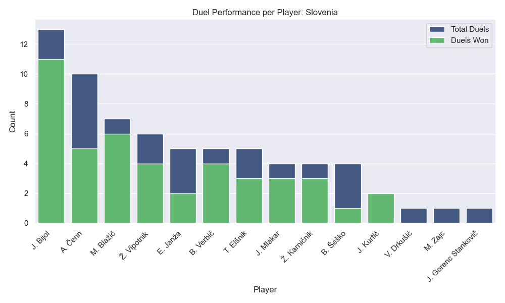
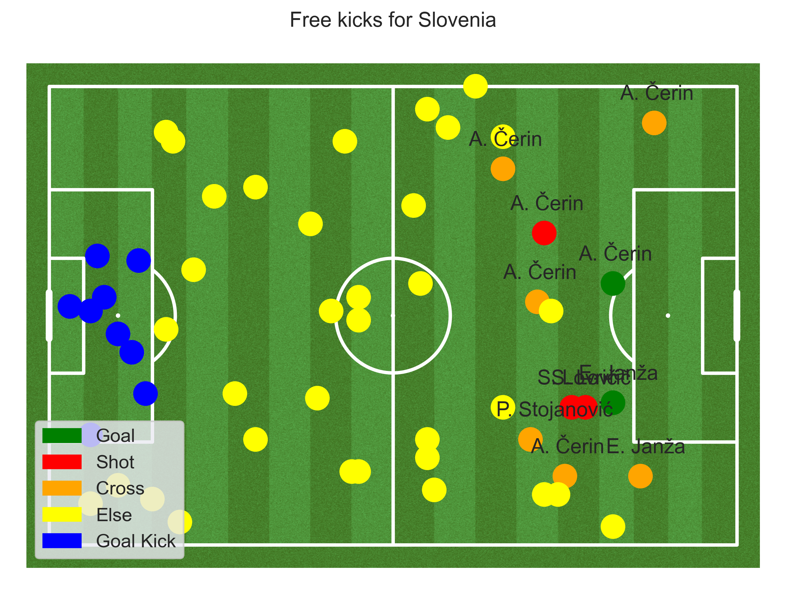

# Preparation Denmark 🇩🇰 to play against Slovenia 🇸🇮 !
<p align="center">
    
  </p>


## 1. Introduction

### 1.1 General comments

Despite Denmark holding the 21st position in the FIFA rankings, and Slovenia being ranked at 55, overlooking a theoretically weaker opponent is never advisable. During the last game against Slovenia (Qualifiers Euro 23) we won with 2-1 in a complicated game while we got a draw 6 month earlier with 1-1 (Qualifiers Euro 23). In this analysis, we'll provide you with all the essential keys to ensure success against Slovenia in the upcoming match.

Based on information from multiple sources, it's seems evident that Slovenia's team possesses notable strengths at some positions. Specifically, their goalkeeper, currently playing for Atlético, stands out, alongside midfielders Benjamin Sesko and Jaka Bijol. Given their midfield/attack roles, it's reasonable to anticipate Slovenia boasting a strong midfield/attack presence.


After analyzing their recent match against Malta, it's evident that Slovenia employed a traditional 4-4-2 formation with no unexpected variations in player selection. Additionally, one of the standout players we identified, Sesko, managed to score a goal during the game. We should keep in mind that the 4-4-2 formation brings a central presence that enables counter-attacks.

### 1.2 Last 5 qualifier games slovenia

| wyscout | skillcorner | date       | home             | away       | Score Home | Score Away |
| ------: | ----------: | ---------- | ---------------- | ---------- | ---------- | ---------- |
| 5414226 |     1385659 | 2023-09-10 | San Marino       | Slovenia   | 0          | 4          |
| 5414260 |     1381446 | 2023-10-14 | Slovenia         | Finland    | 1          | 3          |
| 5414284 |     1381466 | 2023-10-17 | Northern Ireland | Slovenia   | 0          | 1          |
| 5414302 |     1381485 | 2023-11-17 | Denmark          | Slovenia   | 2          | 1          |
| 5414324 |     1381505 | 2023-11-20 | Slovenia         | Kazakhstan | 2          | 1          |

### 1.3 Injured & suspended players

Currently Benjamin Verbič is injured and doesn't have an official return date. No suspension need to be taken into account at this point.

## 2. Statistics of Slovenia's recent games

### 2.1 Formation and line up

We start first by analysing the common composition of Slovenia. In the last 9 games against Malta, USA, Kazakhstan, Denamrk, North Ireland and Finland, Slovenia used 8 times a 4-4-2 composition and the only modified composition was when Benjamin Sesko wasn't available. Therefore we can excpect the composition to be probably the same. Here is a quick recap of pro ans cons of the 4-4-2 composition.

Here is a quick refresh of the pros and cons of 4-4-2:

**Pros :** With a strong defense, wide attack, and quick movement into the opponent's territory, the 4-4-2 excels in counter-attacks. Defensively, it allows for a compact setup with two lines of four players, while the forwards remain poised for quick offensive opportunities. The presence of two strikers presents a unique challenge for defenders, as it reduces time and space on the ball and increases the threat of one-on-one situations. Additionally, passing out from the back becomes more challenging with constant pressure from two attackers.

**Cons :** In a 4-4-2 formation, teams may struggle to control the midfield, especially against opponents using a midfield trio, leading to less possession. Additionally, the 4-4-2 lacks defensive depth, as players within the same line may leave gaps. Despite being compact, this formation is vulnerable to line-breaking passes, making it easier for opponents to bypass multiple players at once. Defensive setups like the 4-1-4-1 offer better coverage between the lines.When attacking, the midfield and defensive lines align closely, restricting forward passing options. This setup can limit the team's ability to create passing opportunities compared to formations with players spread across different lines.

### 2.2 Key statistics


We start by analyzing the direct qualifier match between Denmark and Slovenia on November 20, 2023. The game was largely dominated by Denmark, as evidenced by their 70% possession and a significant advantage in passes, which was double that of Slovenia's. The dominance was further highlighted by the shots on target, with Denmark having 8 compared to Slovenia's 1.

Despite the apparent control over the game by Denmark, the margin of victory was narrow, with Denmark winning by just one goal. This outcome is further clarified upon examining the expected goals metric. Denmark's expected goals stood at 1.33, indicating that despite their dominance, they struggled to create substantial scoring opportunities. On the other hand, Slovenia's expected goals were at 0.13, suggesting their goal could be attributed to a fortunate strike rather than a consistent offensive effort.


<details>
  <summary> Codes </summary>

```python
team_type_counts = df_events.groupby(['team.name', 'type.primary']).size().unstack(fill_value=0)
shots_dnk = df_events[(~df_events["shot.isGoal"].isnull()) & (df_events["team.name"] == "Denmark")]
shots_svn = df_events[(~df_events["shot.isGoal"].isnull()) & (df_events["team.name"] == "Slovenia")]
passes_completed = df_events[df_events["type.primary"] == "pass"].groupby(['team.name'])['pass.accurate'].sum()
possession = df_events.groupby("team.name")["possession.duration"].sum() / df_events["possession.duration"].sum()

team2 = 'Denmark'
dnk_data = {'Goals': shots_dnk['shot.isGoal'].sum(),
            'Shots': shots_dnk.shape[0],
            'Shots on target': shots_dnk['shot.onTarget'].sum(),
            'Exp. goals': shots_dnk['shot.xg'].sum().round(2),
            'Possession': (possession.loc[team2]).round(2), # in percent
            'Passes': team_type_counts.loc[team2, 'pass'],
            'Pass accuracy': (passes_completed.loc[team2] / team_type_counts.loc[team2, 'pass']).round(2),
            'Freekicks': team_type_counts.loc[team2, 'free_kick'],
            'Corners': team_type_counts.loc[team2, 'corner'],
            'Infractions': team_type_counts.loc[team2, 'infraction'],
            'Yellow cards': df_events[(df_events["team.name"] == team2) & (df_events["infraction.yellowCard"] == True)].shape[0],
            'Red cards': df_events[(df_events["team.name"] == team2) & (df_events["infraction.redCard"] == True)].shape[0],
            }

team1 = 'Slovenia'
svn_data = {'Goals': shots_svn['shot.isGoal'].sum(),
            'Shots': shots_svn.shape[0],
            'Shots on target': shots_svn['shot.onTarget'].sum(),
            'Exp. goals': shots_svn['shot.xg'].sum().round(2),
            'Possession': (possession.loc[team1]).round(2), # in percent
            'Passes': team_type_counts.loc[team1, 'pass'],
            'Pass accuracy': (passes_completed.loc[team1] / team_type_counts.loc[team1, 'pass']).round(2),
            'Freekicks': team_type_counts.loc[team1, 'free_kick'],
            'Corners': team_type_counts.loc[team1, 'corner'],
            'Infractions': team_type_counts.loc[team1, 'infraction'],
            'Yellow cards': df_events[(df_events["team.name"] == team1) & (df_events["infraction.yellowCard"] == True)].shape[0],
            'Red cards': df_events[(df_events["team.name"] == team1) & (df_events["infraction.redCard"] == True)].shape[0],
            }

# if category % do not normalize
perc_categories = ['Possession', 'Pass accuracy']

# plot statistics
plot_stats_barchart(svn_data, dnk_data, team1_name='Slovenia', team2_name='Denmark', perc_categories=perc_categories, title='EM Qualifier: 2023-11-20',
                    subtitle='2:1', team1_color='blue', team2_color='red', saveplt=True, savepath='plots/2-statistics/key_statistics.png')
```

</details>

## 3. In possesion - attack of Slovenia

Our analysis of Slovenia's attacking performance in the European Championship qualifier against Denmark on November 20, 2023, serves as the initial basis for evaluating their offensive strategy. Future analyses will encompass a broader range of matches to provide a more comprehensive assessment.

### 3.1 Attacking style:

Slovenia's approach to attacking was markedly different from Denmark's, particularly in their avoidance of prolonged build-up plays. Instead, Slovenia's offensive strategy was predominantly characterized by quick counter-attacks and the utilization of long balls to advance up the field swiftly when in possession.


<details>
  <summary> Codes </summary>
  
  ```python
team_category_perc = (team_category_counts.div(team_category_counts.sum(axis=1), axis=0)).round(2)

dnk_data = {'Build Up': team_category_perc.loc['Denmark', 'build_up'].round(2),
            'Progression': team_category_perc.loc['Denmark', 'progression'].round(2),
            'Final Third': team_category_perc.loc['Denmark', 'final_third_play'].round(2),
            'Long Ball': team_category_perc.loc['Denmark', 'long_ball'],
            'Counter Attack': team_category_perc.loc['Denmark', 'counter_attack'],
            'Set Piece': team_category_perc.loc['Denmark', 'set_piece'],
}

svn_data = {'Build Up': team_category_perc.loc['Slovenia', 'build_up'],
            'Progression': team_category_perc.loc['Slovenia', 'progression'],
            'Final Third': team_category_perc.loc['Slovenia', 'final_third_play'],
            'Long Ball': team_category_perc.loc['Slovenia', 'long_ball'],
            'Counter Attack': team_category_perc.loc['Slovenia', 'counter_attack'],
            'Set Piece': team_category_perc.loc['Slovenia', 'set_piece'],
}

# if category % do not normalize
perc_categories = ['Build Up', 'Progression', 'Final Third', 'Long Ball', 'Counter Attack', 'Set Piece']

plot_stats_barchart(svn_data, dnk_data, team1_name='Slovenia', team2_name='Denmark', perc_categories=perc_categories, title='EM Qualifier: 2023-11-20 (2:1)',
                    subtitle='Attacking style', team1_color='blue', team2_color='red', saveplt=True, savepath='plots/3-attack/attacking_style.png')
```
</details>


### 3.1 Attacking efficiency

The effectiveness of Slovenia's attacking maneuvers was notably lacking. A mere 1% of their attacking efforts resulted in a shot, with none of these attempts being on target. The sole goal they managed to score originated from a free kick taken approximately 35 meters from the goal. Additionally, Slovenia's performance in offensive duels and dribbling was significantly inferior to that of Denmark, further highlighting the inefficacies in their attacking play.


<details>
  <summary> Codes </summary>

```python
def calculate_attacking_efficiency(team_name):

  team_events = df_events[df_events["possession.team.name"] == team_name]

  # Attacks
  with_flank = team_events[(~team_events["possession.attack.flank"].isna())]['possession.id'].nunique()
  with_shot = team_events[(team_events["possession.attack.withShot"] == True)]['possession.id'].nunique()
  with_shot_on_target = team_events[(team_events["possession.attack.withShotOnGoal"] == True)]['possession.id'].nunique()
  with_goal = team_events[(team_events["possession.attack.withGoal"] == True)]['possession.id'].nunique()
  total_events = team_events["possession.id"].nunique()

  # Offensive Duels
  offensive_duels = team_events[(team_events["groundDuel.duelType"] == "offensive_duel")]
  offensive_duels_won = offensive_duels[offensive_duels["groundDuel.keptPossession"] == True]

  # Dribbles
  dribbles = team_events[(team_events["groundDuel.duelType"] == "dribble")]
  dribbles_won = dribbles[dribbles["groundDuel.keptPossession"] == True]


  return {
      'Attack With Flank': round(with_flank / total_events, 2),
      'Attack With Shot': round(with_shot / total_events, 2),
      'Attack With Shot on Goal': round(with_shot_on_target / total_events, 2),
      'Attack With Goal': round(with_goal / total_events, 2),
      'Offensive Duels': round(offensive_duels.shape[0], 2),
      'Offensive Duels Won': round(offensive_duels_won.shape[0] / offensive_duels.shape[0], 2),
      'Dribbles': round(dribbles.shape[0], 2),
      'Dribbles Won': round(dribbles_won.shape[0] / dribbles.shape[0], 2),
  }
  
# Use the function to calculate stats for Denmark and Slovenia
dnk_data = calculate_attacking_efficiency("Denmark")
svn_data = calculate_attacking_efficiency("Slovenia")

# if category % do not normalize
perc_categories = ["Attack With Flank", "Attack With Shot", "Attack With Shot on Goal", "Attack With Goal", "Offensive Duels Won", "Dribbles Won"]

# plot statistics
plot_stats_barchart(svn_data, dnk_data, team1_name='Slovenia', team2_name='Denmark', perc_categories=perc_categories, title='EM Qualifier: 2023-11-20 (2:1)',
                subtitle='Attacking efficiency', team1_color='blue', team2_color='red', saveplt=True, savepath='plots/3-attack/attacking_efficiency.png')
```
</details>


### 3.3 Passing network & Player Heatmap

### Passing network

A look at Slovenia's passing network mirrors the statistics from chapter 2. Slovenia were pushed in behind and were rarely able to create a successful build-up between defence and midfield, which points to the many passes between the two centre-backs (Bijol and Blazic) and Oblak. Denmark managed to isolate the midfield and attack from the game, leaving the defence with only the pass to the centre-back or goalkeeper.

Kranicnik takes on an exciting position in the network. His high pass rate could indicate an inverted right-back. However, it also suggests that the build-up was often attempted via the right flank with Karnicnik and Cerin as the main figures.


```python
# This script isn't complete
third_possession = dynamic_events.groupby(['channel_end', 'third_end'])['possession_duration'].sum().reset_index()
total_possession = third_possession['possession_duration'].sum()
third_possession['possession_percentage'] = (third_possession['possession_duration'] / total_possession) * 100
print(third_possession[['channel_end','third_end', 'possession_percentage']])
```

### Attacking Players Heatmap

In order to analyze Slovenian's attacking behavior, let's take a look at the thermal images of the attacking and midfield players. From the passing Network from chapter 3.1 and the generated images there is a soft tendency that the attacking play is more developped on the right side, through Vipotnik and Verbic/Mlakar. Mlakar and Verbic kept changing their starting positions during the game. Only on the counterattacks do they act as offensive wingers and only then do they give the strikers the opportunity to move into the center. The outside midfielders are therefore very defensively prepared for this game and help out the full-backs.

It is also clear that Slovenian were mainly occupied with defending and Sesko and Vipotnik therefore received little support up front. Elsnik and Cerin took over the position of the typical number 8 and rarely dropped deep to the side and kept the center closed.

<p align="center">
    
    
  </p>

<div style="display:flex;">
    
    
    
    
</div>

<details>
  <summary> Codes </summary>

#### Create an array with players you want to see

```python
  player = ['B. 만코ko', 'J. Kurtič', 'Ž. Karničnik']
    for pl in player:
        df_player = df[df['player.name'] == pl]

    pitch = VerticalPitch(pitch_color='#2f8c58',
                          line_color='white',
                          pitch_type='wyscout')

    fig, ax = pitch.grid(grid_height=0.9, title_height=0.06, axis=False,
                         endnote_height=0.04, title_space=0, endnote_space=0)

    # Heatmap as Kernel Density Estimation
    pitch.kdeplot(
    x=df_player['location.x'],
    y=df_player['location.y'],
    shade = True,
    shade_lowest=False,
    alpha=.5,
    n_levels=10,
    cmap = 'coolwarm',
    ax=ax['pitch']
    )

    legend_elements = [Line2D([0], [0], color='w', markerfacecolor='k', marker='o', label=pl)]

    plt.legend(handles=legend_elements, loc='upper center', bbox_to_anchor=(0.5, 1), bbox_transform=plt.gcf().transFigure,
               handlelength=2, labelspacing=1.2, fontsize=10)

    def replace_dot_space_with_underscore(pl):
        return pl.replace(". ", "_")

    pl = replace_dot_space_with_underscore(pl)

    plt.savefig(f'plots/{pl}_Heatmaps.png', dpi=400)
    plt.show()
```

</details>

### 3.4 Typical tactical moves

#### 3.4.1 Long passes

The long balls from the central defenders or Oblak are very distributed across Denmark's half, but generally with a higher error rate on the left. However, very deep balls into the Danish penalty area arrive much better and more often on the left, which is a weakness in Denmark's play.


<details>
  <summary> Codes </summary>
    
```python
long_passes = df_events[df_events["type.secondary"].str.contains('long_pass')]

pitch = Pitch(pitch_color='grass', line_color='white', stripe=True)

fig, ax = pitch.draw()

for i,shot in long_passes.iterrows():
    #get the information
    x=shot['location.x']
    y=shot['location.y']
    goal=shot['shot.isGoal']
    team_name=shot['team.name']
    #set circlesize
    circleSize=2
    color = "red"
    if 'loss' in shot['type.secondary']:
        color = "white"
    #plot England
    if (team_name!='Denmark'):
        shotCircle=plt.Circle((x/100.0 * pitch_length, y/100.0 * pitch_width),circleSize,color=color)
        #plt.text(x/100.0 * pitch_length-4, y/100.0 * pitch_width - 4,shot['player.name'])
        ax.add_patch(shotCircle)

#set title
fig.suptitle("Long passes map (red ==> success)", fontsize = 12)
plt.savefig("plots/long_passes_map.png", dpi=400)
plt.show()
```

</details>


#### 3.4.2 Crosses

There is no preferred side in the flank play and a clear key player.


<details>
  <summary> Codes </summary>
    
```python
crosses = df_events[df_events["type.secondary"].str.contains('cross')]

pitch = Pitch(pitch_color='grass', line_color='white', stripe=True)
fig, ax = pitch.draw()

for i,shot in crosses.iterrows():
    #get the information
    x=shot['location.x']
    y=shot['location.y']
    goal=shot['shot.isGoal']
    team_name=shot['team.name']
    #set circlesize
    circleSize=2
    color = "red"
    if 'loss' in shot['type.secondary']:
        color = "white"
    #plot England
    if (team_name!='Denmark'):
        shotCircle=plt.Circle((x/100.0 * pitch_length, y/100.0 * pitch_width),circleSize,color=color)
        plt.text(x/100.0 * pitch_length-4, y/100.0 * pitch_width - 4,shot['player.name'])
        ax.add_patch(shotCircle)

#set title
fig.suptitle("Cross map (red ==> success)", fontsize = 12)
plt.savefig("plots/crosses_map.png", dpi=400)
plt.show()
```

</details>


#### 3.4.3 Shots 

What is striking about this statistic is that only shots were taken from the second row and therefore from long range. The two strikers did not get a shot on target. Two shots and only one on goal shows how busy Slovenia were defending. Slovenia's efficiency and above all Janza's shooting technique is astonishing. There is a slight tendency to shoot from the right.


<details>
  <summary> Codes </summary>
    
```python
shots = df_events[~df_events["shot.isGoal"].isna()]

pitch = Pitch(pitch_color='grass', line_color='white', stripe=True)
fig, ax = pitch.draw()

for i,shot in shots.iterrows():
    #get the information
    x=shot['location.x']
    y=shot['location.y']
    goal=shot['shot.isGoal']
    team_name=shot['team.name']
    #set circlesize
    circleSize=2
    #plot England
    if (team_name!='Denmark'):
        color = "white"
        if goal:
            color = "red"

        shotCircle=plt.Circle((x/100.0 * pitch_length, y/100.0 * pitch_width),circleSize,color=color)
        plt.text(x/100.0 * pitch_length-4, y/100.0 * pitch_width - 4,shot['player.name'])
        ax.add_patch(shotCircle)

#set title
fig.suptitle("Shots map (red ==> goal)", fontsize = 12)
plt.savefig("plots/shots_map.png", dpi=400)
plt.show()
```

</details>


#### 3.4.4 Dribblings
Dribbling has only been implemented for the wingers in Slovenia's game. You can rarely expect dribbling from Elsnik and Cerin from the center.
Verbic's dribbling strength in particular must be emphasized here. There is an increased number of dribbles on the right-hand side with a high chance of success. 


<details>
  <summary> Codes </summary>
    
```python
duels = df_events[df_events["type.primary"].str.contains('duel')]

pitch = Pitch(pitch_color='grass', line_color='white', stripe=True)

fig, ax = pitch.draw()

for i,shot in duels.iterrows():
    #get the information
    x=shot['location.x']
    y=shot['location.y']
    goal=shot['shot.isGoal']
    team_name=shot['team.name']
    #set circlesize
    circleSize=2
    color = "red"
    if 'loss' in shot['type.secondary']:
        color = "white"
    #plot England
    if (team_name!='Denmark'):
        shotCircle=plt.Circle((x/100.0 * pitch_length, y/100.0 * pitch_width),circleSize,color=color)
        #plt.text(x/100.0 * pitch_length-4, y/100.0 * pitch_width - 4,shot['player.name'])
        ax.add_patch(shotCircle)

#set title
fig.suptitle("Dribbles map (red ==> success)", fontsize = 12)
plt.savefig("plots/duels_map.png", dpi=400)
plt.show()
```

</details>

#### 3.4.5 Interceptions

Surprisingly, in the center of the Slovenian defense there is a 50/50 chance of success from intercepted balls. Certainly a weak point that Denmark can exploit by coming through the middle or from the left. The right side with Verbic and Karnicnik seems to be like a wall that is difficult to overcome and has a 100% rate of interceptions.


<details>
  <summary> Codes </summary>
    
```python
interceptions = df_events[df_events["type.primary"].str.contains('interception')]

pitch = Pitch(pitch_color='grass', line_color='white', stripe=True)

fig, ax = pitch.draw()

for i,shot in interceptions.iterrows():
    #get the information
    x=shot['location.x']
    y=shot['location.y']
    goal=shot['shot.isGoal']
    team_name=shot['team.name']
    #set circlesize
    circleSize=2
    color = "red"
    if 'loss' in shot['type.secondary']:
        color = "white"
    #plot England
    if (team_name!='Denmark'):
        shotCircle=plt.Circle((x/100.0 * pitch_length, y/100.0 * pitch_width),circleSize,color=color)
        #plt.text(x/100.0 * pitch_length-4, y/100.0 * pitch_width - 4,shot['player.name'])
        ax.add_patch(shotCircle)

#set title
fig.suptitle("Interception map (red ==> success)", fontsize = 12)
plt.savefig("plots/interception_map.png", dpi=400)
plt.show()
```

#### 3.4.6 Fouls

The Slovenians are disciplined and there is a high incidence of fouls in Slovenia's defensive central midfield. Despite a period of high pressure throughout the game, the Slovenians were not tempted to commit many tactical fouls, which indicated that the team was deep and therefore did not allow the Danes to counter-attack. The central midfield did not seem insurmountable and the central midfielders were often only able to help themselves with fouls.


<details>
  <summary> Codes </summary>
    
```python
fouls = df_events[df_events["type.secondary"].str.contains('foul')]

pitch = Pitch(pitch_color='grass', line_color='white', stripe=True)
fig, ax = pitch.draw()

for i,shot in fouls.iterrows():
    #get the information
    x=shot['location.x']
    y=shot['location.y']
    goal=shot['shot.isGoal']
    team_name=shot['team.name']
    #set circlesize
    circleSize=2
    color = "white"

    if 'yellow_card' in shot['type.secondary']:
        color = "yellow"

    #plot England
    if (team_name!='Denmark'):
        shotCircle=plt.Circle((x/100.0 * pitch_length, y/100.0 * pitch_width),circleSize,color=color)
        ax.add_patch(shotCircle)

#set title
fig.suptitle("Foul map (yellow ==> Yellow Card)", fontsize = 12)
plt.savefig("plots/foul_map.png", dpi=400)
plt.show()
```

## 4 Out of possesion - defense of Slovenia

Our analysis of Slovenia's defensive performance in the European Championship qualifier against Denmark on November 20, 2023, serves as the initial basis for evaluating their offensive strategy. Future analyses will encompass a broader range of matches to provide a more comprehensive assessment.

### 4.1 Statistics

The defensive performance of Slovenia in the match clearly illustrates that their primary focus was on maintaining a robust defense, engaging in almost double the number of defensive duels compared to Denmark. Despite the intense defensive activity, the play remained mostly disciplined, with both teams committing 13 fouls each and Slovenia receiving only one yellow card.


<details>
  <summary> Codes </summary>

```python
team_type_counts = df_events.groupby(['team.name', 'type.primary']).size().unstack(fill_value=0)

team2 = 'Denmark'
dnk_data = {'Defensive Duels': df_events[(df_events["groundDuel.duelType"] == "defensive_duel") & (df_events["team.name"] == team2)]["groundDuel.relatedDuelId"].notna().sum(),
            'Interceptions': team_type_counts.loc[team2, 'interception'],
            'Clearances': team_type_counts.loc[team2, 'clearance'],
            'Fouls': team_type_counts.loc[team2, 'infraction'],
            'Yellow cards': df_events[(df_events["team.name"] == team2) & (df_events["infraction.yellowCard"] == True)].shape[0],
            'Red cards': df_events[(df_events["team.name"] == team2) & (df_events["infraction.redCard"] == True)].shape[0],
            }

team1 = 'Slovenia'
svn_data = {'Defensive Duels': df_events[(df_events["groundDuel.duelType"] == "defensive_duel") & (df_events["team.name"] == team1)]["groundDuel.relatedDuelId"].notna().sum(),
            'Interceptions': team_type_counts.loc[team1, 'interception'],
            'Clearances': team_type_counts.loc[team1, 'clearance'],
            'Fouls': team_type_counts.loc[team1, 'infraction'],
            'Yellow cards': df_events[(df_events["team.name"] == team1) & (df_events["infraction.yellowCard"] == True)].shape[0],
            'Red cards': df_events[(df_events["team.name"] == team1) & (df_events["infraction.redCard"] == True)].shape[0],
            }

# if category % do not normalize
perc_categories = []

# plot statistics
plot_stats_barchart(svn_data, dnk_data, team1_name='Slovenia', team2_name='Denmark', perc_categories=perc_categories, title='EM Qualifier: 2023-11-20 (2:1)',
                    subtitle='Defensive stats', team1_color='blue', team2_color='red',saveplt=True, savepath='plots/4-defense/defense_statistics.png')
```
</details>

### 4.2 Defensive efficiency & style

Slovenia's defensive efforts were markedly more dominant and effective than their attacking endeavors. They outperformed Denmark in terms of winning defensive duels, with a success rate of nearly 80% in their defensive third. Furthermore, Slovenia made fewer defensive errors compared to their opponents, contributing to their solid defensive performance.

In terms of their defensive approach, Slovenia opted for a more conservative style. Rather than engaging in aggressive high pressing, they predominantly focused on maintaining a deep defensive line, concentrating their efforts on defending within their own third.


<details>
  <summary> Codes </summary>

```python
def calculate_defensive_efficiency(team_name, opponent_name):

    team_events = df_events[df_events["team.name"] == team_name]

    # Duels
    defensive_duels = team_events[(team_events["groundDuel.duelType"] == "defensive_duel")]
    defensive_duels_ownthird = defensive_duels[(defensive_duels["location.x"] < 33.3)]
    duels_won = defensive_duels[(defensive_duels["groundDuel.stoppedProgress"] == True) | (defensive_duels["groundDuel.recoveredPossession"] == True)].shape[0]
    duels_won_pos = defensive_duels[(defensive_duels["groundDuel.recoveredPossession"] == True)].shape[0]
    duels_won_ownthird = defensive_duels_ownthird[(defensive_duels_ownthird["groundDuel.stoppedProgress"] == True) | (defensive_duels_ownthird["groundDuel.recoveredPossession"] == True)].shape[0]
    total_events = defensive_duels.shape[0]
    total_events_ownthird = defensive_duels_ownthird.shape[0]

    # ball recovery time avg possession duration of opponent
    ball_recovery_time = df_events[(df_events["possession.team.name"] == opponent_name)]["possession.duration"].mean()

    # defensive errors = interceptions + offensive duels lost + dribbles lost in own half
    own_half = df_events[(df_events["location.x"] < 50)]
    interceptions = own_half[(own_half["type.primary"] == "interception") & (own_half["team.name"] == opponent_name)]
    offensive_duels_lost = own_half[(own_half["groundDuel.duelType"] == "offensive_duel") & (own_half["team.name"] == team_name) & (own_half["groundDuel.keptPossession"] == False)]
    dribbles_lost = own_half[(own_half["groundDuel.duelType"] == "offensive_duel") & (own_half["team.name"] == team_name) & (own_half["groundDuel.keptPossession"] == False)]
    defensive_errors = pd.concat([interceptions, offensive_duels_lost, dribbles_lost]).shape[0]

    # Pressure actions
    interceptions = team_events[(team_events["type.primary"] == "interception")]
    clearence = team_events[(team_events["type.primary"] == "clearance")]
    defensive_duels = team_events[(team_events["groundDuel.duelType"] == "defensive_duel")]
    pressures = pd.concat([interceptions, clearence, defensive_duels])

    # High press: Pressure in the opposing third
    high_press = pressures[(pressures["location.x"] > 66.6)]
    mid_press = pressures[(pressures["location.x"] > 33.3) & (pressures["location.x"] < 66.6)]
    low_press = pressures[(pressures["location.x"] < 33.3)]

    return {'Duels Won': round(duels_won / total_events, 2),
            'Duels Won Own Third': round(duels_won_ownthird / total_events_ownthird, 2),
            'Duels Gained Possession': round(duels_won_pos / total_events, 2),
            'Ball Recovery Time': round(ball_recovery_time, 2),
            'Defensive Errors': defensive_errors,
            'High Press': round(high_press.shape[0] / pressures.shape[0], 2),
            'Mid Press': round(mid_press.shape[0] / pressures.shape[0], 2),
            'Low Press': round(low_press.shape[0] / pressures.shape[0], 2),
            }


# Use the function to calculate stats for Denmark and Slovenia
dnk_data = calculate_defensive_efficiency("Denmark", "Slovenia")
svn_data = calculate_defensive_efficiency("Slovenia", "Denmark")

# if category % do not normalize
perc_categories = ["Duels Won", "Duels Won Own Third", "Duels Gained Possession", "High Press", "Mid Press", "Low Press"]

# plot statistics
plot_stats_barchart(svn_data, dnk_data, team1_name='Slovenia', team2_name='Denmark', perc_categories=perc_categories, title='EM Qualifier: 2023-11-20 (2:1)',
                    subtitle='Defensive Efficiency & Style', team1_color='blue', team2_color='red', saveplt=True, savepath='plots/4-defense/defensive_efficiency_style.png')
```
</details>

It's clear to see that the 4-man chain was played consistently throughout the game and that they stayed true to their strategy. In other words, the coach doesn't allow himself to be tempted into plan B, C or D, but draws a clear line. Karnicnik is talented on both feet, which must be taken into account when analyzing the game. In very rare cases, the chain dared to cross the halfway line, but for the majority of the game, it certainly focused solely on defending.

<div style="display:flex;">
    
    
    
    
</div>

<details>
  <summary> Codes </summary>
  
```python

import json
import pandas as pd
from mplsoccer import Pitch, Sbopen
from mplsoccer import VerticalPitch,Pitch
import matplotlib.pyplot as plt
import seaborn as sns
from matplotlib.patches import Patch
from matplotlib.lines import Line2D


# Import the dataset
file_path = './input/wyscout/5414302.json'
with open(file_path, 'r', encoding='utf-8') as file:
    data = json.load(file) 
    
df = pd.json_normalize(data, record_path=['events'])


# Create an array with players you want to see
player = ['B. 만코ko', 'Ž. Vipotnik', 'J. Mlakar', 'T. Elšnik', 'A. Čerin', 'B. Verbič', 'J. Bijol', 'M. Bla쬴캜', 'Ž. Karničnik', 'E. Jan쬬' ]
for pl in player:
    df_player = df[df['player.name'] == pl]
        
    # Pitch     
    pitch = VerticalPitch(pitch_color='#2f8c58', 
                          line_color='white', 
                          pitch_type='wyscout')
    
    fig, ax = pitch.grid(grid_height=0.9, title_height=0.06, axis=False,
                         endnote_height=0.04, title_space=0, endnote_space=0)

    # Heatmap as Kernel Density Estimation
    pitch.kdeplot(
    x=df_player['location.x'],
    y=df_player['location.y'],
    shade = True,
    shade_lowest=False,
    alpha=.5,
    n_levels=10,
    cmap = 'coolwarm',
    ax=ax['pitch']
    )

    legend_elements = [Line2D([0], [0], color='w', markerfacecolor='k', marker='o', label=pl)]

    plt.legend(handles=legend_elements, loc='upper center', bbox_to_anchor=(0.5, 1), bbox_transform=plt.gcf().transFigure,  
               handlelength=2, labelspacing=1.2, fontsize=10)
    
    def replace_dot_space_with_underscore(pl):
        return pl.replace(". ", "_")
    
    pl = replace_dot_space_with_underscore(pl)
    
    plt.savefig(f'plots/{pl}_Heatmaps.png', dpi=400)
    plt.show()
```
</details>


### 4.3 Duel performance of the players
In this section the players of the match Denmark-Slovenia on 20.11.2023 are analyzed regarding the duel performance while defending.
The plot below shows the duel performance of the players from Slovenia. It can be seen that J. Bijpol has the most duels with a total of 13. That showcases that Slovenia had to do a lot of defending and especially J. Bijpol made a big impact in the defending line of Slovenia. Further more the second CB M. Bla쬴캜 with a total of 7 duels and 6 won duels strenghted the defense of Slovenia as well. A. Čerin made a lot of work in the defence too with a total of 10 duels. Although with only 5 won duels he has a percentage of won duels of 50%, which is improvable. It can also be higlighted here that the percentage won of J. Bijol, M. Bla쬴캜, B. Verbič and J. Kurtič is over 75%.



### 4.4 Goal keeper behaviour

## 5. Set plays

### 5.1 Corners

This section analyzes the corners of the match between Denmark and Slovenia on 17.11.2023 and their impact on the game. Corners are a very important part of the game of football as they can often lead to scoring opportunities for the attacking team, but also to counter-attacking opportunities for the defending team. As can be seen from the following graph of corner events, Denmark was the more dominant team, with regards to corners.


In total, Denmark received 8 corners and Slovenia only 2. With 8 corners in a match, we can take a closer look at Denmark's offensive tactics and Slovenia's defensive tactics. The statistics of the corners show that 3 of the corners resulted in a shot, 2 of which were on target and 1 was a goal.

If we take a look at the map of the Danes' pass receiver position, we can see more details of their offensive tactics.


87.5% of their corners found their target in the middle of the penalty area, while 12.5% were hit far behind the penalty area.

A look at the map of shots after corners shows what happened at the dangerous corners.


It is possible to see the shooting positions of the 3 shots after the corners. From this map you can conclude that Denmark is pretty good at generating shooting opportunities after corners if these are whipped into the center of the penalty area. You can also see that Slovenia had trouble defending M. Jensen in aerial duels, as he is their main shot creator from corners with two shots and one goal.

The same analysis can be done for Slovenia as an attacking team. As we can see from the statistics of corner kicks, 1 of the 2 corners resulted in a shot that was not on target.


As Slovenia only had two corner kicks, they could not try multiple corner kick tactics, and as can be seen from the corner kick recipient locations map, all of their corner kick targets were inside the penalty area.

We can get more information from the shots after corner for Slovenia map.


We see that one of the corners, which was originally targeted at the center of the penalty area, was deflected and immediately taken by M. Zajc as a shot, but not on target and therefore not particularly dangerous.

After corners, there is often an opportunity to launch a counter-attack if they are defended properly. Therefore, we looked at the consecutive counter-attacks after corners for this game, but in this case there were none, as the advanced statistics of corner events show.


<details>
<summary> Codes</summary>

##### Corner events

```python
# Corner events
df_corners = df_events[df_events['type.primary']=='corner']

# Corner for Slovenia
df_corners_svn = df_corners[df_corners["team.name"] == "Slovenia"]
corners_svn = df_corners_svn.shape[0]

# Coorner for Opponent
df_corners_opp = df_corners[df_corners["opponentTeam.name"] == "Slovenia"]
corners_opp = df_corners_opp.shape[0]

# Amount of corner events that ended with a shot for Slovenia
shots_svn = (df_corners_svn['possession.attack.withShot'] == True).sum()
shots_on_goal_svn = (df_corners_svn['possession.attack.withShotOnGoal'] == True).sum()
goals_scored_svn = (df_corners_svn['possession.attack.withGoal'] == True).sum()
xgoal_svn = df_corners_svn[~df_corners_svn['possession.attack.xg'].isnull()]['possession.attack.xg'].sum().round(2)

# Amount of corner events that ended with a shot for Denmark
shots_opp = (df_corners_opp['possession.attack.withShot'] == True).sum()
shots_on_goal_opp = (df_corners_opp['possession.attack.withShotOnGoal'] == True).sum()
goals_scored_opp = (df_corners_opp['possession.attack.withGoal'] == True).sum()
xgoal_opp = df_corners_opp[~df_corners_opp['possession.attack.xg'].isnull()]['possession.attack.xg'].sum().round(2)

# Create barchart for corner overview
svn_data = {'Corners': corners_svn,
            'Shots': shots_svn,
            'Shots on Target': shots_on_goal_svn,
            'Goals': goals_scored_svn,
            'Expected Goals': xgoal_svn,
            }

opp_data = {'Corners': corners_opp,
            'Shots': shots_opp,
            'Shots on Target': shots_on_goal_opp,
            'Goals': goals_scored_opp,
            'Expected Goals': xgoal_opp,
            }

# if category % do not normalize
perc_categories = []

# Show and save the plot
plot_stats_barchart(svn_data, opp_data, team1_name='Slovenia', team2_name='Denmark', perc_categories=perc_categories, title='EM Qualifier: 2023-11-17', subtitle='Corner events', team1_color='blue', team2_color='red', saveplt=True, savepath='plots/5-SetPieces/5_1-Corners/corner_statistics.png')
```

##### Shot map

```python
# Plot shot position and success on football field for Slowenia
df_shots_svn = df_corners_svn[df_corners_svn['possession.attack.withShot'] == True]

# Create Pitch with certain attributes
pitch = Pitch(pitch_length=pitch_length, pitch_width=pitch_width, pitch_color='grass', line_color='white', stripe=True)
fig, ax = pitch.draw()

# Draw every shot and colour it regarding its success
for i, shot in df_shots_svn.iterrows():

    # Position of shot
    [x, y] = shot[['possession.endLocation.x', 'possession.endLocation.y']].to_list()

    teamname = shot['team.name']

    # Color of shot depends on if it was off/on target or goal
    if shot['possession.attack.withGoal'] is True:
        color = "green"

    elif shot['possession.attack.withShotOnGoal'] is True:
        color = "orange"

    else:
        color = "red"

    shotCircle = plt.Circle((x/100.0 * pitch_length, y/100.0 * pitch_width), 2, color=color)

    plt.text(x/100.0 * pitch_length-4, y/100.0 * pitch_width - 4, shot['player.name'])

    ax.add_patch(shotCircle)

# Define the legend labels and corresponding colors
legend_labels = ['Goal', 'On Target', 'Off Target']
legend_colors = ['green', 'orange', 'red']

# Create proxy artists for legend
legend_patches = [Patch(color=color, label=label) for color, label in zip(legend_colors, legend_labels)]

# Add legend to the plot
plt.legend(handles=legend_patches, loc='lower right')

# Create title and save plot
fig.suptitle(f"Shots after Corner for {teamname}", fontsize = 12)
plt.savefig(f"plots/5-SetPieces/5_1-Corners/{teamname}_shots_corners_map.png", dpi=400)
plt.show()
```

##### Recipients location map

```python
# Create Dataframe for the distribution of corner passes for Slowenia
df_distribution = pd.DataFrame()

# Determine pass types based on recipient location
pass_short = ((df_corners_svn["pass.endLocation.y"] < 19.0) & (df_corners_svn["location.y"] == 0.0)) | \
             ((df_corners_svn["pass.endLocation.y"] > 81.0) & (df_corners_svn["location.y"] == 100.0))
pass_parea = (df_corners_svn["pass.endLocation.y"] >= 19.0) & (df_corners_svn["pass.endLocation.y"] <= 81.0)
pass_long  = ((df_corners_svn["pass.endLocation.y"] < 19.0) & (df_corners_svn["location.y"] == 100.0)) | \
             ((df_corners_svn["pass.endLocation.y"] > 81.0) & (df_corners_svn["location.y"] == 0.0))
pass_wide  = (df_corners_svn["pass.endLocation.x"] >= 16.0) & (df_corners_svn["pass.endLocation.x"] <= 84.0)

# For every Corner type safe statistics for plotting
for i, pass_dst in enumerate([pass_short, pass_parea, pass_long, pass_wide]):

    if df_corners_svn.loc[pass_dst].empty:
        df_distribution.at[i, "x"] = -1.0
        df_distribution.at[i, "y"] = -1.0
        df_distribution.at[i, "amount"] = -1.0
        continue

    df_distribution.at[i, "x"] = np.mean(df_corners_svn.loc[pass_dst]['pass.endLocation.x'].to_numpy()).round(1)
    df_distribution.at[i, "y"] = np.mean(df_corners_svn.loc[pass_dst]['pass.endLocation.y'].to_numpy()).round(1)
    df_distribution.at[i, "amount"] = df_corners_svn.loc[pass_dst]['pass.endLocation.x'].count()

# Adjust circle sizes and transparency proportional to the number of passes received in a specific area
df_distribution['marker_size'] = (df_distribution['amount'] / df_distribution['amount'].max() * 1500)
df_distribution['marker_size'] = abs((df_distribution['marker_size'] > 0) * df_distribution['marker_size']).round(0)
df_distribution['alpha'] = abs(df_distribution['marker_size'] / df_distribution['marker_size'].max()).round(2)
df_distribution['percentage'] = abs(df_distribution['amount'] / df_distribution[df_distribution['amount'] > 0]['amount'].sum() * (df_distribution['amount'] > 0)) * 100

# Create pitch with certain attributes
pitch = Pitch(pitch_color='grass', line_color='white', stripe=True)
fig, ax = pitch.draw()

# Draw circles proportional to the number of passes received in specific areas
pitch.scatter(df_distribution.x / 100. * pitch_length, df_distribution.y / 100. * pitch_width, s=df_distribution.marker_size, \
              color='cornflowerblue', edgecolors='mediumblue', linewidth=2, alpha=df_distribution.alpha.apply(lambda x: max(x, 0.75)), ax=ax, zorder = 3)

# Annotate circles with percentage of total passes
for i in range(4):

        x = df_distribution.at[i, "x"]
        if x == -1.0:
                continue

        x = x/100. * pitch_length
        y = df_distribution.at[i, "y"]/100. * pitch_width

        pitch.annotate(f"{df_distribution.at[i, 'percentage']}%", xy=(x, y), c='white', va='center',
                   ha='center', size=8, weight = "bold", ax=ax, zorder = 4)

# Create title and save plot
team_name = df_corners_svn["team.name"].iloc[0]
fig.suptitle(f"Corner pass recipient location percentage for {team_name}", fontsize = 12)
plt.savefig('plots/5-SetPieces/5_1-Corners/corner_recipient_loc_SVN.png', dpi=400)
plt.show()

```
</details>

### 5.2 Penalties

There were no penalties in the match between Denmark and Slovenia on 17.11.2023, which is why this section is not covered in the first draft.

<details>
<summary> Codes</summary>

</details>

### 5.3 Free kicks

This section analyzes the free kicks of the match between Denmark and Slovenia on 17.11.2023 and their impact on the game. Free kicks, especially the closer they get to the goal, are a very important part of the game.

If you look at the Slovenia free-kick map, you can see 4 different types of free-kicks. First, the goal kick, which we defined as a free kick inside your own penalty area. Secondly, the shot, which is a free kick that is taken directly as a shot on goal, regardless of whether it is on target or not. Thirdly, the cross, which is a free kick that is used to directly create a promising attacking opportunity by hitting the ball into the penalty area, but is not taken as a shot. And the "Else" category, which serves as a catch-all for all other types of free kicks.



From Slovenia's free-kick map, it can be deduced that Slovenia were pushed back deep into their own half by Denmark's pressing and were sometimes able to get a free-kick out of it. Slovenia also had a direct free-kick from E. Janza, which he was able to convert into a goal. As they are 1 for 1 in goals scored from free kicks, they appear to be very dangerous in this area of the game.


Denmark's free-kick map shows that the Danes were often stopped by fouls in the build-up to their attacking play, as their free kicks are usually taken at the end of the second third of the pitch. Slovenia also managed to avoid free kicks near their own goal, meaning that Denmark only had one opportunity for an attacking free kick.

It is also possible to see when teams consider the distance to goal suitable for an attacking free kick such as a shot or a cross.


With Slovenia, we see that most of the free kicks were around 80 meters, so neither suitable for a cross nor for a direct shot. But as soon as they were closer than 30 meters, they shot directly and were quite efficient in this game. Since they didn't have an offensive free kick cross, we can't say much about that.


With Denmark, we see that most of the free kicks were taken around the 70m mark, so they are not suitable for either a cross or a direct shot, but this suggests that they were a bit more offensive than the Slovenians. When they get closer to goal, around the 40-meter mark, they start using the free kicks as crosses. Since they didn't have a direct free kick shot, we can't say much about that.

To see which players shoot free kicks most often, we have listed all players in a diagram.


With Slovenia, you can see that they had a lot of goal kicks and free kicks which defenders like Bijol took, indicating that they were constantly under pressure and in risky situations in their own half around the penalty area.


Denmark's most prominent free kick taker is midfielder P. Hojberg. This suggests that they have been fouled mainly in the build-up to their attacking play.

To summarize, Slovenia doesn't seem to get many dangerous free-kicks, but when they do, they are very dangerous. Slovenia seems to try to disrupt the Danish build-up play by fouling the Danes in midfield in the Slovenian half, but not in the attacking positions around the penalty area. Denmark could exploit this by playing more 1-v-1 situations as Slovenia seems to defend passively and does not try to risk a free kick near the goal.

<details>
<summary> Codes</summary>

##### Free kick average distance

```python
# Free kick events for Slowenia
df_freekicks = df_events[(df_events['type.primary'] == 'free_kick') & (df_events['team.name'] == 'Slovenia')]

# Classify free kicks as shot, cross, goalkick or else
df_freekick_shots = df_freekicks[df_freekicks['type.secondary'].str.contains("shot")]
df_freekick_cross = df_freekicks[df_freekicks['type.secondary'].str.contains("cross")]
df_goalkick = df_freekicks[(df_freekicks['location.x'] <= 16.0) & ((df_freekicks['location.y'] <= 81.0) & (df_freekicks['location.y'] >= 19.0))]
df_freekick_else = df_freekicks[~df_freekicks['type.secondary'].str.contains("cross") & ~df_freekicks['type.secondary'].str.contains("shot") & ~((df_freekicks['location.x'] <= 16.0) & ((df_freekicks['location.y'] <= 81.0) & (df_freekicks['location.y'] >= 19.0)))]

# Calculate averages
avg_distance_shots = np.mean(np.sqrt(((100 - df_freekick_shots['location.x'])/100. * pitch_length)**2 + ((50 - df_freekick_shots['location.y'])/100. * pitch_width)**2))
avg_distance_cross = np.mean(np.sqrt(((100 - df_freekick_cross['location.x'])/100. * pitch_length)**2 + ((50 - df_freekick_cross['location.y'])/100. * pitch_width)**2))
avg_distance_else = np.mean(np.sqrt(((100 - df_freekick_else['location.x'])/100. * pitch_length)**2 + ((50 - df_freekick_else['location.y'])/100. * pitch_width)**2))

# Create Dataframe for the average distances of types of free kicks for Slowenia
df_distance = pd.DataFrame(columns=['type', 'average_distance'])

# Assign calculated averages
df_distance.at[0, 'type'] = 'shot'
df_distance.at[1, 'type'] = 'cross'
df_distance.at[2, 'type'] = 'else'

df_distance.at[0, 'average_distance'] = avg_distance_shots
df_distance.at[1, 'average_distance'] = avg_distance_cross
df_distance.at[2, 'average_distance'] = avg_distance_else

# Apply a Seaborn theme
sns.set_theme(style="darkgrid")

# Choose a color palette for the plot
palette = sns.color_palette("viridis", len(df_distance))

# Create the bar chart with the chosen palette
sns.barplot(x='type', y='average_distance', data=df_distance, palette=palette)

# Set the title of the plot
plt.title('Average Distance for Freekick Types')

# Customize further with Seaborn and Matplotlib
plt.xlabel('Free kick Type') # X-axis label
plt.ylabel('Average Distance [m]')    # Y-axis label

# Show and save the plot
plt.savefig('plots/5-SetPieces/5_3-FreeKicks/avg_distance_freekick_slov.png', dpi=400)
plt.show()

```

##### Free kick takers

```python
# Create Dataframe that holds average distance of the different freekick types
df_fk_amount = pd.DataFrame(columns=['name', 'amount'])
for i, name in enumerate(df_freekicks["player.name"].unique()):

    if isinstance(name, float) and np.isnan(name):
        continue

    df_fk_amount.at[i, "name"] = name

    # Calculate number of passes
    df_fk_amount.at[i, "amount"] = df_freekicks.loc[df_freekicks["player.name"] == name].count().iloc[0]

# Apply a Seaborn theme
sns.set_theme(style="darkgrid")

# Choose a color palette for the plot
palette = sns.color_palette("viridis", len(df_fk_amount))

# Create the bar chart with the chosen palette
sns.barplot(x='name', y='amount', data=df_fk_amount, palette=palette)

# Set the title of the plot
plt.title('Amount of free kicks taken by indiviual players')

# Customize further with Seaborn and Matplotlib
plt.xlabel('Player Name') # X-axis label
plt.ylabel('Amount of Free kicks')    # Y-axis label

# Show and save the plot
plt.savefig('plots/5-SetPieces/5_3-FreeKicks/freekick_takers_slov.png', dpi=400)
plt.show()
```

##### Free kick location map

```python
# Create pitch with certain attributes
pitch = Pitch(pitch_length=pitch_length, pitch_width=pitch_width, pitch_color='grass', line_color='white', stripe=True)
fig, ax = pitch.draw()

# Define the legend and pitch circle colors
colors=['red', 'orange', 'yellow', 'green']

# Draw circles on basis of free kick types
for idx, dataset in enumerate([df_freekick_shots, df_freekick_cross, df_freekick_else, df_goalkick]):
    color = colors[idx]
    for i, freekick in dataset.iterrows():

        if isinstance(freekick['player.name'], float) and np.isnan(freekick['player.name']):
            continue

        # Position of free kick
        [x, y] = freekick[['location.x', 'location.y']].to_list()

        shotCircle = plt.Circle((x/100.0 * pitch_length, y/100.0 * pitch_width), 2, color=color)

        plt.text(x/100.0 * pitch_length-4, y/100.0 * pitch_width - 4, freekick['player.name'])

        ax.add_patch(shotCircle)

# Define the legend labels
legend_labels = ['Shot', 'Cross', 'Else', 'Goal Kick']

# Create proxy artists for legend
legend_patches = [Patch(color=color, label=label) for color, label in zip(colors, legend_labels)]

# Add legend to the plot
plt.legend(handles=legend_patches, loc='lower right')

# Create title and save plot
fig.suptitle(f"Free kicks for Slovenia", fontsize = 12)
plt.savefig(f"plots/5-SetPieces/5_3-FreeKicks/Slovenia_freekick_map.png", dpi=400)
plt.show()
```

</details>

## 6 Statistics of the players :

Based on the provided data, the most dangerous players can be identified across different metrics. These players have a diverse set of skills, combining endurance, speed, and agility, which can pose significant challenges for opposing teams. They have the most dangerous from a physical perspective.

**Adam Gnezda Čerin**: He stands out for his overall distance covered, running distance, and high-speed running distance. His combination of endurance and speed makes him a formidable presence on the field.

**Benjamin Verbič**: Not only does Verbič excel in running and high-speed running distances, but he also demonstrates significant sprinting ability. His capability to cover ground quickly and maintain high speeds makes him a threat to opponents, particularly in quick transitions and counterattacks.

**Benjamin 만코ko**: While not leading in total distance covered, 만코ko shines in sprinting distance and max speed. His explosive acceleration and top speed make him a dangerous forward, capable of breaking through defenses and creating scoring opportunities.

#### Overall values
| Player name | Distance | Running Distance | HSR Distance | Sprinting Distance | Accelerations | Max speed |
|:---------------------|-----------:|-------------------:|---------------:|---------------------:|----------------:|------------:|
| Adam Gnezda Čerin | 12318 | 2323 | 675 | 118 | 5 | 27.2 |
| Benjamin Verbič | 8654 | 1350 | 564 | 156 | 11 | 27.5 |
| Benjamin 만코ko | 9439 | 1226 | 462 | 228 | 11 | 31.1 |
| Erik Jan쬬 | 6943 | 833 | 363 | 115 | 8 | 28.1 |
| Jaka Bijol | 9688 | 1061 | 355 | 57 | 6 | 27.1 |
| Jan Mlakar | 10772 | 1675 | 590 | 81 | 5 | 26.9 |
| Jasmin Kurtič | 4454 | 922 | 117 | 0 | 2 | 22.9 |
| Jon Gorenc- tankovič | 2986 | 546 | 185 | 12 | 2 | 24.6 |
| Miha Bla쬴캜 | 10579 | 1368 | 333 | 67 | 5 | 25.9 |
| Miha Zajc | 1266 | 223 | 90 | 6 | 0 | 25.2 |
| Sandi Lovrič | 2926 | 498 | 153 | 52 | 2 | 29.6 |
| Timi Max Elšnik | 7857 | 1185 | 367 | 27 | 3 | 25.3 |
| Vanja Drkušić | 3954 | 597 | 264 | 101 | 0 | 29.4 |
| Žan Karničnik | 11470 | 1751 | 501 | 129 | 7 | 28.4 |
| Žan Vipotnik | 10364 | 1195 | 490 | 149 | 13 | 29.2 |


In examining the top three players across each specific physical aspect, we gain a better insight into the diverse skill sets present in Slovenia:

#### Top 3 Distance
| Player name | Distance | Running Distance | HSR Distance | Sprinting Distance | Accelerations | Max speed |
|:------------------|-----------:|-------------------:|---------------:|---------------------:|----------------:|------------:|
| Adam Gnezda Čerin | 12318 | 2323 | 675 | 118 | 5 | 27.2 |
| Žan Karničnik | 11470 | 1751 | 501 | 129 | 7 | 28.4 |
| Jan Mlakar | 10772 | 1675 | 590 | 81 | 5 | 26.9 |
#### Top 3 Running Distance
| Player name | Distance | Running Distance | HSR Distance | Sprinting Distance | Accelerations | Max speed |
|:------------------|-----------:|-------------------:|---------------:|---------------------:|----------------:|------------:|
| Adam Gnezda Čerin | 12318 | 2323 | 675 | 118 | 5 | 27.2 |
| Žan Karničnik | 11470 | 1751 | 501 | 129 | 7 | 28.4 |
| Jan Mlakar | 10772 | 1675 | 590 | 81 | 5 | 26.9 |
#### Top 3 HSR Distance
| Player name | Distance | Running Distance | HSR Distance | Sprinting Distance | Accelerations | Max speed |
|:------------------|-----------:|-------------------:|---------------:|---------------------:|----------------:|------------:|
| Adam Gnezda Čerin | 12318 | 2323 | 675 | 118 | 5 | 27.2 |
| Jan Mlakar | 10772 | 1675 | 590 | 81 | 5 | 26.9 |
| Benjamin Verbič | 8654 | 1350 | 564 | 156 | 11 | 27.5 |
#### Top 3 Sprinting Distance
| Player name | Distance | Running Distance | HSR Distance | Sprinting Distance | Accelerations | Max speed |
|:----------------|-----------:|-------------------:|---------------:|---------------------:|----------------:|------------:|
| Benjamin 만코ko | 9439 | 1226 | 462 | 228 | 11 | 31.1 |
| Benjamin Verbič | 8654 | 1350 | 564 | 156 | 11 | 27.5 |
| Žan Vipotnik | 10364 | 1195 | 490 | 149 | 13 | 29.2 |
#### Top 3 Accelerations
| Player name | Distance | Running Distance | HSR Distance | Sprinting Distance | Accelerations | Max speed |
|:----------------|-----------:|-------------------:|---------------:|---------------------:|----------------:|------------:|
| Žan Vipotnik | 10364 | 1195 | 490 | 149 | 13 | 29.2 |
| Benjamin Verbič | 8654 | 1350 | 564 | 156 | 11 | 27.5 |
| Benjamin 만코ko | 9439 | 1226 | 462 | 228 | 11 | 31.1 |
#### Top 3 Max speed
| Player name | Distance | Running Distance | HSR Distance | Sprinting Distance | Accelerations | Max speed |
|:---------------|-----------:|-------------------:|---------------:|---------------------:|----------------:|------------:|
| Benjamin 만코ko | 9439 | 1226 | 462 | 228 | 11 | 31.1 |
| Sandi Lovrič | 2926 | 498 | 153 | 52 | 2 | 29.6 |
| Vanja Drkušić | 3954 | 597 | 264 | 101 | 0 | 29.4 |

<details>
<summary> Codes</summary>

```python
# Load data
metadata_df = pd.read_csv(data_dir / f"{match_id}_metadata.csv")
play_direction_df = pd.read_csv(data_dir / f"{match_id}_play_direction.csv")
phase_df = pd.read_csv(data_dir / f"{match_id}_phase.csv")
lineup_df = pd.read_csv(data_dir / f"{match_id}_lineup.csv")
tracking_df = pd.read_csv(data_dir / f"{match_id}_tracking.csv")
visible_area_df = pd.read_csv(data_dir / f"{match_id}_visible_area.csv")
physical_df = pd.read_csv(data_dir / f"{match_id}_physical.csv")
passes_df = pd.read_csv(data_dir / f"{match_id}_passes.csv")
on_ball_pressures_df = pd.read_csv(data_dir / f"{match_id}_on_ball_pressures.csv")
off_ball_runs_df = pd.read_csv(data_dir / f"{match_id}_off_ball_runs.csv")
max_ball_z = int(tracking_df.z.max())

# Skillcorner
physical_data = physical_df[['player_name','player_id', 'Distance','Running Distance', 'HSR Distance', 'Sprinting Distance','Count High Acceleration','PSV-99']]

# Rename some columns
physical_data = physical_data.rename(columns={
"player_name": "Player name",
"Count High Acceleration": "Accelerations",
"PSV-99": "Max speed"
})

# Exclude danish team
valid_players = np.array(lineup_df[lineup_df['team_name'] != "Denmark"]['player_id'])

# Sort by values
physical_data = physical_data.sort_values(by="Player name")
physical_data = physical_data[physical_data['player_id'].isin(valid_players)].drop(columns=['player_id'])

# Print players
print(physical_data.to_markdown(index=False))

# Print top 3 each time
for val in physical_data.keys():
    print(f'#### Top 3 {val}')
    print(physical_data.sort_values(by=val, ascending=False).head(3).to_markdown(index=False))
```

</details>


## 7 Weaknesses & Tactic to adopt

This section will be filled out in the final draft 
